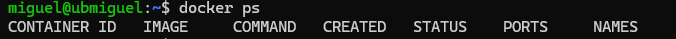
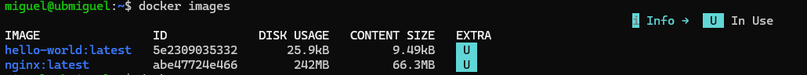
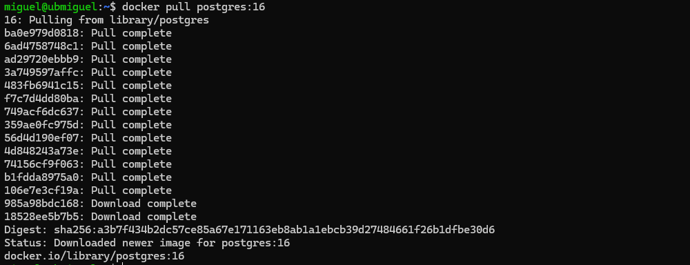
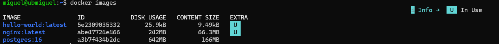
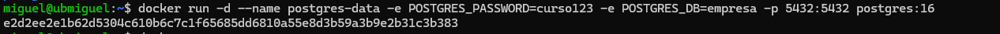

# 🧑🏽‍💻Practica 04 - PostgreSQL en Docker para Ingeniería de Datos

Esta práctica reproduce el flujo básico de ingestión y explotación de datos en un entorno de **Ingeniería de Datos** utilizando contenedores:

* **Despliegue ágil sin dependencias locales:** Permite aprovisionar un servidor relacional completo (PostgreSQL 16) en segundos sin alterar ni ensuciar el sistema operativo anfitrión (Ubuntu Server) con librerías o servicios persistentes del gestor de base de datos.


* **Construcción de una capa de *Staging*:** Establece el patrón de ingestión directa (`ventas.csv` $\rightarrow$ contenedor $\rightarrow$ tabla temporal `staging_ventas`), habitual para recibir datos crudos de negocio antes de aplicar reglas de limpieza o normalización.


* **Validación y analítica de datos en destino:** Facilita la carga masiva mediante comandos estándar de SQL (`COPY`) y la comprobación de calidad de datos (conteo de filas, comprobación de esquemas y agregaciones analíticas de importes por producto).


* **Dominio del ciclo de vida de los contenedores:** Consolida la gestión práctica de estados (`docker run`, `stop`, `start`, `restart`, `rm` y `rmi`), la inspección de redes/puertos expuestos (`5432:5432`) y la monitorización de consumo (`docker stats`).


* **Comprensión de la persistencia de datos (efimeridad):** Demuestra de forma experimental la diferencia crítica entre la **imagen** (plantilla inmutable) y el **contenedor** (instancia viva): los datos se mantienen al detener e iniciar la instancia, pero se pierden por completo al destruir el contenedor si no se emplean volúmenes dedicados (*Docker Volumes*).


## Escenario

Una empresa de ingeniería de datos recibe diariamente archivos CSV procedentes de sus sistemas de ventas.

El equipo necesita crear rápidamente una base de datos temporal para:

```
ventas.csv
     ↓
PostgreSQL en Docker
     ↓
Tabla staging_ventas
     ↓
Consultas de validación
```

En lugar de instalar PostgreSQL directamente en Ubuntu Server, vamos a ejecutarlo dentro de un contenedor Docker.

Todo se realizará desde:

```
Windows
   ↓
VS Code
   ↓ SSH
Ubuntu Server
   ↓
Docker Engine
   ↓
PostgreSQL Container
```

Este laboratorio reutiliza los comandos principales aprendidos en la Clase 1 de Docker.

---

# 1. Comprobar Docker

Desde la terminal remota de **conectada a Ubuntu Server**:

```bash
docker --version
```


Comprobamos los contenedores actuales:

```bash
docker ps
```


Y las imágenes disponibles:

```bash
docker images
```

---

# 2. Descargar PostgreSQL

Vamos a utilizar la imagen oficial:

```bash
docker pull postgres:16
```


Comprobamos que se ha descargado:

```bash
docker images
```

Deberíamos encontrar algo parecido a:

```
REPOSITORY   TAG
postgres     16

```


Aquí estamos utilizando dos comandos para Contenedores:

```
docker pull=>Descarga de imagenes
docker images=>Revisión de imagenes
```

---

# 3. Crear el contenedor PostgreSQL

Ejecutamos:

```bash
docker run -d --name postgres-data -e POSTGRES_PASSWORD=curso123 -e POSTGRES_DB=empresa -p 5432:5432 postgres:16
```


Vamos a analizar el comando.
Has ejecutado con éxito el paso central de despliegue del contenedor de base de datos. Analicemos tanto la anatomía del comando como la salida que te devolvió el daemon de Docker.

---

### 1. Desglose detallado del comando

```bash
docker run -d --name postgres-data -e POSTGRES_PASSWORD=curso123 -e POSTGRES_DB=empresa -p 5432:5432 postgres:16

```

* **`docker run`**:
* Es el comando compuesto que combina dos operaciones internas del motor: primero crea el contenedor (`docker create`) asignándole su capa de lectura/escritura sobre la imagen, y de inmediato lo inicializa (`docker start`).
* Si la imagen `postgres:16` no estuviera descargada previamente en local, `docker run` la habría descargado (*pull*) de forma automática antes de crearlo.


* **`-d` (*detached mode* / segundo plano)**:


* Ordena a Docker ejecutar el contenedor en segundo plano.


* Libera la terminal inmediatamente devolviéndote el prompt (`$`), permitiendo que el proceso principal de PostgreSQL siga corriendo como servicio en el fondo sin bloquear tu consola interactiva.


* **`--name postgres-data`**:


* Asigna un identificador legible y único al contenedor dentro del host.


* Esto sustituye los nombres aleatorios automáticos (como `lucid_curie`) y te permite referenciarlo en los comandos posteriores (`docker logs postgres-data`, `docker exec postgres-data ...`, `docker stop postgres-data`) en lugar de tener que copiar su ID alfanumérico.


* **`-e POSTGRES_PASSWORD=curso123`**:


* El modificador `-e` (*environment*) inyecta una variable de entorno dentro del espacio de procesos del contenedor.


* La imagen oficial de PostgreSQL exige por seguridad definir una contraseña o declarar confianza explícita. Aquí define la contraseña de autenticación para el superusuario predeterminado (`postgres`).


* **`-e POSTGRES_DB=empresa`**:


* Inyecta una segunda variable de entorno.


* Durante el script de inicialización (`docker-entrypoint.sh`), PostgreSQL crea automáticamente una base de datos con este nombre además de la base predeterminada `postgres`. El entorno de staging queda listo desde el primer segundo.


* **`-p 5432:5432` (*port publishing*)**:


* Establece una regla de mapeo y reenvío de puertos mediante `iptables`/`nftables` en el host:
* **`5432` (izquierda - host):** Abre y escucha en el puerto 5432 de la interfaz de red de tu Ubuntu Server.


* **`5432` (derecha - contenedor):** Redirige el tráfico entrante al puerto 5432 donde escucha el proceso `postgres` dentro del espacio aislado de red del contenedor.


* Gracias a esto, cualquier cliente externo (como DBeaver, pgAdmin o herramientas ETL desde Windows) puede conectarse apuntando a la IP de Ubuntu en el puerto 5432.


* **`postgres:16`**:


* Es la **imagen base y su etiqueta (*tag*)** a partir de la cual se construye la instancia.


* Define la versión principal 16 de PostgreSQL compilada sobre Debian (la base oficial estándar).


---

### 2. Explicación de la respuesta devuelta

```text
e2d2ee2e1b62d5304c610b6c7c1f65685dd6810a55e8d3b59a3b9e2b31c3b383

```

* **ID largo del contenedor (*Full Container ID*):**
* Cuando se utiliza `-d`, la salida estándar de Docker siempre es el hash criptográfico SHA-256 completo de 64 caracteres hexadecimales que identifica unívocamente a esta instancia en el sistema (`/var/lib/docker/containers/<ID>`).
* Cuando ejecutas comandos como `docker ps`, Docker muestra una versión truncada (los primeros 12 caracteres: `e2d2ee2e1b62`). Ambos identificadores representan exactamente la misma entidad.


* **Confirmación de éxito:**
* Al devolver este identificador sin mensajes de error intermedios, Docker confirma que el contenedor se creó en el almacenamiento local, se le asignó una interfaz virtual de red (veth) conectada al puente `bridge` de Docker y se lanzó el proceso raíz `postgres`.


---

### Siguiente paso según el laboratorio

PostgreSQL realiza un proceso de inicialización en su primer arranque (creación de catálogos del sistema, configuración del usuario y creación de la BD `empresa`).

Puedes comprobar que el servicio ya está listo para recibir conexiones revisando los logs (Paso 5 del guion):

```bash
docker logs postgres-data

```

*(Deberás ver la línea: `database system is ready to accept connections`)*.


## `-d`

```
-d
```

Ejecuta PostgreSQL en segundo plano.

## `-name postgres-data`

```
--name postgres-data
```

Asigna el nombre:

```
postgres-data
```

al contenedor.

## `p 5432:5432`

```
-p 5432:5432
```

Relaciona:

```
Puerto 5432 Ubuntu → Puerto 5432 PostgreSQL
```

## `e`

La opción:

```
-e
```

permite definir variables de entorno.

En este caso:

```bash
-e POSTGRES_PASSWORD=curso123
```

define la contraseña del usuario administrador de PostgreSQL.

Y:

```bash
-e POSTGRES_DB=empresa
```

hace que PostgreSQL cree inicialmente una base de datos llamada:

```
empresa
```

---

# 4. Comprobar que el contenedor está funcionando

Ejecuta:

```bash
docker ps
```

Deberíamos observar algo similar a:

```
CONTAINER ID   IMAGE         PORTS                    NAMES
abc123...      postgres:16   0.0.0.0:5432->5432/tcp   postgres-data
```

Ahora tenemos:

```
Ubuntu Server
       |
       | 5432
       ↓
Docker
       |
       ↓
PostgreSQL
       |
       ↓
Base de datos empresa
```

---

# 5. Consultar los logs

PostgreSQL tarda unos segundos en inicializarse.

Podemos observar el proceso con:

```bash
docker logs postgres-data
```

Entre los mensajes deberíamos terminar encontrando algo parecido a:

```
database system is ready to accept connections
```

También podemos seguir los logs en tiempo real:

```bash
docker logs -f postgres-data
```

Para salir:

```
Ctrl + C
```

El contenedor continuará funcionando.

---

# 6. Entrar en PostgreSQL

Ahora utilizamos `docker exec`.

Ejecuta:

```bash
docker exec -it postgres-data psql -U postgres -d empresa
```

Estamos haciendo lo siguiente:

```
docker exec
       ↓
contenedor postgres-data
       ↓
ejecutar programa psql
       ↓
conectarse a BD empresa
```

El prompt debería cambiar a algo parecido a:

```
empresa=#
```

Ya estamos dentro de PostgreSQL.

---

# 7. Crear una tabla de Staging

Dentro de PostgreSQL:

```sql
CREATE TABLE staging_ventas (
    id INTEGER,
    fecha DATE,
    producto VARCHAR(100),
    cantidad INTEGER,
    precio NUMERIC(10,2)
);
```

Comprobamos la tabla:

```sql
SELECT * FROM staging_ventas;
```

Todavía estará vacía.

Salimos:

```
\q
```

---

# 8. Crear un pequeño dataset CSV

Ahora estamos nuevamente en Ubuntu Server.

Vamos a crear un archivo de datos:

```bash
echo "id,fecha,producto,cantidad,precio" > ventas.csv
```

Añadimos algunas ventas:

```bash
echo "1,2026-09-01,Portatil,2,1200.00" >> ventas.csv
```

```bash
echo "2,2026-09-01,Monitor,5,350.00" >> ventas.csv
```

```bash
echo "3,2026-09-02,Teclado,10,75.00" >> ventas.csv
```

```bash
echo "4,2026-09-02,Raton,15,35.00" >> ventas.csv
```

```bash
echo "5,2026-09-03,Portatil,1,1350.00" >> ventas.csv
```

Visualizamos:

```bash
cat ventas.csv
```

Resultado:

```
id,fecha,producto,cantidad,precio
1,2026-09-01,Portatil,2,1200.00
2,2026-09-01,Monitor,5,350.00
3,2026-09-02,Teclado,10,75.00
4,2026-09-02,Raton,15,35.00
5,2026-09-03,Portatil,1,1350.00
```

Aquí tenemos nuestro pequeño **dataset de origen**.

---

# 9. Copiar el CSV al contenedor

Utiliza:

```bash
docker cp ventas.csv postgres-data:/tmp/ventas.csv
```

El flujo es:

```
Ubuntu Server
ventas.csv
     |
     | docker cp
     ↓
Contenedor PostgreSQL
/tmp/ventas.csv
```

Podemos comprobar que llegó:

```bash
docker exec postgres-data ls /tmp
```

Debería aparecer:

```
ventas.csv
```

También podemos visualizarlo desde fuera del contenedor:

```bash
docker exec postgres-data cat /tmp/ventas.csv
```

---

# 10. Cargar el CSV en PostgreSQL

Entramos nuevamente:

```bash
docker exec -it postgres-data psql -U postgres -d empresa
```

Ejecutamos:

```sql
COPY staging_ventas
FROM '/tmp/ventas.csv'
DELIMITER ','
CSV HEADER;
```

PostgreSQL debería indicar:

```
COPY 5
```

Eso significa que ha cargado:

```
5 filas
```

---

# 11. Validar los datos

En Ingeniería de Datos no basta con cargar información.

Hay que comprobarla.

Ejecutamos:

```sql
SELECT * FROM staging_ventas;
```

## Contar registros

```sql
SELECT COUNT(*)
FROM staging_ventas;
```

Resultado esperado:

```
5
```

## Calcular ventas

```sql
SELECT
    producto,
    SUM(cantidad * precio) AS importe_ventas
FROM staging_ventas
GROUP BY producto
ORDER BY importe_ventas DESC;
```

Ahora ya estamos realizando una pequeña transformación analítica:

```
CSV
 ↓
Staging
 ↓
Validación
 ↓
Agregación
```

---

# 12. Salir de PostgreSQL

```
\q
```

---

# 13. Inspeccionar el contenedor

Utilizamos otro comando de la Clase 1:

```bash
docker inspect postgres-data
```

Busca visualmente información relacionada con:

```
IPAddress
Ports
State
Image
Name
```

---

# 14. Consultar el puerto

```bash
docker port postgres-data
```

Deberíamos obtener algo parecido a:

```
5432/tcp -> 0.0.0.0:5432
```

Es decir:

```
PostgreSQL
Container :5432
      ↑
      |
Ubuntu :5432
```

---

# 15. Consultar recursos utilizados

Ejecuta:

```bash
docker stats postgres-data
```

Podemos observar:

```
CPU %
MEM USAGE
MEM %
NET I/O
```

Para salir:

```
Ctrl + C
```

---

# 16. Detener PostgreSQL

Ejecuta:

```bash
docker stop postgres-data
```

Comprobamos:

```bash
docker ps
```

Ya no aparecerá.

Pero si ejecutamos:

```bash
docker ps -a
```

seguirá existiendo:

```
postgres-data
```

con estado similar a:

```
Exited
```

> **Detener un contenedor no significa eliminarlo.**
> 

---

# 17. Volver a iniciar PostgreSQL

Ejecuta:

```bash
docker start postgres-data
```

Comprobamos:

```bash
docker ps
```

PostgreSQL vuelve a estar funcionando.

---

# 18. Comprobar si los datos siguen allí

Ejecutamos:

```bash
docker exec -it postgres-data psql -U postgres -d empresa
```

Y después:

```sql
SELECT * FROM staging_ventas;
```

Los datos siguen presentes porque simplemente hemos detenido e iniciado **el mismo contenedor**.

Salimos:

```
\q
```

Esto refuerza la diferencia entre:

```
docker stop
      ↓
contenedor permanece

docker start
      ↓
volvemos a utilizarlo
```

---

# 19. Reiniciar PostgreSQL

Podemos hacerlo directamente:

```bash
docker restart postgres-data
```

Comprobamos:

```bash
docker ps
```

---

# 20. Eliminar el contenedor

Primero:

```bash
docker stop postgres-data
```

Después:

```bash
docker rm postgres-data
```

Comprobamos:

```bash
docker ps -a
```

`postgres-data` ya no existe.

Aquí aparece una lección importante para futuras clases:

> Los datos estaban almacenados dentro del contenedor. Al eliminar el contenedor, esos datos dejan de estar disponibles con él.
> 

Esto prepara el siguiente tema:

```
Docker Volumes
```

porque allí aprenderemos cómo conseguir:

```
Eliminar contenedor
       ↓

Datos sobreviven
       ↓

Crear otro contenedor
       ↓

Recuperar los mismos datos
```

---

# 21. La imagen PostgreSQL todavía existe

Aunque hayamos eliminado el contenedor:

```bash
docker images
```

seguiremos teniendo:

```
postgres:16
```

Esto refuerza nuevamente:

```
IMAGEN ≠ CONTENEDOR
```

La imagen es la plantilla.

El contenedor era una instancia creada a partir de ella.

---

# 22. Eliminar la imagen

Si queremos limpiar completamente:

```bash
docker rmi postgres:16
```

Comprobamos:

```bash
docker images
```

---

# 23. Comandos de la Clase 1 utilizados

Este laboratorio utiliza casi todos los comandos principales:

| Comando | Uso dentro del laboratorio |
| --- | --- |
| `docker --version` | Comprobar instalación |
| `docker pull` | Descargar PostgreSQL |
| `docker images` | Ver la imagen |
| `docker run` | Crear PostgreSQL |
| `docker ps` | Ver PostgreSQL activo |
| `docker ps -a` | Ver activo/detenido |
| `docker logs` | Revisar inicialización |
| `docker exec` | Ejecutar SQL dentro del contenedor |
| `docker cp` | Introducir el CSV |
| `docker inspect` | Examinar configuración |
| `docker port` | Consultar publicación 5432 |
| `docker stats` | Consultar recursos |
| `docker stop` | Detener PostgreSQL |
| `docker start` | Iniciarlo otra vez |
| `docker restart` | Reiniciarlo |
| `docker rm` | Eliminar el contenedor |
| `docker rmi` | Eliminar la imagen |

---

---

# 25. Flujo completo del laboratorio

```
ventas.csv
    │
    │ docker cp
    ▼
┌──────────────────────────┐
│ Docker Container         │
│                          │
│ PostgreSQL               │
│ ┌──────────────────────┐ │
│ │ staging_ventas       │ │
│ │                      │ │
│ │ id                   │ │
│ │ fecha                │ │
│ │ producto             │ │
│ │ cantidad             │ │
│ │ precio               │ │
│ └──────────────────────┘ │
└──────────────────────────┘
             │
             │ SQL
             ▼
      Validación
             │
             ▼
      Transformación
             │
             ▼
       Datos analíticos
```

---