1.Introduccion_a_la_inteligencia_en_tiempo_real_en Microsoft_Fabric

# Empieza con Inteligencia en Tiempo Real en Microsoft Fabric

Microsoft Fabric ofrece Inteligencia en Tiempo Real, permitiéndote crear soluciones analíticas para flujos de datos en tiempo real. En este ejercicio, utilizarás las capacidades de Inteligencia en Tiempo Real de Microsoft Fabric para ingerir, analizar y visualizar un flujo en tiempo real de datos del mercado bursátil.

Este laboratorio tarda aproximadamente 30 minutos en completarse.

**Propina:** Para contenido relacionado con la formación, véase Empezar con Inteligencia en Tiempo Real en Microsoft Fabric.

---

## Crea un espacio de trabajo

> **Nota:** Necesitas acceso a una capacidad de pago o de prueba de Fabric para completar este ejercicio. Para información sobre la prueba gratuita de Fabric, consulta la prueba de Fabric.
> 
> **Nota:** Necesitas un tenent Microsoft Fabric para completar este ejercicio.

1. Accede a la página principal de Microsoft Fabric en un navegador e inicia sesión con tus credenciales de Fabric. (`[https://app.fabric.microsoft.com/home?experience=fabric](https://app.fabric.microsoft.com/home?experience=fabric)`)
2. En la barra de menú de la izquierda, selecciona **Espacios de trabajo** (el icono se parece a 🗇).
3. Crea un nuevo espacio de trabajo con el nombre que elijas, seleccionando un modo de licencia que incluya la capacidad de Fabric (Trial, Premium o Text).
4. Cuando abra tu nuevo espacio de trabajo, debería estar vacío.

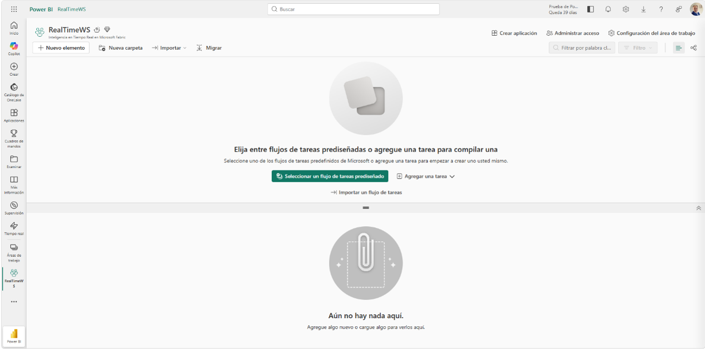

---

## Crear un flujo de eventos

Ahora estás listo para encontrar e ingerir datos en tiempo real de una fuente en streaming. Para ello, empezarás en el Fabric Real-Time Hub. El hub en tiempo real ofrece una forma sencilla de encontrar y gestionar fuentes de datos en streaming.

> **Consejo:** La primera vez que uses el Actual Hub pueden mostrarse algunos consejos para empezar. Puedes cerrar estos.

1. En la barra de menú de la izquierda, selecciona el **hub en tiempo real**.
> **Nota:** Si no ves el hub en tiempo real, selecciona la puntuación (...) y luego fija el hub en tiempo real en la barra de menú.

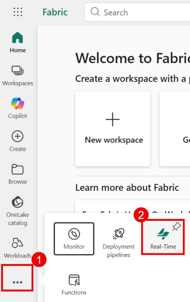

2. En el hub en tiempo real, selecciona **Añadir datos**.

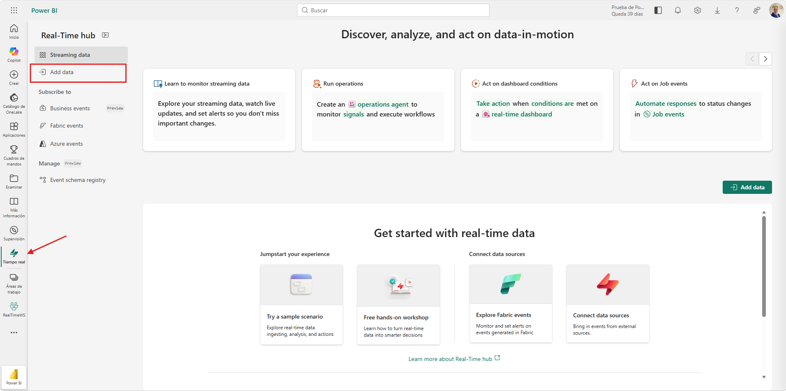

3. Seleccione la fuente de datos de muestra del mercado bursátil.

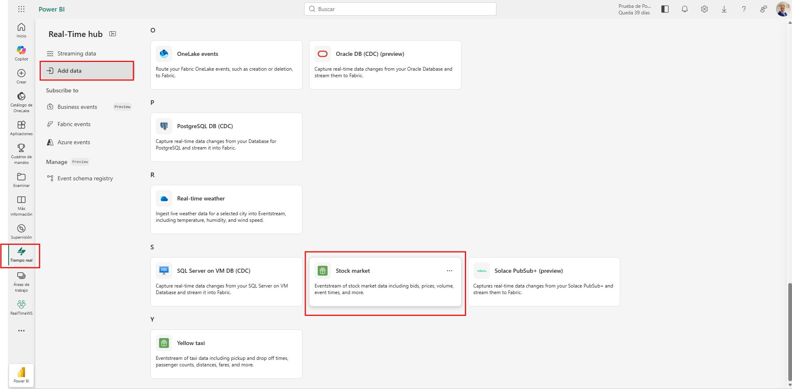

4. Configura la fuente de datos de la siguiente manera:
   * **Nombre de la fuente:** `stock`
   * **Espacio de trabajo:** Selecciona el espacio de trabajo que has creado
   * **Nombre de Eventstream:** `stock-data`
   
   El flujo por defecto asociado a estos datos se llamará automáticamente *stock-data-stream*.

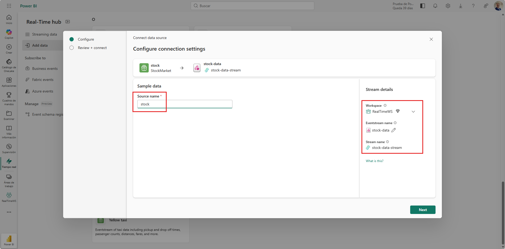

5. Selecciona **Siguiente**, luego **Conecta** para crear el flujo de eventos.

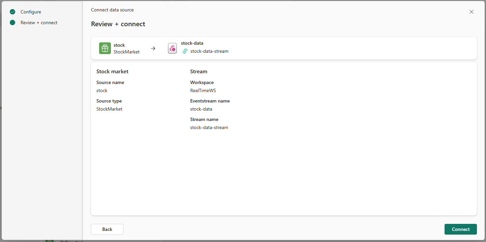

6. Selecciona **Abierto al evento**. El eventstream mostrará la fuente de stock y el flujo de datos de stock en el lienzo de diseño:

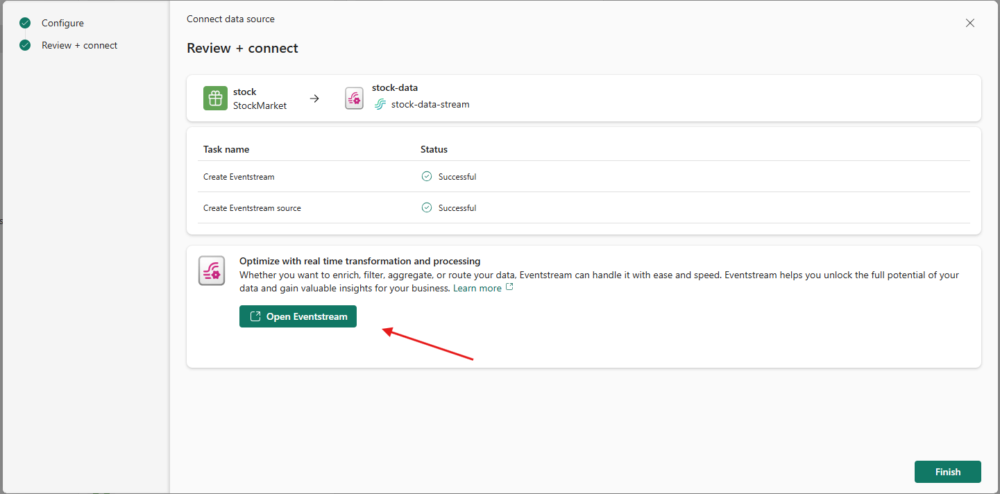

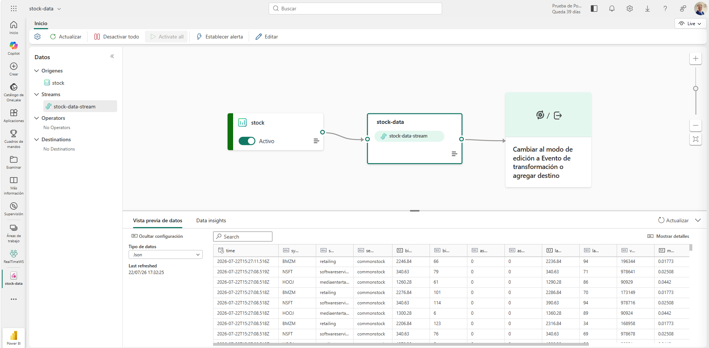

---

## Crear una casa de eventos

El eventstream ingiere los datos de stock en tiempo real, pero actualmente no hace nada con ellos. Creemos una casa de eventos (Eventhouse) donde podamos almacenar los datos capturados en una tabla.

1. En la barra de menú de la izquierda, selecciona **Crear**. 
2. En la nueva página, en la sección de Inteligencia en Tiempo Real, selecciona **Caseta de Eventos**. Dale un nombre único que elijas (ej. *EventhouseRealTime*).
> **Nota:** Si la opción Crear no está fijada en la barra lateral, primero debes seleccionar la opción de puntos suspensivos (...).

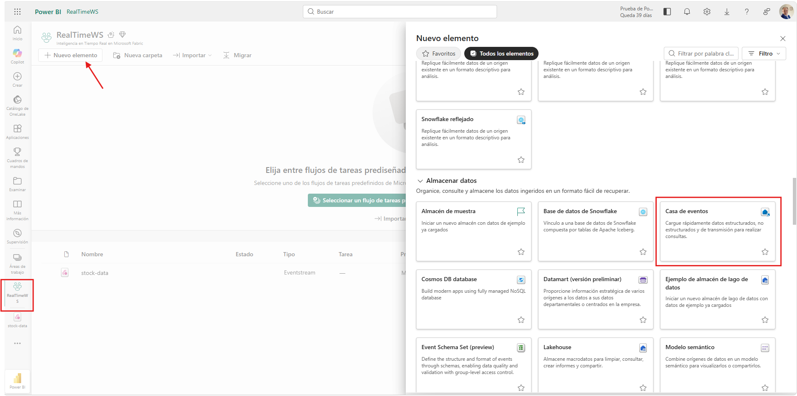

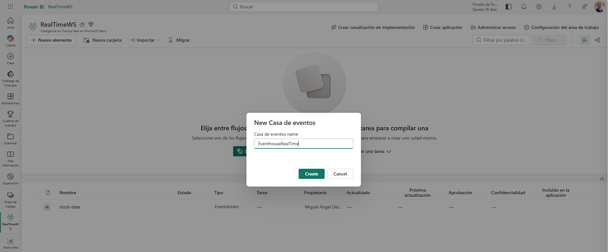

3. Cierra cualquier consejo o prompt que se muestre hasta que veas tu nueva sala de eventos vacía.

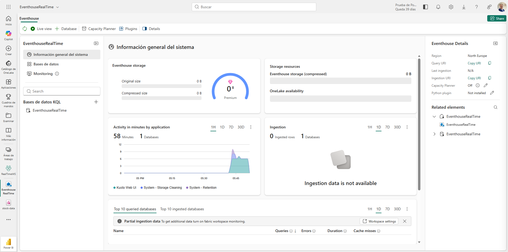

4. En el panel de la izquierda, ten en cuenta que tu casa de eventos contiene una base de datos KQL con el mismo nombre que la casa de eventos. Puedes crear tablas para tus datos en tiempo real en esta base de datos, o crear bases de datos adicionales según sea necesario.
5. Selecciona la base de datos y observa que hay un conjunto de consultas asociado. Este archivo contiene algunas consultas KQL de ejemplo que puedes usar para empezar a consultar las tablas de tu base de datos.

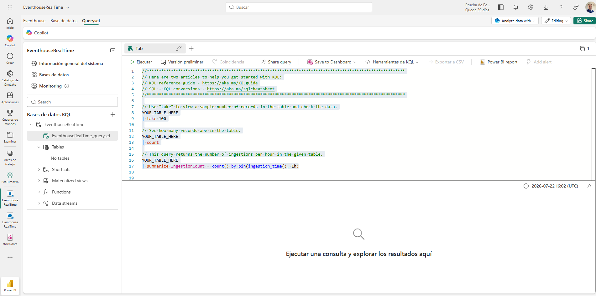

Sin embargo, actualmente no hay tablas para consultar. Vamos a resolver ese problema pasando los datos del flujo de eventos a una nueva tabla.

6. En la página principal de tu base de datos KQL, selecciona **Obtener datos**.

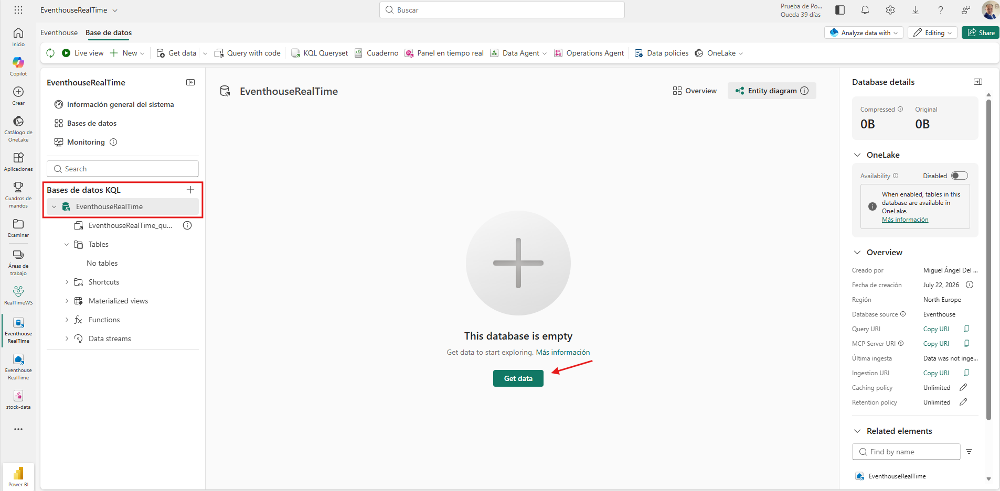

7. Para la fuente de datos, selecciona **Eventstream > Event stream existente**.

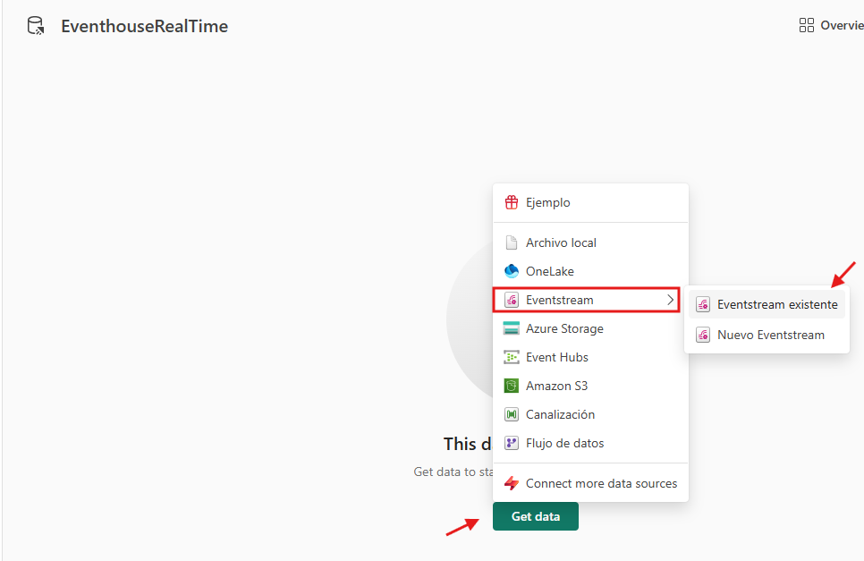

8. En el panel de Seleccionar o crear una tabla de destino, crea una nueva tabla llamada `stock`. Luego, en el panel Configurar el origen de datos, selecciona tu espacio de trabajo y el flujo de eventos `stock-data` y nombra la conexión `stock-table`.

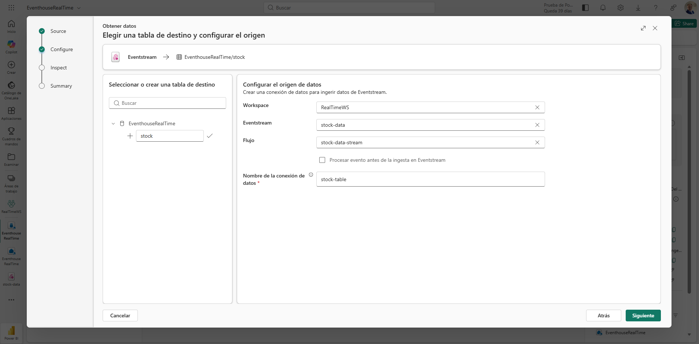

9. Usa el botón **Siguiente** para completar los pasos e inspeccionar los datos y luego terminar la configuración. Luego cierra la ventana de configuración para ver tu casa de eventos con la tabla de stock.

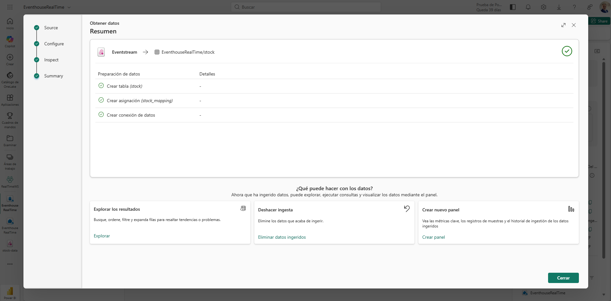

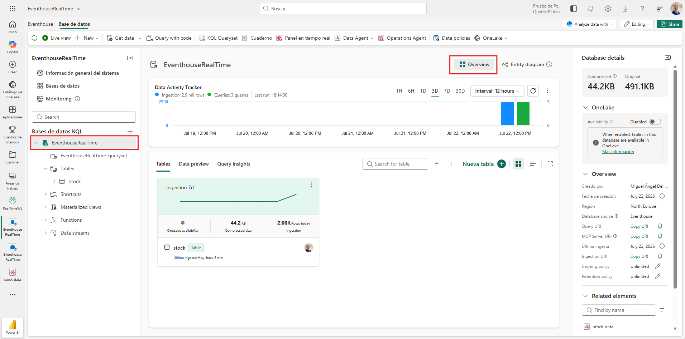

Se ha creado la conexión entre el arroyo y la mesa. Vamos a verificar eso en el evento stream.

10. En la barra de menú de la izquierda, selecciona el **hub en Tiempo-Real**. En el menú `...` del flujo datos de stock, selecciona **Abrir flujo de eventos**.
El evento ahora muestra un destino para el stream:

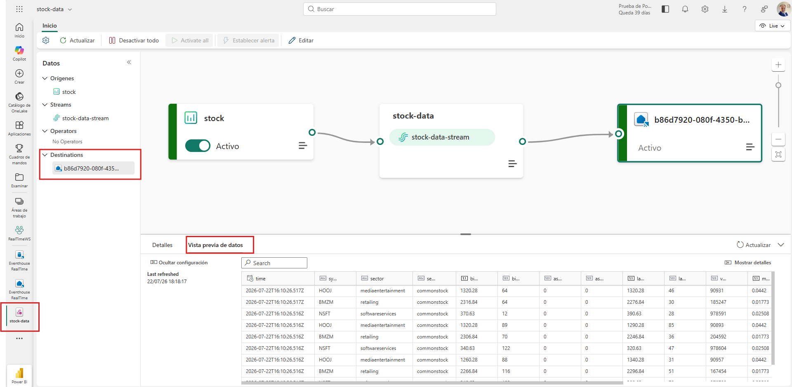

> **Consejo:** Selecciona el destino en el lienzo de diseño y, si no aparece ninguna vista previa de datos debajo, selecciona Actualizar.

En este ejercicio, has creado un flujo de eventos muy sencillo que captura datos en tiempo real y los carga en una tabla. En una solución real, normalmente se añadirían transformaciones para agregar los datos en ventanas temporales (por ejemplo, para capturar el precio medio de cada acción en periodos de cinco minutos).

Ahora vamos a explorar cómo puedes consultar y analizar los datos capturados.

---

## Consulta los datos capturados

El flujo de eventos captura datos en tiempo real del mercado bursátil y los carga en una tabla de tu base de datos KQL. Puedes consultar esta tabla para ver los datos capturados.

1. En la barra de menú de la izquierda, selecciona tu base de datos de casas de eventos.
2. Selecciona el **conjunto de consultas** de tu base de datos.
3. En el panel de consulta, modifica la primera consulta de ejemplo como se muestra aquí:

```kusto
stock
| take 100
```
4. Selecciona el código de consulta y ejecuta para ver 100 filas de datos de la tabla.

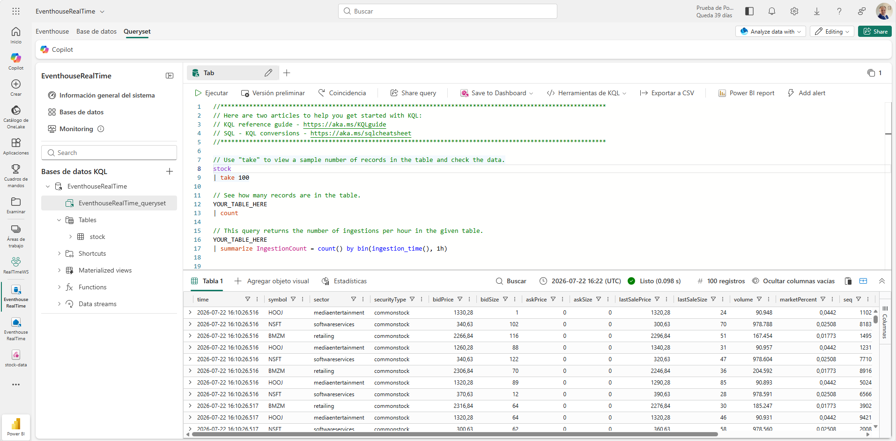

5. Revisa los resultados y luego modifica la consulta para obtener el precio medio de cada símbolo bursátil en los últimos 5 minutos:

```kusto
stock
| where ["time"] > ago(5m)
| summarize avgPrice = avg(todecimal(bidPrice)) by symbol
| project symbol, avgPrice
```

6. Resalta la consulta modificada y ejecútala para ver los resultados.

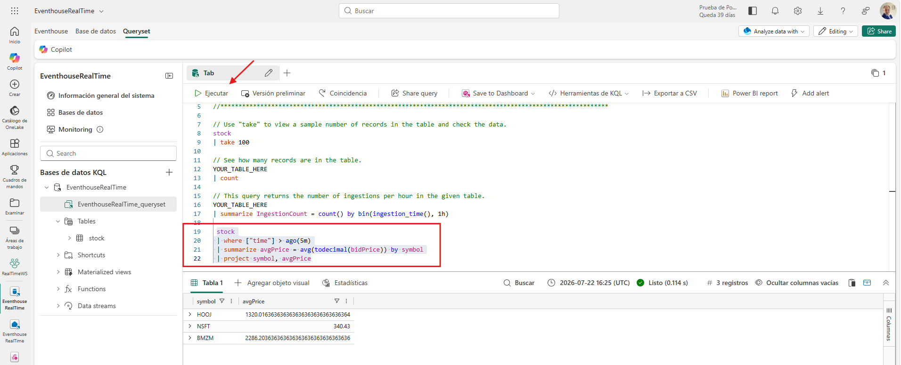

7. Espera unos segundos y vuelve a ejecutarlo, observando que los precios medios cambian a medida que se añaden nuevos datos a la tabla del flujo en tiempo real.

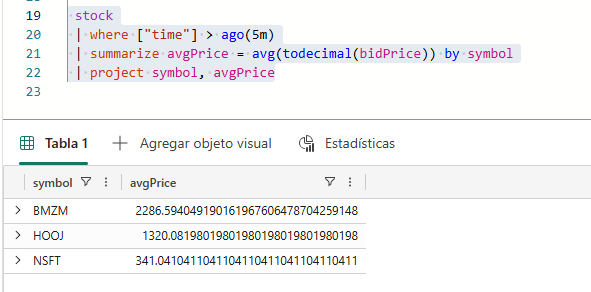

---

## Crea un panel de control en tiempo real

Ahora que tienes una tabla que se está llenando por flujo de datos, puedes usar un panel de control en tiempo real para visualizar los datos.

1. En el editor de consultas, selecciona la consulta KQL que usaste para recuperar los precios medios de las acciones de los últimos cinco minutos.
2. En la barra de herramientas, selecciona **Guardar en el panel de control**. Luego fija la consulta **en un nuevo panel de control** con los siguientes ajustes:
   * **Nombre del panel de control:** `Stock Dashboard`
   * **Nombre de la ficha:** `Average Prices`

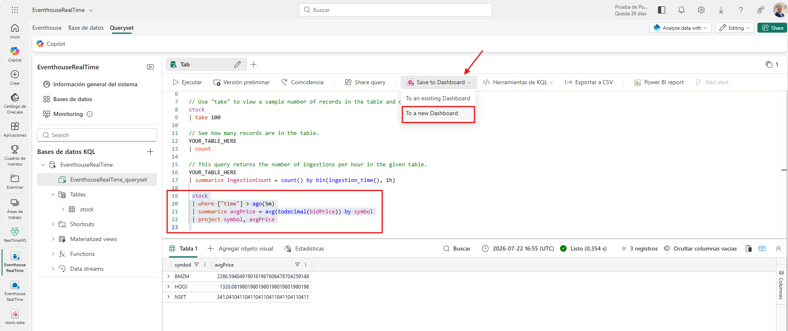

3. Crea el panel de control y ábrelo. Debería verse así:

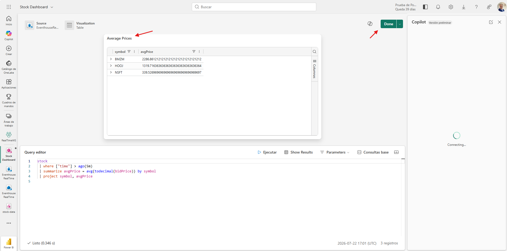

4. En la parte superior derecha del panel de control, cambia del modo **Visualización** al modo **Edición**.
5. Selecciona el icono de **Editar** (lápiz) para la casilla de Precios Medios.
6. En el panel de formato visual, cambia el Visual de **Tabla** a **Cuadro de columnas**:

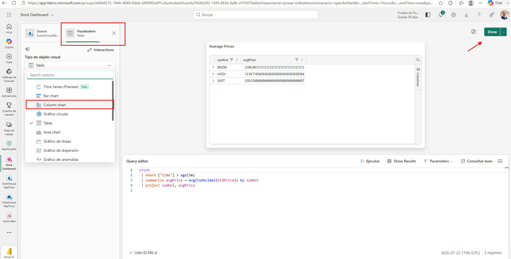

7. En la parte superior del panel de control, selecciona **Aplicar cambios** y consulta tu panel modificado:

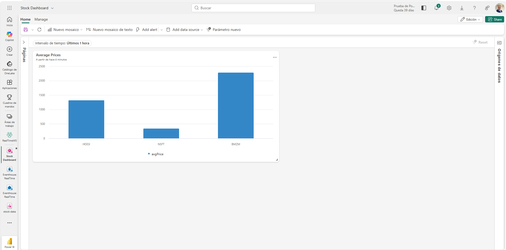

Ahora tienes una visualización en tiempo real de tus datos bursátiles.

---

## Crea una alerta

La inteligencia en tiempo real en Microsoft Fabric incluye una tecnología llamada Activator, que puede desencadenar acciones basadas en eventos en tiempo real. Vamos a usarla para alertarte cuando el precio medio de la acción suba una cantidad específica.

1. En la ventana del panel que contiene la visualización del precio de tu acción, en la barra de herramientas, selecciona **Establecer alerta**.
2. En el panel de Establecer alertas, crea una alerta con los siguientes ajustes:
   * **Ejecuta la consulta cada:** `5 minutos`
   * **Comprobar:** `En cada evento agrupado por`
   * **Campo de agrupación:** `symbol`
   * **Cuándo:** `avgPrice`
   * **Condición:** `Aumenta en`
   * **Valor:** `100`
   * **Acción:** `Envíame un correo electrónico`
   * **Guardar ubicación:**
     * **Espacio de trabajo:** `Tu espacio de trabajo`
     * **Objeto:** `Crear un nuevo objeto`
     * **Nuevo nombre del objeto:** `UpdateAvgPrice5min`

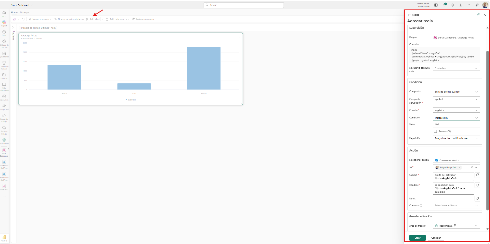

3. Crea la alerta y espera a que se guarde. Luego cierra el panel para confirmar que ha sido creado.
4. En la barra de menú de la izquierda, selecciona la página de tu espacio de trabajo (guardando cualquier cambio no guardado en tu panel si se lo pide).
5. En la página del espacio de trabajo, consulta los elementos que has creado en este ejercicio, incluido el activador de tu alerta.
6. Abre el activador y, en su página, bajo el nodo de *avgPrice*, selecciona el identificador único de tu alerta. Luego mira su pestaña **Historial**.

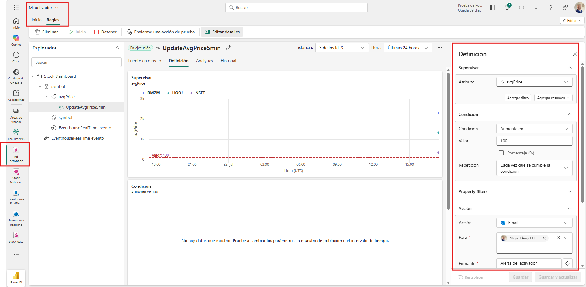

Tu alerta puede que no se haya activado, en cuyo caso el historial no contendrá datos. Si el precio medio de la acción cambia más de 100, el activador te enviará un correo electrónico y la alerta se registrará en el historial.

---

## Limpieza de recursos

En este ejercicio, has creado una casa de eventos, ingerido datos en tiempo real usando un flujo de eventos, consultado los datos ingeridos en una tabla de base de datos KQL, creado un panel de control en tiempo real para visualizar los datos en tiempo real y configurado una alerta usando Activator.

Si has terminado de explorar la Inteligencia en Tiempo Real en Fabric, puedes eliminar el espacio de trabajo que creaste para este ejercicio.

1. En la barra de la izquierda, selecciona el icono de tu espacio de trabajo.
2. En la barra de herramientas, selecciona **Configuración del espacio de trabajo**.
3. En la sección **General**, selecciona **Eliminar este espacio de trabajo**.

---
[⬅️ Laboratorio Anterior](../readmeLab.md) | [🏠 Índice de Laboratorios](../../Readmedp-600.md) | [Siguiente Laboratorio ➡️](../2.Siguiente_Lab/readme2.md)