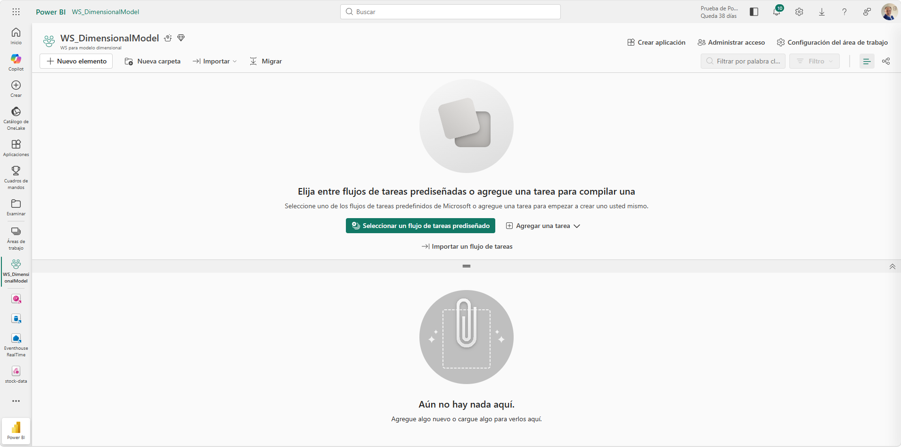
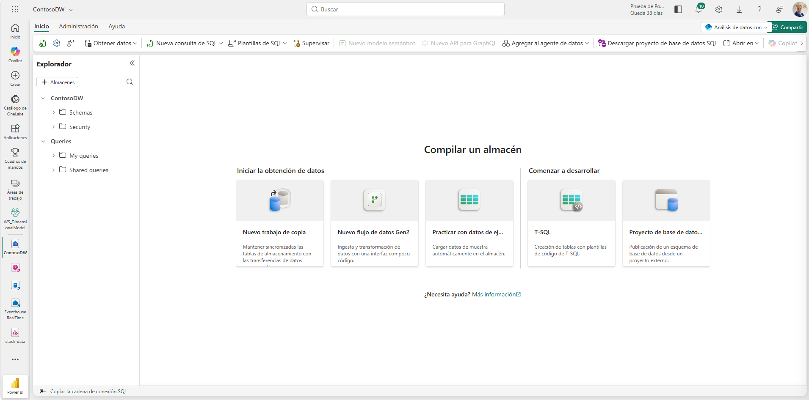
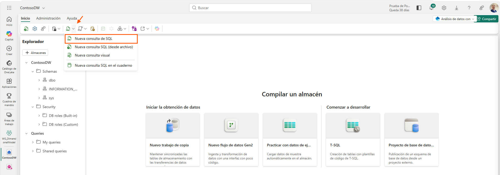
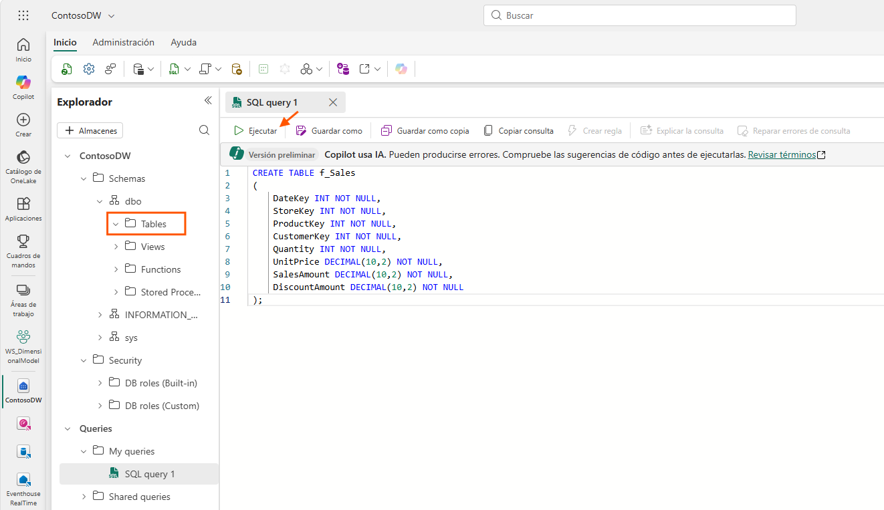
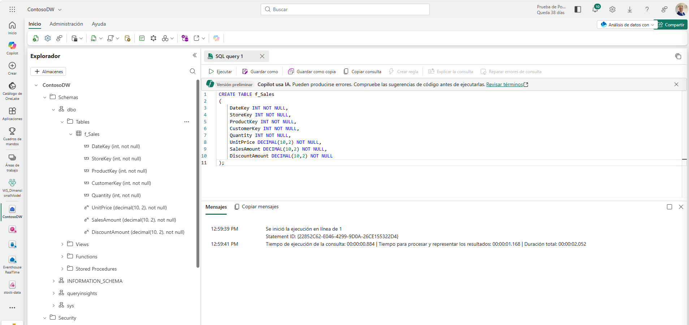
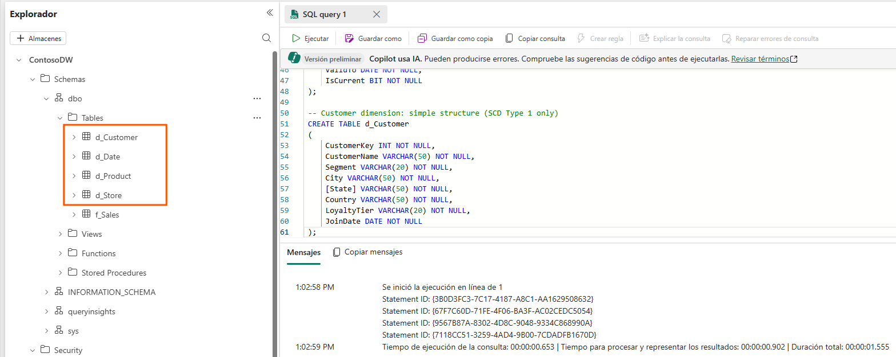
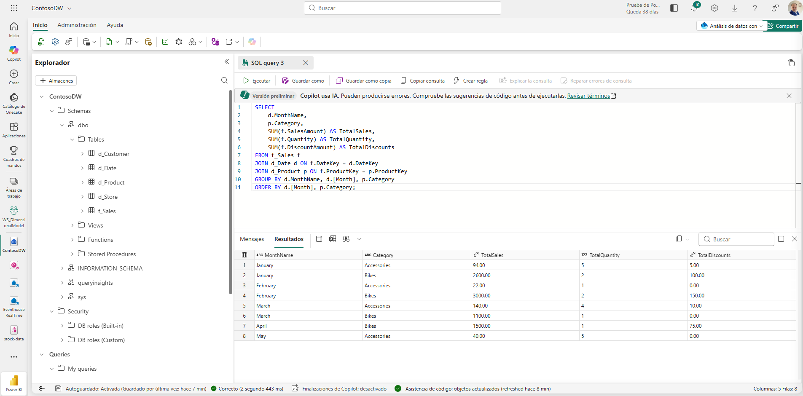
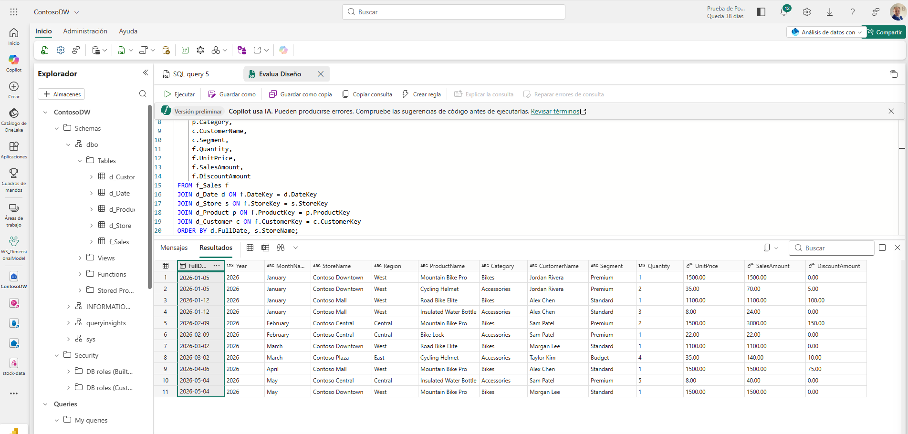

2.Design_and_implement_a_dimensional_model
# Laboratorio 2: Diseñar e implementar un modelo dimensional[cite: 2]

## Índice
* [Objetivos](#objetivos)
* [Requisitos Previos](#requisitos-previos)
* [1. Crear un espacio de trabajo (workspace)](#Crea-un-espacio-de-trabajo-(workspace))
* [Crea un espacio de trabajo](#crea-un-espacio-de-trabajo)
* [2. Crear un almacén de datos](#2-crear-un-almacén-de-datos)
* [3. Crear la tabla de hechos (fact table)](#3-crear-la-tabla-de-hechos-fact-table)
* [4. Crear las tablas de dimensiones](#4-crear-las-tablas-de-dimensiones)
* [5. Añadir restricciones de tabla](#5-añadir-restricciones-de-tabla)
* [6. Datos de muestra de carga](#6-datos-de-muestra-de-carga)
* [7. Consulta el esquema estrella](#7-consulta-el-esquema-estrella)
* [8. Implementar patrones SCD](#8-implementar-patrones-scd)
* [9. Verifica el diseño](#9-verifica-el-diseño)
* [10. Pruébalo con Copilot (opcional)](#10-pruébalo-con-copilot-opcional)
* [11. Limpieza de recursos](#11-limpieza-de-recursos)


# Diseñar e implementar un modelo dimensional

En Microsoft Fabric, un almacén de datos proporciona semántica completa de T-SQL para crear y gestionar modelos dimensionales. Los modelos dimensionales organizan los datos en tablas de hechos que capturan eventos empresariales y tablas dimensionales que proporcionan el contexto para el análisis. Esta estructura, conocida como esquema estrella (star schema), es el enfoque recomendado para la mayoría de las cargas de trabajo analíticas y la base para los modelos semánticos de Power BI.

En este ejercicio, diseñas e implementas un modelo dimensional de esquema en estrella para Contoso Retail, una organización minorista ficticia que necesita analizar el rendimiento de ventas en tiendas, productos, clientes y periodos temporales. Creas las tablas de hechos y dimensiones en un Fabric Warehouse, cargas datos de muestra y ejecutas consultas analíticas que unen la tabla de hechos a las tablas dimensionales como un esquema estrella (star schema).

También implementas patrones de dimensión que cambia lentamente (SCD) para manejar datos que cambian con el tiempo, demostrando cómo funcionan en la práctica los cambios de Tipo 1 (sobrescribir) y Tipo 2 (seguimiento histórico).

Este laboratorio tarda aproximadamente 30 minutos en completarse.

> **Propina:** Para contenido relacionado con la formación, véase Diseño de modelos dimensionales para análisis en Microsoft Fabric.

---

## Crea un espacio de trabajo (workspace)

> **Nota:** Necesitas acceso a una capacidad de pago o de prueba de Fabric para completar este ejercicio. Para información sobre la prueba gratuita de Fabric, consulta la prueba de Fabric.

1. Accede a la página principal de Microsoft Fabric en un navegador e inicia sesión con tus credenciales de Fabric. [Fabric](https://app.fabric.microsoft.com/home?experience=fabric)
2. En la barra de menú de la izquierda, selecciona **Espacios de trabajo** (el icono se parece a 🗇).
3. Elige un **tipo de espacio de trabajo de Fabric y Power BI** en la sección Avanzado. Las opciones podrían ser: Fabric, prueba de Fabric, Power BI Premium.
4. Cuando abra tu nuevo espacio de trabajo, debería estar vacío.



---

## Crea un almacén de datos

Ahora que tienes un espacio de trabajo, crea un almacén de datos para alojar tu modelo dimensional.

1. En tu espacio de trabajo, selecciona **+ Nuevo artículo** y luego selecciona **Almacén (Warehouse)** en la sección de Datos de la Tienda. Llámala `ContosoDW`.
2. Tras un minuto aproximadamente, se crea un nuevo almacén que se abre en el navegador.



---

## Crea la tabla de hechos (fact table)

La tabla de datos recoge los eventos empresariales que quieres medir — para Contoso Retail, son las transacciones de ventas. El grano es una fila por línea de transacción de venta. Las columnas numéricas que agregas en las consultas se llaman medidas: cantidad, precio unitario, importe de ventas y monto de descuento. La tabla también incluye claves foráneas que vinculan cada transacción a tablas de cuatro dimensiones.

1. En tu almacén, selecciona el botón de **Nueva consulta SQL** en la barra de herramientas e introduce la siguiente instrucción T-SQL:

```sql
CREATE TABLE f_Sales
(
    DateKey INT NOT NULL,
    StoreKey INT NOT NULL,
    ProductKey INT NOT NULL,
    CustomerKey INT NOT NULL,
    Quantity INT NOT NULL,
    UnitPrice DECIMAL(10,2) NOT NULL,
    SalesAmount DECIMAL(10,2) NOT NULL,
    DiscountAmount DECIMAL(10,2) NOT NULL
);
```



2. Usa el botón **▷ Ejecutar** para ejecutar el script SQL.



3. Usa el botón de **Actualizar** en la barra de herramientas para actualizar la vista. En el panel del Explorador, expande `Esquemas > dbo > Tablas` y verifica que la tabla de `f_Sales` ha sido creada.

> **Nota:** El prefijo `f_` identifica esto como una tabla de hechos. Esta convención de nombres facilita que analistas y herramientas distingan tablas de hechos de tablas dimensionales. La tabla de hechos intencionadamente no tiene una clave primaria, lo cual es una práctica habitual porque no sirve para una función útil para las tablas de hechos y aumentaría innecesariamente el almacenamiento.



---

## Crea las tablas de dimensiones

Las tablas dimensionales proporcionan el contexto que hace que los datos de hechos sean significativos. Responden al quién, qué, cuándo y dónde detrás de cada medida. Para este modelo, necesitas cuatro dimensiones: fecha, tienda, producto y cliente.

Las dimensiones del producto y la tienda incluyen columnas de seguimiento SCD Tipo 2 (`ValidFrom`, `ValidTo`, `IsCurrent`) porque la empresa necesita registrar los cambios históricos en los costes del producto y las asignaciones regionales de tienda. Las dimensiones cliente y de fecha utilizan estructuras más simples porque solo se necesitan correcciones (Tipo 1) para los clientes, y la dimensión de fecha es un dato de referencia estático.

1. En la pestaña del menú principal, selecciona **Consulta nueva SQL** y ejecuta el siguiente código para crear las tablas de las cuatro dimensiones:

```sql
-- Date dimension: uses YYYYMMDD integer format as surrogate key
CREATE TABLE d_Date
(
    DateKey INT NOT NULL,
    FullDate DATE NOT NULL,
    [Year] INT NOT NULL,
    [Quarter] INT NOT NULL,
    [Month] INT NOT NULL,
    MonthName VARCHAR(10) NOT NULL,
    [Day] INT NOT NULL,
    [DayOfWeek] VARCHAR(10) NOT NULL,
    FiscalYear INT NOT NULL,
    FiscalQuarter INT NOT NULL,
    IsHoliday BIT NOT NULL,
    IsWeekday BIT NOT NULL
);

-- Store dimension: includes SCD Type 2 tracking columns
CREATE TABLE d_Store
(
    StoreKey INT NOT NULL,
    StoreNaturalKey VARCHAR(10) NOT NULL,
    StoreName VARCHAR(50) NOT NULL,
    StoreType VARCHAR(20) NOT NULL,
    City VARCHAR(50) NOT NULL,
    [State] VARCHAR(50) NOT NULL,
    Country VARCHAR(50) NOT NULL,
    Region VARCHAR(50) NOT NULL,
    OpenDate DATE NOT NULL,
    ValidFrom DATE NOT NULL,
    ValidTo DATE NOT NULL,
    IsCurrent BIT NOT NULL
);

-- Product dimension: includes SCD Type 2 tracking columns
CREATE TABLE d_Product
(
    ProductKey INT NOT NULL,
    ProductNaturalKey VARCHAR(10) NOT NULL,
    ProductName VARCHAR(50) NOT NULL,
    Brand VARCHAR(50) NOT NULL,
    Subcategory VARCHAR(50) NOT NULL,
    Category VARCHAR(50) NOT NULL,
    UnitCost DECIMAL(10,2) NOT NULL,
    ValidFrom DATE NOT NULL,
    ValidTo DATE NOT NULL,
    IsCurrent BIT NOT NULL
);

-- Customer dimension: simple structure (SCD Type 1 only)
CREATE TABLE d_Customer
(
    CustomerKey INT NOT NULL,
    CustomerName VARCHAR(50) NOT NULL,
    Segment VARCHAR(20) NOT NULL,
    City VARCHAR(50) NOT NULL,
    [State] VARCHAR(50) NOT NULL,
    Country VARCHAR(50) NOT NULL,
    LoyaltyTier VARCHAR(20) NOT NULL,
    JoinDate DATE NOT NULL
);
```

> **Nota:** La dimensión de fecha utiliza el formato `YYYYMMDD` entero como clave sustituta. Esta es la práctica aceptada para las dimensiones de la fecha porque es tanto significativa como eficiente. El año fiscal comienza en julio, por lo que enero de 2026 cae en el tercer trimestre fiscal. Las dimensiones de almacenamiento y producto incluyen una columna `NaturalKey` (el identificador del sistema de origen) y tres columnas de seguimiento SCD Tipo 2: `ValidFrom`, `ValidTo`, y `IsCurrent`. La clave sustituta (`StoreKey`, `ProductKey`) identifica de forma única cada versión de un miembro de la dimensión. Este diseño es esencial para seguir los cambios históricos, que implementarás más adelante en este ejercicio.

2. Usa el botón de **Actualizar** en la barra de herramientas. En el panel del Explorador, comprueba que las cinco tablas (`f_Sales`, `d_Date`, `d_Store`, `d_Product`, `d_Customer`) aparecen en `Esquemas > dbo > Tablas`.

> **Consejo:** Si las tablas tardan un poco en aparecer, actualiza la página del navegador.



---

## Añadir restricciones de tabla

Ahora que existen las tablas de hechos y dimensiones, conéctalas en un esquema estrella añadiendo restricciones de clave extranjera, cargando datos de muestra y ejecutando consultas analíticas. En Fabric Warehouse, las restricciones de tabla (claves primarias y externas) no pueden definirse en línea dentro de una instrucción `CREATE TABLE`; utiliza `ALTER TABLE` para añadirlas después de que se crean las tablas. Las restricciones son `NOT ENFORCED` y sirven como metadatos que documentan las relaciones entre tablas. Estos metadatos ayudan a Power BI a detectar automáticamente relaciones cuando creas un modelo semántico desde el almacén.

Crea una nueva consulta SQL y ejecuta el siguiente código para añadir claves primarias a cada tabla de dimensiones y claves externas a la tabla de hechos:

```sql
-- Add primary keys to dimension tables
ALTER TABLE d_Date
    ADD CONSTRAINT PK_d_Date PRIMARY KEY NONCLUSTERED (DateKey) NOT ENFORCED;
ALTER TABLE d_Store
    ADD CONSTRAINT PK_d_Store PRIMARY KEY NONCLUSTERED (StoreKey) NOT ENFORCED;
ALTER TABLE d_Product
    ADD CONSTRAINT PK_d_Product PRIMARY KEY NONCLUSTERED (ProductKey) NOT ENFORCED;
ALTER TABLE d_Customer
    ADD CONSTRAINT PK_d_Customer PRIMARY KEY NONCLUSTERED (CustomerKey) NOT ENFORCED;

-- Add foreign keys to the fact table
ALTER TABLE f_Sales
    ADD CONSTRAINT FK_Sales_Date FOREIGN KEY (DateKey)
        REFERENCES d_Date(DateKey) NOT ENFORCED;
ALTER TABLE f_Sales
    ADD CONSTRAINT FK_Sales_Store FOREIGN KEY (StoreKey)
        REFERENCES d_Store(StoreKey) NOT ENFORCED;
ALTER TABLE f_Sales
    ADD CONSTRAINT FK_Sales_Product FOREIGN KEY (ProductKey)
        REFERENCES d_Product(ProductKey) NOT ENFORCED;
ALTER TABLE f_Sales
    ADD CONSTRAINT FK_Sales_Customer FOREIGN KEY (CustomerKey)
        REFERENCES d_Customer(CustomerKey) NOT ENFORCED;
```

---

## Datos de muestra de carga

Con el esquema en su lugar, carga los datos de muestra para poder consultar el esquema estrella. Este bloque inserta filas en las cinco tablas.

Crea una nueva consulta SQL y ejecuta el siguiente código para cargar datos de muestra en todas las tablas dimensionales y en la tabla de hechos:

```sql
-- Load date dimension data
INSERT INTO d_Date VALUES
(20260105, '2026-01-05', 2026, 1, 1, 'January', 5, 'Monday', 2026, 3, 0, 1),
(20260112, '2026-01-12', 2026, 1, 1, 'January', 12, 'Monday', 2026, 3, 0, 1),
(20260209, '2026-02-09', 2026, 1, 2, 'February', 9, 'Monday', 2026, 3, 0, 1),
(20260302, '2026-03-02', 2026, 1, 3, 'March', 2, 'Monday', 2026, 3, 0, 1),
(20260406, '2026-04-06', 2026, 2, 4, 'April', 6, 'Monday', 2026, 4, 0, 1),
(20260504, '2026-05-04', 2026, 2, 5, 'May', 4, 'Monday', 2026, 4, 0, 1);

-- Load store dimension data
INSERT INTO d_Store VALUES
(1, 'ST-001', 'Contoso Downtown', 'Flagship', 'Seattle', 'Washington', 'United States', 'West', '2020-03-15', '2026-01-01', '9999-12-31', 1),
(2, 'ST-002', 'Contoso Mall', 'Standard', 'Portland', 'Oregon', 'United States', 'West', '2021-07-01', '2026-01-01', '9999-12-31', 1),
(3, 'ST-003', 'Contoso Central', 'Standard', 'Chicago', 'Illinois', 'United States', 'Central', '2019-11-20', '2026-01-01', '9999-12-31', 1),
(4, 'ST-004', 'Contoso Plaza', 'Express', 'New York', 'New York', 'United States', 'East', '2022-01-10', '2026-01-01', '9999-12-31', 1);

-- Load product dimension data
INSERT INTO d_Product VALUES
(1, 'MB-PRO', 'Mountain Bike Pro', 'AdventureWorks', 'Mountain Bikes', 'Bikes', 1200.00, '2026-01-01', '9999-12-31', 1),
(2, 'RB-ELT', 'Road Bike Elite', 'AdventureWorks', 'Road Bikes', 'Bikes', 900.00, '2026-01-01', '9999-12-31', 1),
(3, 'HL-STD', 'Cycling Helmet', 'SafeRide', 'Helmets', 'Accessories', 25.00, '2026-01-01', '9999-12-31', 1),
(4, 'WB-STD', 'Water Bottle', 'HydroGear', 'Bottles', 'Accessories', 5.00, '2026-01-01', '9999-12-31', 1),
(5, 'LK-STD', 'Bike Lock', 'SecureLock', 'Locks', 'Accessories', 15.00, '2026-01-01', '9999-12-31', 1);

-- Load customer dimension data
INSERT INTO d_Customer VALUES
(1, 'Jordan Rivera', 'Premium', 'Seattle', 'Washington', 'United States', 'Gold', '2023-06-15'),
(2, 'Alex Chen', 'Standard', 'Portland', 'Oregon', 'United States', 'Silver', '2024-01-20'),
(3, 'Sam Patel', 'Premium', 'Chicago', 'Illinois', 'United States', 'Gold', '2022-11-05'),
(4, 'Taylor Kim', 'Budget', 'New York', 'New York', 'United States', 'Bronze', '2025-03-12'),
(5, 'Morgan Lee', 'Standard', 'Seattle', 'Washington', 'United States', 'Silver', '2024-08-30');

-- Load fact data (sales transactions)
INSERT INTO f_Sales VALUES
(20260105, 1, 1, 1, 1, 1500.00, 1500.00, 0.00),
(20260105, 1, 3, 1, 2, 35.00, 70.00, 5.00),
(20260112, 2, 2, 2, 1, 1100.00, 1100.00, 100.00),
(20260112, 2, 4, 2, 3, 8.00, 24.00, 0.00),
(20260209, 3, 1, 3, 2, 1500.00, 3000.00, 150.00),
(20260209, 3, 5, 3, 1, 22.00, 22.00, 0.00),
(20260302, 1, 2, 5, 1, 1100.00, 1100.00, 0.00),
(20260302, 4, 3, 4, 4, 35.00, 140.00, 10.00),
(20260406, 2, 1, 2, 1, 1500.00, 1500.00, 75.00),
(20260504, 3, 4, 3, 5, 8.00, 40.00, 0.00);
```

---

## Consulta el esquema estrella

Crea una nueva consulta SQL y ejecuta el siguiente código para analizar las ventas por categoría de producto y mes:

```sql
SELECT
    d.MonthName,      p.Category,
    SUM(f.SalesAmount) AS TotalSales,
    SUM(f.Quantity) AS TotalQuantity,
    SUM(f.DiscountAmount) AS TotalDiscounts
FROM f_Sales f
JOIN d_Date d ON f.DateKey = d.DateKey
JOIN d_Product p ON f.ProductKey = p.ProductKey
GROUP BY d.MonthName, d.[Month], p.Category
ORDER BY d.[Month], p.Category;
```

Observa cómo la consulta refleja el diseño del esquema estrella: la tabla de hechos (`f_sales`) se une a cada tabla de dimensiones para incorporar atributos descriptivos. Las funciones `SUM` agregan las columnas numéricas de la tabla de hechos, y la cláusula `GROUP BY` utiliza atributos dimensionales para definir el agrupamiento.



| MonthName | Category | TotalSales | TotalQuantity | TotalDiscounts |
| :--- | :--- | :--- | :--- | :--- |
| January | Accessories | 94.00 | 5 | 5.00 |
| January | Bikes | 2600.00 | 2 | 100.00 |
| February | Accessories | 22.00 | 1 | 0.00 |
| February | Bikes | 3000.00 | 2 | 150.00 |
| March | Accessories | 140.00 | 4 | 10.00 |
| March | Bikes | 1100.00 | 1 | 0.00 |
| April | Bikes | 1500.00 | 1 | 75.00 |
| May | Accessories | 40.00 | 5 | 0.00 |

Crea una nueva consulta SQL y ejecuta el siguiente código para analizar las ventas por región de tienda y segmento de clientes:

```sql
SELECT
    s.Region,  c.Segment,
    SUM(f.SalesAmount) AS TotalSales,
    COUNT(*) AS TransactionCount
FROM f_Sales f
JOIN d_Store s ON f.StoreKey = s.StoreKey
JOIN d_Customer c ON f.CustomerKey = c.CustomerKey
GROUP BY s.Region, c.Segment
ORDER BY s.Region, c.Segment;
```

Revisa los resultados. Intercambiando las tablas de dimensiones en las cláusulas JOIN y GROUP BY, puedes analizar los mismos datos de datos desde diferentes ángulos sin cambiar el esquema subyacente.

| Región | Segmento | Ventas totales | TransactionCount |
| :--- | :--- | :--- | :--- |
| Central | Premium | 3062.00 | 3 |
| Este | Presupuesto | 140.00 | 1 |
| Oeste | Premium | 1570.00 | 2 |
| Oeste | Estándar | 3724.00 | 4 |

---

## Implementar patrones SCD

Los datos dimensionales cambian con el tiempo. Los clientes se mudan, los productos se reasignan y las tiendas se reasignan a diferentes regiones. Los patrones de dimensión que cambia lentamente (SCD) definen cómo responde tu modelo dimensional a estos cambios.

La dimensión del producto utiliza dos patrones SCD:
* **Tipo 2 (añadir nueva fila)** para `UnitCost` — la empresa necesita hacer un seguimiento de los cambios de coste para un análisis histórico de margen.
* **Tipo 1 (sobrescritura)** para `ProductName` — las correcciones de nombre deben aplicarse a todo el historial.

### Simular un cambio SCD Tipo 2

Supongamos que el coste del Mountain Bike Pro aumenta de 1.200 a 1.350 dólares con efecto a partir del 1 de marzo de 2026. Un cambio SCD Tipo 2 expira la fila actual e inserta una nueva versión.

Crea una nueva consulta SQL y ejecuta el siguiente código para:
1. Caducar la versión actual del producto
2. Insertar la nueva versión
3. Añade una venta que haga referencia al producto actualizado

```sql
-- Step 1: Expire the current version of Mountain Bike Pro
UPDATE d_Product
SET ValidTo = '2026-03-01',
    IsCurrent = 0
WHERE ProductNaturalKey = 'MB-PRO'
  AND IsCurrent = 1;

-- Step 2: Insert the new version with updated cost
INSERT INTO d_Product VALUES
(6, 'MB-PRO', 'Mountain Bike Pro', 'AdventureWorks', 'Mountain Bikes', 'Bikes', 1350.00, '2026-03-01', '9999-12-31', 1);

-- Step 3: A sale after the cost change references the new product version (ProductKey = 6)
INSERT INTO f_Sales VALUES
(20260504, 1, 6, 5, 1, 1500.00, 1500.00, 0.00);
```

Crea una nueva consulta SQL y ejecuta el siguiente código para ver cómo SCD Tipo 2 preserva la precisión histórica:

```sql
SELECT
    d.FullDate,    p.ProductName,
    p.UnitCost AS ProductCostVersion,
    p.ValidFrom AS CostEffectiveDate,
    f.Quantity,  f.SalesAmount
FROM f_Sales f
JOIN d_Date d ON f.DateKey = d.DateKey
JOIN d_Product p ON f.ProductKey = p.ProductKey
WHERE p.ProductNaturalKey = 'MB-PRO'
ORDER BY d.FullDate;
```

Revisa los resultados. Las ventas de enero, febrero y abril están vinculadas a la versión original de coste (1.200 dólares), mientras que la de mayo está vinculada a la nueva versión de coste (1.350 dólares). Cada fila de datos conserva el coste del producto que estaba vigente en el momento de la venta. Este es el principal beneficio del SCD Tipo 2: los hechos históricos siguen siendo precisos incluso después de que cambien los atributos dimensionales.

| Fecha completa | Nombre del producto | ProductCostVersion | CostEffectiveDate | Cantidad | SalesAmount |
| :--- | :--- | :--- | :--- | :--- | :--- |
| 2026-01-05 | Mountain Bike Pro | 1200.00 | 2026-01-01 | 1 | 1500.00 |
| 2026-02-09 | Mountain Bike Pro | 1200.00 | 2026-01-01 | 2 | 3000.00 |
| 2026-04-06 | Mountain Bike Pro | 1200.00 | 2026-01-01 | 1 | 1500.00 |
| 2026-05-04 | Mountain Bike Pro | 1350.00 | 2026-03-01 | 1 | 1500.00 |

### Simular un cambio SCD Tipo 1

Ahora supongamos que el nombre del producto "Water Bottle" debe corregirse a "Insulated Water Bottle". Un cambio SCD Tipo 1 sobrescribe el valor existente en su lugar, sin seguimiento de historial.

Crea una nueva consulta SQL y ejecuta el siguiente código para sobrescribir el nombre del producto:

```sql
UPDATE d_Product
SET ProductName = 'Insulated Water Bottle'
WHERE ProductNaturalKey = 'WB-STD';
```

Crea una nueva consulta SQL y ejecuta el siguiente código para verificar ambos cambios SCD:

```sql
SELECT ProductKey, ProductNaturalKey, ProductName, UnitCost, ValidFrom, ValidTo, IsCurrent
FROM d_Product
ORDER BY ProductNaturalKey, ValidFrom;
```

Fíjate que:
* **MB-PRO** tiene dos filas: la versión caducada (`ProductKey 1`, costó 1.200 $) y la versión actual (`ProductKey 6`, costó 1.350 $). Esto es SCD Tipo 2.
* **WB-STD** tiene una fila con el nombre corregido "Botella de agua aislante". El nombre original ha desaparecido. Esto es SCD Tipo 1.

| ProductKey | ProductoNaturalKey | Nombre del producto | CosteUnitario | ValidFrom | ValidTo | IsCurrent |
| :--- | :--- | :--- | :--- | :--- | :--- | :--- |
| 3 | HL-STD | Casco de ciclismo | 25.00 | 2026-01-01 | 9999-12-31 | 1 |
| 5 | LK-STD | Candado de bicicleta | 15.00 | 2026-01-01 | 9999-12-31 | 1 |
| 1 | MB-PRO | Mountain Bike Pro | 1200.00 | 2026-01-01 | 2026-03-01 | 0 |
| 6 | MB-PRO | Mountain Bike Pro | 1350.00 | 2026-03-01 | 9999-12-31 | 1 |
| 2 | RB-ELT | Bicicleta de Carretera Elite | 900.00 | 2026-01-01 | 9999-12-31 | 1 |
| 4 | WB-STD | Botella de agua aislante | 5.00 | 2026-01-01 | 9999-12-31 | 1 |

---

## Verifica el diseño

Revisa tu modelo dimensional completo realizando una consulta exhaustiva que una las cuatro dimensiones a la tabla de hechos.

Crea una nueva consulta SQL y ejecuta el siguiente código:

```sql
SELECT
    d.FullDate, d.[Year], d.MonthName, 
    s.StoreName, s.Region,
    p.ProductName, p.Category,
    c.CustomerName, c.Segment,
    f.Quantity, f.UnitPrice, f.SalesAmount, f.DiscountAmount
FROM f_Sales f
JOIN d_Date d ON f.DateKey = d.DateKey
JOIN d_Store s ON f.StoreKey = s.StoreKey
JOIN d_Product p ON f.ProductKey = p.ProductKey
JOIN d_Customer c ON f.CustomerKey = c.CustomerKey
ORDER BY d.FullDate, s.StoreName;
```

Revisa los resultados. Confirma que el modelo soporta:
* **Ventas por periodo de tiempo:** La dimensión de fecha permite agrupar por año, trimestre, mes y día.
* **Ventas por ubicación:** La dimensión de la tienda proporciona la jerarquía geográfica (Región > País > Estado > Ciudad).
* **Ventas por producto:** La dimensión del producto proporciona la jerarquía del producto (Subcategoría > Subcategoría > Marca > Producto).
* **Ventas por segmento de cliente:** La dimensión de cliente permite segmentar por segmento y nivel de fidelidad.

Revisa los resultados teniendo en cuenta el siguiente resumen del diseño:
* **Tipo de esquema:** Esquema estrella con una tabla de hechos (`f_Sales`) y cuatro tablas dimensionales (`d_Date`, `d_Store`, `d_Product`, `d_Customer`).
* **Grano:** Una fila por línea de transacción de venta.
* **Medidas:** Cantidad (aditivo), Precio unitario (no aditivo), Volumen de ventas (aditivo), ImporteDedescuento (aditivo). Las medidas aditivas pueden sumarse en todas las dimensiones. Las medidas no aditivas (como el precio unitario) no pueden sumarse de forma significativa — deberían promediarse o utilizarse en cálculos en su lugar.
* **Jerarquías:** Fecha (Año > Trimestre > Mes > Día), Tienda (Región > País > Estado > Ciudad), Producto (Categoría > Subcategoría > Marca > Producto).
* **Seguimiento SCD:** Tipo 2 según el coste del producto; Tipo 1 en el nombre del producto y todos los atributos del cliente (como se demuestra en este ejercicio). La dimensión del almacén también incluye columnas SCD Tipo 2 por diseño.



---

## Pruébalo con Copilot (opcional)

Copilot puede ayudar con varias tareas de este ejercicio:

| Tarea | Alternativa a Copilot |
| :--- | :--- |
| Escritura de sentencias `CREATE TABLE` | Usa Copilot en el editor SQL para generar definiciones de tablas a partir de una descripción en lenguaje natural de tu modelo dimensional. |
| Escritura de consultas de esquema estrella | Pide a Copilot que escriba consultas de agregación que unan la tabla de hechos a las tablas de dimensiones. |
| Escritura de lógica de actualización SCD | Pide a Copilot que genere el SQL para un cambio SCD Tipo 2 en un atributo de dimensión específico. |

**Ejemplo de prompt:**
"Write a query that shows total sales revenue and discount amount by store region and product category for Q1 2026, using the f_Sales fact table with d_Store and d_Product dimensions."

> **Propina:** Completa primero los pasos manuales para aprender y luego prueba Copilot para ver cómo acelera las tareas comunes.

---

## Limpieza de recursos

En este ejercicio, creaste un almacén de datos con un modelo dimensional de esquema estrella que contiene una tabla de hechos de ventas y tablas de cuatro dimensiones. Cargaste datos de muestra, ejecutaste consultas que unían la tabla de hechos a las tablas de dimensiones e implementaste patrones de cambio SCD Tipo 1 y Tipo 2.

Cuando termines de explorar tu almacén de datos, elimina el espacio de trabajo que creaste para este ejercicio.
1. En la barra de la izquierda, selecciona el icono de tu espacio de trabajo para ver todos los elementos que contiene.
2. En la barra de herramientas, selecciona **Configuración del espacio de trabajo**.
3. En la sección General, selecciona **Eliminar este espacio de trabajo**.

```
⬅️ Anterior | 🏠 Inicio | Siguiente ➡️

```

```