# **Diseña modelos semánticos escalables**

En este ejercicio, trabajarás con funciones DAX para mejorar la flexibilidad y eficiencia de los modelos de datos, especialmente a través de características como grupos de cálculo y parámetros de campo. Al usar estas características juntas, puedes crear informes interactivos sin necesidad de múltiples visuales o expresiones DAX complejas, creando modelos semánticos altamente flexibles y escalables.

En este ejercicio, aprendes cómo:

* Utiliza funciones DAX para modificar el comportamiento de las relaciones.  
* Crea grupos de cálculo y aplícalos en cálculos de inteligencia temporal dinámica.  
* Crea parámetros de campo para seleccionar y mostrar dinámicamente diferentes campos y medidas.

Este laboratorio tarda aproximadamente **30** minutos en completarse.

## **Antes de empezar**

**Nota:** Necesitas instalar [Power BI Desktop](https://www.microsoft.com/download/details.aspx?id=58494) (noviembre de 2025 o posterior) para completar este ejercicio.

1. Descarga el [archivo inicial de Análisis de Ventas](https://github.com/MicrosoftLearning/mslearn-fabric/raw/main/Allfiles/Labs/15/15-scalable-semantic-models.zip) y guárdalo localmente.https://github.com/MicrosoftLearning/mslearn-fabric/raw/main/Allfiles/Labs/15/15-scalable-semantic-models.zip  
2. Extrae la carpeta a la **carpeta C:\\Users\\Student\\Downloads\\15-scalable-semantic-models**.  
3. Abre el archivo **Analización.pbix de ventas de 15 inicios**.

Ignora y cierra cualquier advertencia que pida aplicar cambios: no selecciones *Descartar cambios*.

## **Trabajo con relaciones**

En esta tarea, abrirás una solución Power BI Desktop predesarrollada para aprender sobre el modelo de datos. A continuación, explorarás el comportamiento de las relaciones modelo activas.

1. En Power BI Desktop, a la izquierda, cambia a la **vista de modelo**.

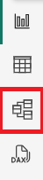


2. Utiliza el diagrama del modelo para revisar el diseño del modelo.

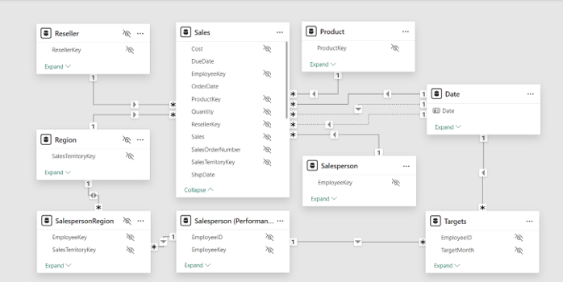


3. Observa que hay tres relaciones entre las **tablas de Fecha** y **Ventas**.

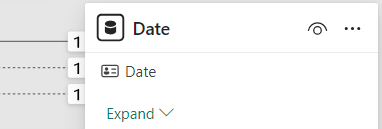

La columna **de fechas** en la tabla **de fechas** es una columna única que representa el lado "uno" de las relaciones. Los filtros aplicados a cualquier columna de la **tabla de fechas** se propagan a la tabla **de ventas** usando una de las relaciones.\*

4. Pasa el cursor sobre cada una de las tres relaciones para resaltar la columna lateral "muchas" en la tabla **de Ventas**.  
5. Observa que la relación entre **Date** y **OrderDate** está activa. El diseño actual del modelo indica que la **tabla de fechas** es una dimensión de rol. Esta dimensión podría representar el papel de la *fecha de pedido*, *fecha de vencimiento* o *fecha de envío*. El rol depende de los requisitos analíticos del informe.

Usaremos DAX más adelante para usar estas relaciones inactivas sin crear otra tabla solo para obtener dos relaciones activas para columnas de fechas diferentes.

### **Visualiza los datos de ventas por fecha**

En esta tarea, visualizarás las ventas totales por año y usarás relaciones inactivas.

1. Cambia a la vista **de informe**.

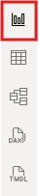

2. Para añadir una imagen de tabla, en el panel **de Visualizaciones**, selecciona el icono visual de **Tabla**.

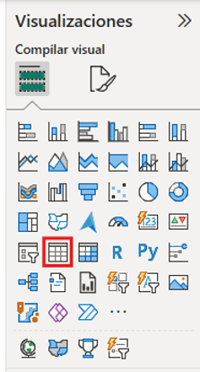
 

3. Para añadir columnas a la visualización de la tabla, en el panel **de Datos** (ubicado a la derecha), primero expande la **tabla de fechas**.  
4. Arrastra la columna **del Año** y suelta la imagen de la tabla.  
5. Abre la tabla de **Ventas** y luego arrastra y suelta la columna **Total** Sales en la imagen de la tabla.

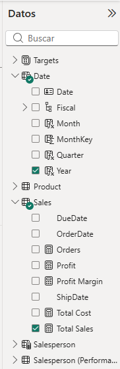

6. Revisa la imagen de la mesa.

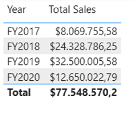


La imagen de la tabla muestra la suma de la columna **de Ventas Totales** agrupada por año. ¿Pero qué significa **Año**? Debido a que existe una relación activa entre las **tablas de Fecha** y **Ventas** y la columna **de Fecha del Pedido**, **Año** significa el año fiscal en el que se realizaron los pedidos.

### **Utiliza relaciones inactivas**

En esta tarea, usarás la función USERELATIONSHIP para activar una relación inactiva.

1. En el panel **de Datos**, haz clic derecho en la tabla **de Ventas** y luego selecciona **Nueva medida**.

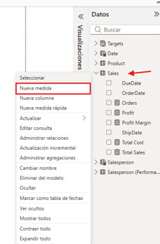


2. En la barra de fórmulas (situada debajo de la cinta), sustituye el texto por la siguiente definición de medida y luego pulsa **Enter**.

```DAX

 Sales Shipped \=

 CALCULATE (

 SUM ('Sales'\[Sales\]),

 USERELATIONSHIP('Date'\[Date\], 'Sales'\[ShipDate\])

 )
```
Esta fórmula utiliza la función CALCULATE para modificar el contexto del filtro. Es la función USERELATIONSHIP la que activa la **relación ShipData**, solo para esta medida.

3. Añade la medida **de Ventas Enviadas** a la imagen de la tabla.  
4. Ampliar la visualización de la tabla para que todas las columnas sean completamente visibles. Observa que la **fila Total** es la misma, pero el importe de ventas de cada año en **Ventas Totales** y **Ventas Enviadas** es diferente. Esa diferencia se debe a que los pedidos se reciben en un año determinado mientras se envían solo al año siguiente o que ni siquiera se han enviado aún.

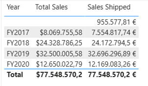


Crear medidas que establezcan temporalmente las relaciones como activas es una forma de trabajar con dimensiones de rol de personaje. Sin embargo, puede volverse tedioso cuando hay que crear versiones de rol para muchos compases. Por ejemplo, si hubiera 10 medidas relacionadas con ventas y tres fechas de juego de rol, podría significar crear 30 medidas. Crearlas con grupos de cálculo facilita el proceso.

## **Crear grupos de cálculo**

En esta tarea, crearás un grupo de cálculo para el análisis de Inteligencia Temporal.

1. Cambiar a la **vista modelo**.

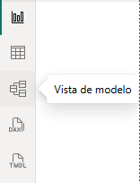


2. En la vista de modelo, selecciona **Grupo de cálculo** para crear una nueva tabla de grupo de cálculo, columna de grupo y elemento. Si aparece una ventana de advertencia, selecciona **Sí** para confirmar la creación del grupo de cálculo.

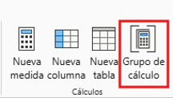

> **Nota:**
Una ***medida implícita*** ocurre cuando, en la vista de Informe, usas una columna de datos del panel de datos directamente en un aspecto visual. El visual te permite agregarlo como una SUMA, PROMEDIO, MÍNIMO, MÁXIMO u otra agregación básica, que se convierte en una medida implícita. Una vez que creas un grupo de cálculo, Power BI Desktop ya no crea medidas implícitas, lo que significa que debes crear medidas explícitamente para agregar columnas de datos.

3. Renombra el grupo de cálculo como *Time Calculations* y la columna de cálculo como *Yearly Calculations*.

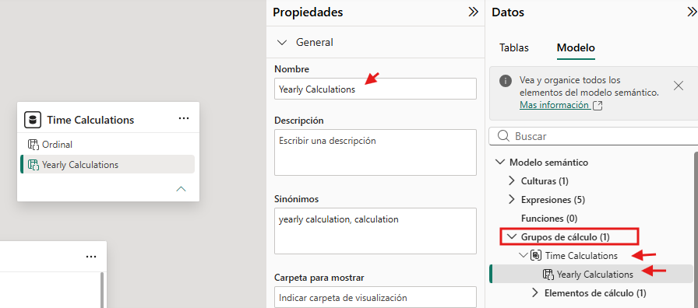


4. En la pestaña **Modelo** del panel **de Datos**, selecciona el ítem de cálculo creado automáticamente con tu grupo de cálculo.  
5. Sustituye y compromete la fórmula del elemento por lo siguiente:

```DAX

Year-to-Date (YTD) \= CALCULATE(SELECTEDMEASURE(), DATESYTD('Date'\[Date\]))
```
6. Haz clic derecho en el campo **Elementos de cálculo** y selecciona **Nuevo elemento de cálculo**.

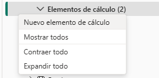


7. Utiliza la siguiente fórmula DAX para el nuevo artículo:

```DAX

Previous Year (PY) \= CALCULATE(SELECTEDMEASURE(), PREVIOUSYEAR('Date'\[Date\]))
```
8. Crea un tercer elemento con la siguiente fórmula DAX:

```DAX

Year-over-Year (YoY) Growth \=

VAR MeasurePriorYear \=

CALCULATE(

	SELECTEDMEASURE(),

	SAMEPERIODLASTYEAR('Date'\[Date\])

)

RETURN

DIVIDE(

	(SELECTEDMEASURE() \- MeasurePriorYear),

	MeasurePriorYear

)
```

El último ítem de cálculo debería devolver valores solo en porcentaje, por lo que necesita una ***cadena de formato dinámico*** para cambiar el formato de las medidas que afecta.

1. En el panel **de Propiedades** del elemento YoY, activa la función **de Formato dinámico de cadena**.  
2. En la barra de fórmulas de DAX, verifica que el campo a su izquierda esté configurado como **Format** y escribe la siguiente cadena de formato: "0.\#\#%"

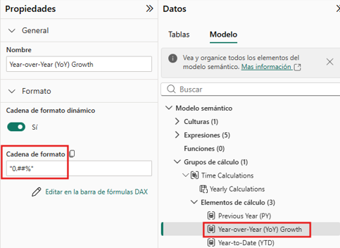


3. Confirma que tu grupo de cálculo es lo siguiente:

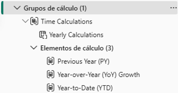


### **Aplicar un grupo de cálculo a las medidas**

En esta tarea, visualizarás cómo los ítems de cálculo afectan a las medidas de forma visual.

1. Cambia a la vista **de informe**.  
2. En la parte inferior del lienzo, selecciona la pestaña **Resumen**.  
3. Selecciona la matriz visual ya creada en el lienzo y arrastra la columna **de cálculo de Cálculos Anuales** desde el panel **de Datos** al campo **Columnas** en el panel **de Visualizaciones**.

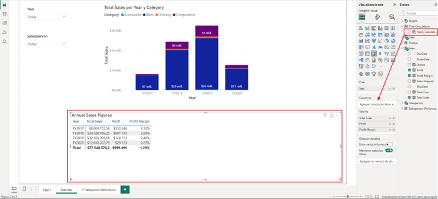

4. Observa que ahora la matriz tiene un conjunto de cifras de ventas para cada artículo de cálculo.

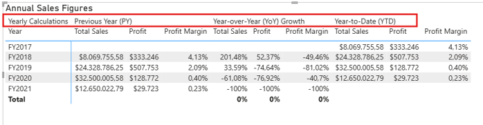

Tener toda esta información en una sola imagen a la vez puede ser difícil de leer y, por tanto, sería conveniente limitar la imagen a una cifra de ventas cada vez. Para ello, podemos usar un parámetro de campo.

## **Crear parámetros de campo**

En esta tarea, crearás parámetros de campo para cambiar los visuales.

1. Selecciona la pestaña **Modelado** en la cinta superior, luego expande el botón **Nuevo parámetro** y **selecciona Campos**.

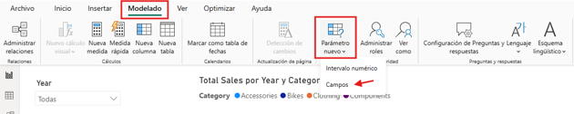


2. En la ventana de Parámetros, renombra el parámetro a **Sales Figures** (Cifras de Ventas), verifica que la opción **Añadir segmentador a esta página** esté marcada y añade los siguientes campos de la tabla de **Sales** (Ventas):

   o   Total Sales (Ventas totales)

   * Profit (Beneficio)  
   * Profit Margin (Margen de beneficio)  
   * Orders (Pedidos)

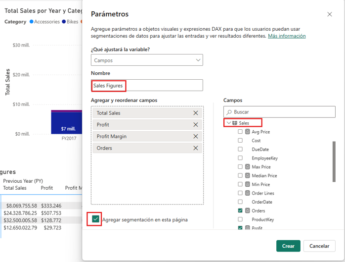

3. **Selecciona Crear**.  
4. Una vez creado el slicer (segmentador), puedes seleccionar la matriz y eliminar todos los campos de **Valores** en el panel de Visualizaciones y añadir en su lugar el parámetro de campo **Sales Figures** (Cifras de Ventas).

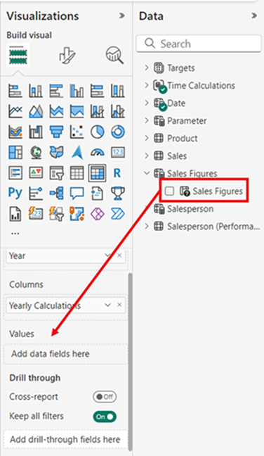

5. Consulta las diferentes cifras de ventas en el segmentador y cómo cambia la matriz cuando se selecciona cada una.  
6. Observa cómo se selecciona el campo Profit (Beneficio) usando el slicer para el parámetro de campo Sales figures (Cifras de Ventas). Esta es la misma matriz de arriba, así que puedes ver los tres elementos de cálculo (PY, YoY, YTD) pero solo se aplican a Profit (Beneficio) por el slicer.

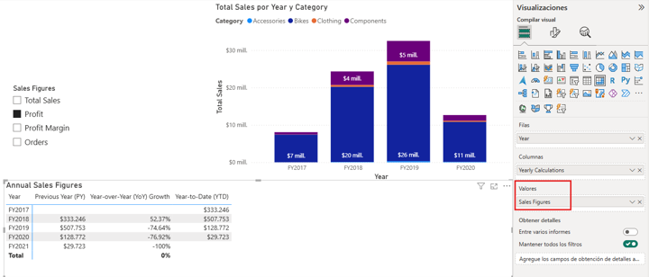

### **Parámetros de campo de edición**

En esta tarea, editarás el parámetro del campo **Sales Figures** (Cifras de Ventas) modificando directamente su expresión DAX.

1. Selecciona la pestaña **de Salesperson Performance (**Rendimiento del Vendedor) en la parte inferior del lienzo. Fíjate en el gráfico de barras agrupado para cambiar el gráfico entre Ventas por mes y Objetivo por mes.

Aunque crear los botones de marcador te permite cambiar el tipo visual con cada opción, si necesitas cambiar entre muchos compases, tendrás que crear un botón de marcador para cada uno y eso puede llevar mucho tiempo. En su lugar, podemos usar un parámetro de campo con todas las medidas que queremos analizar y cambiar rápidamente entre ellas.

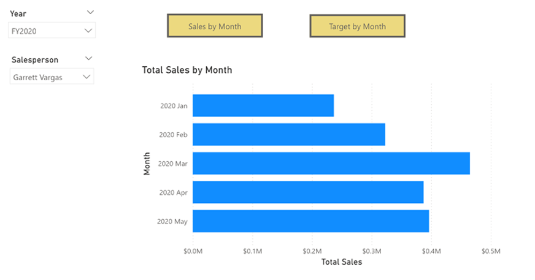


2. Selecciona el gráfico de barras visual y sustituye el campo **Total** Sales en **el eje X** por el parámetro **de campo Sales Numbers**.  
3. Crea una imagen **de Slicer** y arrastra el parámetro **de Cifras de Ventas** al área **de Campo**.

Para esta imagen aún necesitas evaluar el Objetivo por Mes, que no está en el parámetro de campo.

1. Seleccione el parámetro **Cifras de Ventas** en el panel de Datos y añada el campo Objetivo en la expresión DAX del parámetro como se indica a continuación:

```DAX

Sales Figures \= {

 ("Total Sales", NAMEOF('Sales'\[Total Sales\]), 0),

 ("Profit", NAMEOF('Sales'\[Profit\]), 1),

 ("Profit Margin", NAMEOF('Sales'\[Profit Margin\]), 2),

 ("Orders", NAMEOF('Sales'\[Orders\]), 3),

 ("Target", NAMEOF('Targets'\[Target\]), 4\)

}
```

2. Confirma los cambios y verifica que los cambios visuales cambien mientras seleccionas las diferentes cifras de ventas.  
3. Elimina los botones de marcadores y observa el estado final de la página del informe.

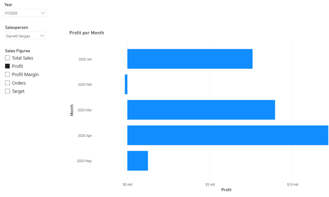

Laboratorio completo

Para terminar el ejercicio, cierra Power BI Desktop: no hace falta guardar el archivo.
