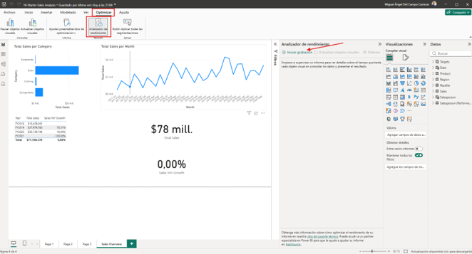
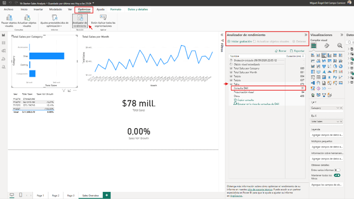
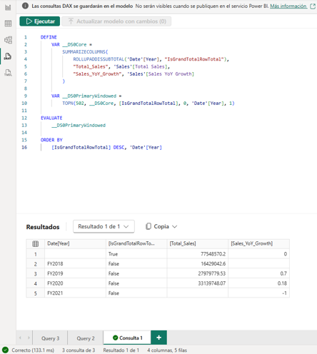
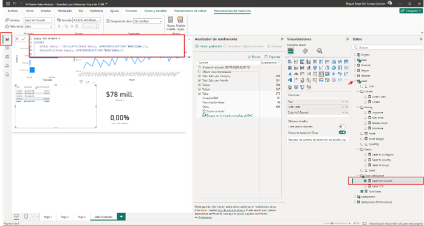
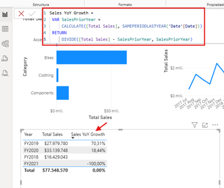
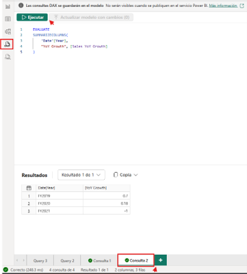
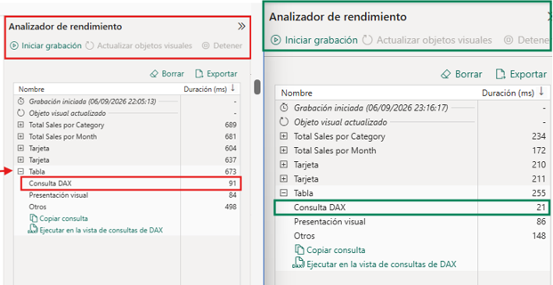

# **4. Optimizar el rendimiento del modelo semántico**

En este ejercicio, abres un informe de Power BI Desktop basado en datos de ventas de AdventureWorks. El informe contiene medidas que utilizan patrones DAX ineficientes. Utilizas el analizador de rendimiento para capturar datos de tiempo, identificar el visual más caro, analizar la consulta DAX, aplicar una optimización y volver a medir para confirmar la mejora. También exploras la cardinalidad examinando las estadísticas de columna en el modelo. Aprendes cómo:

* Utiliza el analizador de rendimiento para capturar e interpretar los datos de temporización para los visuales de informes.  
* Exporta una consulta DAX lenta y analízala en la vista de consulta DAX.  
* Identificar y corregir patrones DAX caros usando variables.  
* Examina la cardinalidad de la columna para entender dónde es mayor el consumo de memoria.  
* Verifica las mejoras de rendimiento comparando mediciones antes y después.

Este laboratorio tarda aproximadamente **30** minutos en completarse.

**Propina:** Para contenido relacionado con la formación, [véase Optimizar el rendimiento de modelos semánticos](https://learn.microsoft.com/training/modules/optimize-semantic-model-performance/).

**Fases del Laboratorio y Técnicas a Dominar**

1. **Análisis con el Analizador de Rendimiento (Performance Analyzer)**  
   * El ejercicio comienza ejecutando el Analizador de rendimiento en Power BI Desktop para capturar los tiempos de respuesta de cada gráfico interactivo.  
   * **Objetivo:** Aislar el problema. Aprenderás a distinguir si el retraso proviene del renderizado (*Visual display*), de la sobrecarga del motor DAX (*DAX query*) o de tiempos de espera de red y procesamiento cruzado (*Other*).  
   * Se te enseñará a extraer la consulta subyacente para inspeccionarla a fondo.  
2. **Optimización de Expresiones DAX**  
   * Corregirás código DAX ineficiente responsable de altos tiempos de CPU.  
   * **Técnica clave:** El uso intensivo de variables (VAR) para almacenar resultados intermedios. Esto obliga al motor a calcular la expresión una sola vez, en lugar de recalcularla por cada fila en un contexto iterativo.  
   * Modificarás sentencias como FILTER. En lugar de filtrar una tabla completa (lo cual desencadena costosas transiciones de contexto), se recomienda aplicar los filtros directamente a columnas específicas (predicados booleanos simples).  
3. **Reducción de Cardinalidad**  
   * El motor analítico en memoria (VertiPaq) comprime peor las columnas con muchos valores distintos (alta cardinalidad).  
   * **El escenario típico:** Dividir una columna DateTime (muy granular, con valores únicos por segundo) en dos columnas separadas: una Date y una Time. Esto reduce drásticamente el tamaño del diccionario de compresión.  
   * Eliminar por completo las columnas que no participan en medidas, segmentadores o relaciones es el paso inicial más efectivo para liberar memoria en una capacidad de Fabric.  
4. **Implementación de Agregaciones**  
   * Para resolver cuellos de botella en tablas de hechos masivas, el laboratorio introduce las tablas de agregación.  
   * Se diseñan tablas agrupadas importadas en memoria (por ejemplo, "Ventas por Mes y Tienda") que resuelven instantáneamente las consultas de alto nivel de los usuarios, enviando a DirectQuery únicamente las consultas que exigen detalles a nivel de transacción individual.

## **Antes de empezar**

Necesitas [instalar Power BI Desktop](https://www.microsoft.com/download/details.aspx?id=58494) (noviembre de 2025 o posterior) para completar este ejercicio. *Nota: Los elementos de la interfaz pueden variar ligeramente según tu versión.*

1. Abre un navegador web e introduce la siguiente URL para descargar la [carpeta zip de 16-optimize-performance](https://github.com/MicrosoftLearning/mslearn-fabric/raw/refs/heads/main/Allfiles/Labs/16/16-optimize-performance.zip):

https://github.com/MicrosoftLearning/mslearn-fabric/raw/refs/heads/main/Allfiles/Labs/16/16-optimize-performance.zip

2. Guarda el archivo en **Descargas** y extrae el archivo zip en la carpeta **16-optimize-performance**.  
3. Abre el archivo **16-Starter-Sales Analysis.pbix** de la carpeta que has extraído.

**Nota:** Ignora y cierra cualquier advertencia que pida aplicar cambios, pero no selecciones *Descartar cambios*.

Este archivo contiene un modelo de ventas de AdventureWorks con una página de informe que incluye varios elementos visuales. Algunas medidas de este modelo usan patrones DAX intencionadamente ineficientes que identificas y corriges.

## **Captura una línea base de rendimiento**

En esta tarea, usas un analizador de rendimiento para medir cuánto tarda cada visual en cargarse. Estos tiempos sirven como referencia para que puedas compararlos después de aplicar una optimización.

1. En Power BI Desktop, accede a la página de informes de **Sales Overview** (Resumen de Ventas).  
2. En la **cinta Optimizar**, selecciona **Analizador de rendimiento**.

El panel del analizador de rendimiento se abre en el lado derecho del lienzo del informe.

3. En el panel del analizador de rendimiento, **selecciona Iniciar grabación**.

Imagen1.png

4. Selecciona **Actualizar imágenes** para recargar todas las imágenes de la página actual.  
5. Espera a que terminen de cargar todas las imágenes y luego **selecciona Detener grabación**.  
6. En los resultados del analizador de rendimiento, amplía la entrada para el **visual de la Tabla**. Esta tabla muestra el año, ventas totales y crecimiento interanual de ventas.  
7. Fíjate en el tiempo **de consulta DAX** (en milisegundos) para esta imagen visual. Esta es tu línea base.

**Nota:** Con el conjunto de datos de AdventureWorks, los tiempos de consulta pueden ser cortos (menos de 500 ms). Eso es de esperar: este conjunto de datos no es grande. El objetivo es aprender el proceso diagnóstico. Incluso un cambio de 80 ms a 30 ms demuestra que la optimización funcionó. Si todos los tiempos parecen idénticos, selecciona **Borrar** y luego **Actualizar visuales** de nuevo para obtener las mediciones sin caché.

## **Analizar la consulta DAX lenta**

En esta tarea, exportas la consulta DAX para el **visual de la Tabla** y examinas su estructura. Luego miras la fórmula de medida subyacente para encontrar el patrón ineficiente.

1. En el panel del analizador de rendimiento, amplía la entrada para el visual **de la tabla** si aún no está ampliada.  
2. Selecciona **Ejecutar en la vista de consulta DAX**. Power BI Desktop abre la vista de consulta DAX con la consulta generada por el visual.  
3. Selecciona **Ejecutar** para ejecutar la consulta. La cuadrícula de resultados muestra los valores para cada año fiscal: y . Total\_Sales  Sales\_YoY\_Growth  
4. Revisa la consulta generada. Se parece algo a esto:

'''DAX

 DEFINE
  VAR \_\_DS0Core \=

   	SUMMARIZECOLUMNS(

     	ROLLUPADDISSUBTOTAL('Date'\[Year\], "IsGrandTotalRowTotal"),

       	"Total\_Sales", 'Sales'\[Total Sales\],

       	"Sales\_YoY\_Growth", 'Sales'\[Sales YoY Growth\]

                   	)
 	VAR \_\_DS0PrimaryWindowed \=

     	TOPN(502, \_\_DS0Core, \[IsGrandTotalRowTotal\], 0, 'Date'\[Year\], 1\)
 EVALUATE
    	\_\_DS0PrimaryWindowed
          
          ORDER BY
     
     \[IsGrandTotalRowTotal\] DESC, 'Date'\[Year\]

     '''

>Nota: Esta consulta no es la definición de medida en sí. Power BI genera esta consulta para llenar el visual. agrupa los datos por año, añade la fila total y limita el recuento de filas. Las medidas ( y ) se mencionan por nombre, pero sus fórmulas no se muestran aquí porque están presentes en el modelo. Para ver la lógica real de la medida, tienes que mirar en la barra de fórmulas. SUMMARIZECOLUMNS ROLLUPADDISSUBTOTAL TOPN \[Total Sales\] \[Sales YoY Growth\]

Imagen2.png

5. Vuelve a **la vista de informe**. En el panel de **Datos**, amplía la tabla **Sales**(Ventas) y selecciona la medida **de Sales YoY Growth** (crecimiento interanual de ventas). La barra de fórmulas muestra la definición de la medida:

'''Codigo

 Sales YoY Growth \=

 DIVIDE(

 	\[Total Sales\] \- CALCULATE(\[Total Sales\], SAMEPERIODLASTYEAR('Date'\[Date\])),

 	CALCULATE(\[Total Sales\], SAMEPERIODLASTYEAR('Date'\[Date\]))

 )
'''

6. Mira la fórmula. La expresión CALCULATE(\[Total Sales\] , SAMEPERIODLASTYEAR('Date'\[Date\])) aparece dos veces, en el numerador y en el denominador, pero calcula el mismo valor en ambas ocasiones. **Esto significa que el motor evalúa el cálculo de ventas del año anterior dos veces por fila en la consulta, lo cual es un desperdicio.**

****

Imagen3.png

Patrones ineficientes comunes como este incluyen:

* **Subexpresiones repetidas**: La misma CALCULATE evaluada varias veces sin almacenarla en un VAR.  
  * **FILTER en una tabla completa**: FILTER(Sales, ...) iterando cada fila en lugar de usar un predicado columna en CALCULATE.  
  * **COUNTROWS(FILTER(...)):** Contar filas iterando una tabla filtrada en lugar de usar CALCULATE(COUNTROWS(...), ...).

La medida de **Sales YoY Growth** (crecimiento interanual de ventas) tiene una subexpresión repetida: the prior-year calculation (el cálculo del año anterior) se evalúa dos veces. En la siguiente tarea, solucionas esto almacenándolo en una variable.

## **Optimizar la medida DAX**

En esta tarea, reescribes la medida de **Sales YoY Growth** (crecimiento interanual de ventas) usando una variable para que el cálculo del año anterior se evalúe solo una vez.

1. En **la vista de informe**, selecciona la medida de **Sales YoY Growth** (crecimiento interanual de ventas) en el panel de **Datos** para que su fórmula aparezca en la barra de fórmulas.  
2. Selecciona todo el texto en la barra de fórmulas y reemplázalo por la siguiente versión optimizada:

'''Código

 Sales YoY Growth \=

 VAR SalesPriorYear \=

 	CALCULATE(\[Total Sales\], SAMEPERIODLASTYEAR('Date'\[Date\]))

 RETURN

 	DIVIDE(\[Total Sales\] \- SalesPriorYear, SalesPriorYear)
'''

Imagen4.png

Las VAR tiendas muestran el resultado del prior-year (año anterior) una vez. La RETURN expresión hace referencia SalesPriorYear  dos veces sin recalcularla.

3. Pulsa **Enter** para confirmar el cambio de fórmula.  
4. Para verificar que la medida sigue devolviendo los valores correctos, cambia a **la vista de consulta DAX**, abre una nueva pestaña de consulta y ejecuta la siguiente consulta:

'''Código

 EVALUATE

 SUMMARIZECOLUMNS(

 	'Date'\[Year\],

 	"YoY Growth", \[Sales YoY Growth\]

 )
'''

Compara los resultados con lo que viste antes. Los valores deberían ser los mismos — por ejemplo, el año fiscal 2019 debería seguir mostrando aproximadamente 0,7 y el año fiscal 2020 aproximadamente 0,18. La optimización cambia la velocidad, no los resultados.

Imagen5.png

## **Examinar la cardinalidad de la columna**

En esta tarea, usas la función COLUMNSTATISTICS() DAX para ver cuántos valores distintos contiene cada columna. Las columnas con alta cardinalidad comprimen menos eficientemente y consumen más memoria. Entender dónde es mayor la cardinalidad te ayuda a tomar decisiones informadas sobre el diseño de modelos.

1. Cambia a **la vista de consulta DAX** en Power BI Desktop.  
2. En una nueva pestaña de consulta, introduce la siguiente consulta y **selecciona Ejecutar**:

'''Código

 DEFINE

 	VAR \_stats \= COLUMNSTATISTICS()

 EVALUATE

 	FILTER(\_stats, NOT CONTAINSSTRING(\[Column Name\], "RowNumber-"))

 ORDER BY \[Cardinality\] DESC
'''

>Este código DAX es una consulta de diagnóstico diseñada para **identificar las columnas que más memoria consumen en tu modelo semántico**, ordenándolas de mayor a menor según su cantidad de valores únicos (cardinalidad).

En el contexto del examen DP-600 y la optimización de modelos en Microsoft Fabric, esta es una técnica fundamental para descubrir cuellos de botella de compresión en el motor VertiPaq.

Aquí tienes el desglose línea por línea de lo que está haciendo el motor:

* DEFINE VAR \_stats \= COLUMNSTATISTICS()  
  * Declara una variable temporal llamada \_stats.  
  * La función COLUMNSTATISTICS() es una función interna de diagnóstico de DAX (no se usa para crear medidas, sino para hacer consultas al modelo). Devuelve una tabla con metadatos de todas las columnas del modelo, incluyendo valores como *Min*, *Max*, *Max Length* y, lo más importante, *Cardinality* (Cardinalidad).  
* EVALUATE  
  * Es el comando que indica al motor que ejecute y devuelva una tabla de resultados (similar a un SELECT en T-SQL).  
* FILTER(\_stats, NOT CONTAINSSTRING(\[Column Name\], "RowNumber-"))  
  * Toma la tabla de estadísticas generada y filtra la salida.  
  * Excluye cualquier columna cuyo nombre contenga "RowNumber-". Estas son columnas internas y ocultas que el motor de Analysis Services/VertiPaq genera automáticamente para mantener la integridad estructural y rastrear errores. Como no puedes optimizarlas ni borrarlas, se filtran para limpiar el ruido del informe.  
* ORDER BY \[Cardinality\] DESC  
  * Ordena los resultados basándose en la **Cardinalidad** de forma descendente.  
  * Las columnas con más valores únicos aparecerán en la parte superior.

>>**Nota>**:

La cuadrícula de resultados devuelve una fila por columna en el modelo, ordenada por el número de valores distintos. El FILTER excluye las columnas internas del sistema que no forman parte de tu modelo. Las columnas con mayor cardinalidad aparecen en la parte superior.

3. Revisa los resultados y observa de dónde provienen las columnas de mayor cardinalidad:  
   * **SalesOrderNumber** en la tabla de **Sales** tiene la cardinalidad más alta (3.616) — casi un valor distinto por fila. Esto es típico para identificadores de transacciones en tablas de hecho.  
   * La **Date** en la **tabla de Date** es la segunda (1.826). La tabla del calendario cubre un rango de fechas más amplio que los datos reales de ventas, por lo que tiene valores más distintos que **OrderDate (**Fecha de pedido) (990) en la tabla de **Sales**.  
   * **Cost** (1.430) y **Sales** (1.411) tienen alta cardinalidad para columnas numéricas — muchos valores decimales distintos. Redondear a menos decimales es una forma de reducir la cardinalidad de las columnas numéricas.  
   * **ResellerKey** (701) y **Reseller** (699) están casi 1:1, lo que se espera para una clave dimensional y su etiqueta.  
4. Fíjate que las columnas de la tabla de hechos (**Sales**) dominan la parte superior de la lista. En un esquema estrella, las tablas dimensionales permanecen pequeñas mientras que las tablas de hechos impulsan el consumo de memoria. Por eso **la optimización de tablas de hechos tiene el mayor impacto**.

## **Verifica las mejoras**

En esta tarea, vuelves a ejecutar el analizador de rendimiento para compararlo con tu línea base ahora que has optimizado la medida de crecimiento interanual de ventas.

1. Cambia a **la vista de Informes** y abre el panel del analizador de rendimiento si aún no está abierto.  
2. **Selecciona Borrar** y luego **selecciona Iniciar grabación**.  
3. **Selecciona Actualizar visuales** y espera a que terminen de cargar todos los visuales.  
4. Selecciona **Detener grabación**.  
5. Amplía la entrada visual **de la Tabla** y compara su tiempo **de consulta DAX** con la línea base que has registrado antes.

>**Nota:** La diferencia absoluta puede ser pequeña con este conjunto de datos. La conclusión importante es el proceso: medir → diagnosticar → arreglar → verificar.

Imagen6.png

## **Pruébalo con Copilot (opcional)**

En esta tarea, usas Copilot en la vista de consultas DAX para obtener sugerencias impulsadas por IA que faciliten y optimizen tus consultas DAX.

Si Copilot está disponible en tu entorno Power BI Desktop, prueba estos pasos adicionales:

1. En el analizador de rendimiento, **selecciona Copiar consulta** para cualquier imagen visual.  
2. Cambia a la vista de consultas DAX. Pega la consulta y pregunta a Copilot:

Simplify this DAX query and suggest performance improvements.

Imagen7.png

3. Revisa las sugerencias de Copilot. Compáralos con la optimización manual que aplicaste.  
4. Pregunta a Copilot:

Explain why evaluating the same CALCULATE expression twice is slower than using a variable.

5. Opcionalmente, pide a Copilot que genere una nueva medida usando las mejores prácticas desde el principio:

Write a measure that calculates profit margin percentage using variables for Sales and Cost.

>**Nota:** Copilot genera nuevas ideas y sugerencias sin cambiar las medidas que ya optimizaste.

## **Limpieza de recursos**

