# **Aplicar la seguridad del modelo semántico**

En este ejercicio, implementará la seguridad a nivel de fila (RLS) en un modelo semántico de Power BI. Comenzará revisando el modelo y creando roles estáticos, luego importará una tabla de asignación de vendedores y configurará un rol dinámico que filtre los datos según la identidad del usuario.

En este ejercicio, aprenderás a:

* Importe y prepare una tabla de asignación de seguridad utilizando Power Query.  
* Configure una relación bidireccional con propagación de filtros de seguridad.  
* Cree roles estáticos y dinámicos utilizando DAX.  
* Validar el comportamiento del rol mediante pruebas con diferentes identidades de usuario.

Este laboratorio tarda aproximadamente **30** minutos en completarse.

**Consejo:** Para obtener contenido de capacitación relacionado, consulte [Aplicar la seguridad del modelo semántico](https://learn.microsoft.com/training/modules/enforce-semantic-model-security/) .

## **Configurar el entorno**

Necesitas tener instalado [Power BI Desktop](https://www.microsoft.com/download/details.aspx?id=58494) (versión de noviembre de 2025 o posterior) para completar este ejercicio. *Nota: Los elementos de la interfaz de usuario pueden variar ligeramente según tu versión.*

1. Abra un navegador web e ingrese la siguiente URL para descargar la [carpeta comprimida 17-enforce-security](https://github.com/MicrosoftLearning/mslearn-fabric/raw/refs/heads/main/Allfiles/Labs/17/17-enforce-security.zip) :

[https://github.com/MicrosoftLearning/mslearn-fabric/raw/refs/heads/main/Allfiles/Labs/17/17-enforce-security.zip](https://github.com/MicrosoftLearning/mslearn-fabric/raw/refs/heads/main/Allfiles/Labs/17/17-enforce-security.zip)

2. Guarda el archivo en la **carpeta Descargas** y extrae el archivo zip en la carpeta **17-enforce-security** .  
3. Abra el archivo **17-Starter-Sales Analysis.pbix** de la carpeta extraída.

> **Nota:** Si una advertencia de seguridad le pide que aplique los cambios, seleccione **Ignorar** o **Cerrar** . No seleccione **Descartar cambios** . Si se le solicita información sobre la conexión a la fuente de datos, ignore la advertencia; no necesitará actualizar los datos en este laboratorio.

## **Revisar el modelo de datos**

En esta tarea, revisarás la estructura del modelo semántico para comprender cómo se relacionan las tablas y dónde se deben aplicar los filtros de seguridad.

1. En Power BI Desktop, a la izquierda, cambie a la vista **Modelo** .

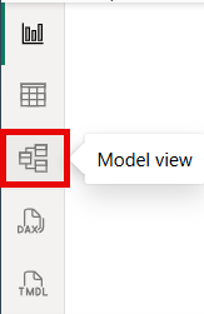

Imagen1.png

2. Revise el diagrama del modelo para ver las relaciones entre las tablas.

El modelo consta de seis tablas de dimensiones y una tabla de hechos en un esquema de estrella. La Sales tabla de hechos almacena los detalles de los pedidos de venta.

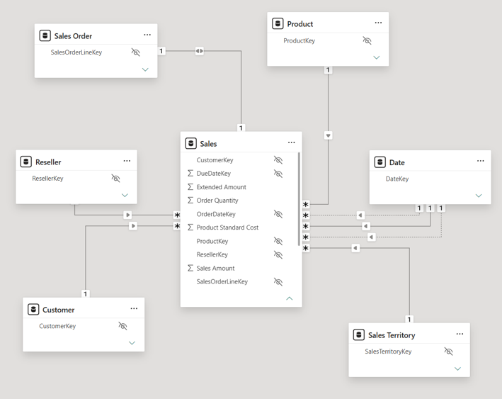

Imagen2.png

3. Amplíe la Sales Territory tabla para ver sus columnas.

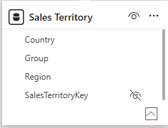

Imagen3.png

4. Localiza la Region columna en la tabla. Esta Region columna almacena las regiones de ventas de Adventure Works.

En esta organización, los vendedores solo pueden ver los datos relacionados con la región de ventas que les ha sido asignada.

## **Crear roles estáticos**

La forma más sencilla de RLS es un rol estático, donde un filtro DAX codifica un valor de campo. Los roles estáticos son útiles para comprender la mecánica de RLS antes de adoptar un enfoque basado en datos. En esta sección, creará dos roles estáticos (uno por región) y validará que cada uno filtre correctamente.

En esta tarea, deberá definir un filtro estático en la Sales Territory tabla para dos regiones.

1. Cambiar a la vista **de informe** .  
2. Observe que el gráfico de columnas apiladas muestra datos para todas las regiones. Esto cambia una vez que se aplica RLS.

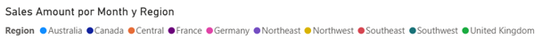

Imagen3b.png

3. En la cinta de **opciones Modelado** , en el grupo **Seguridad** , seleccione **Administrar roles** .

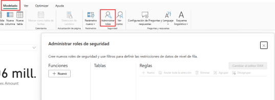 

Imagen4.png

4. Seleccione **\+ Nuevo** , asigne un nombre al rol Australia y seleccione la Sales Territory tabla.  
5. En la sección **Reglas** , seleccione **\+ Nuevo** y configure el filtro:  
   * **Columna** \= Region  
   * **Condición** \= Igual a  
   * **Valor** \= Australia

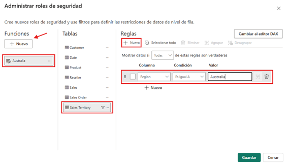

Imagen4b.png

6. Seleccione **\+ Nuevo** nuevamente en la sección **Roles** para agregar un segundo rol llamado Canada, aplicando el mismo filtro para Canada y **Guardar** .

### **Validar los roles estáticos**

En esta tarea, usted confirma que cada rol restringe el informe a la región que le ha sido asignada.

1. En la cinta **de opciones Modelado** , seleccione **Ver como** , seleccione el Australia rol y seleccione **Aceptar** .

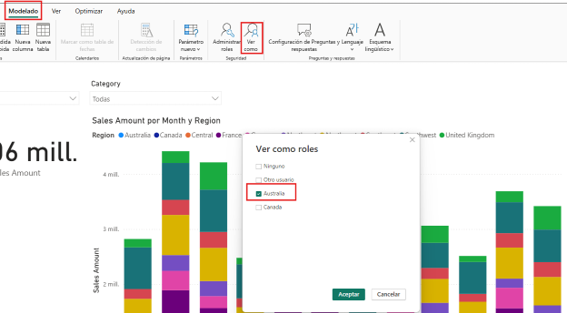

Imagen4c.png

2. Verifique que el gráfico muestre solo datos de Australia y, a continuación, seleccione **Dejar de ver** .

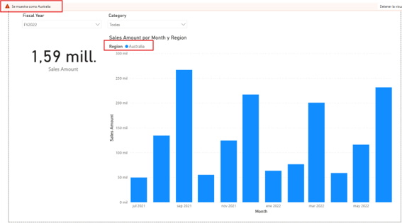

Imagen4d.png

 

3. Repita el proceso para el Canada rol y confirme que solo muestra datos de Canadá, luego seleccione **Dejar de ver** .

Los roles estáticos funcionan, pero no son escalables. Cada nueva región requiere una nueva definición de rol, y cualquier cambio implica actualizar y volver a publicar el modelo semántico. Para 11 regiones de Adventure Works, eso significa crear y mantener 11 roles, y la cantidad aumenta a medida que crece el negocio.

## **Limpiar los recursos**

Elimine los roles estáticos Australia creados Canada en este laboratorio antes de continuar con el siguiente paso.

## **Agregar la tabla Salesperson (Vendedor)**

La seguridad a nivel de fila dinámica requiere una tabla de asignación que vincule cada identidad de usuario con un territorio de ventas. En esta sección, importará la Salesperson tabla desde un archivo CSV, la preparará en Power Query y configurará la relación para que los filtros de seguridad se propaguen correctamente.

### **Importar el archivo CSV**

En esta tarea, utilizará Power Query para importar Salesperson datos del archivo CSV incluido en la carpeta comprimida (zip) extraída.

1. En la cinta **de opciones Inicio** , seleccione **Obtener datos** \> **Texto/CSV** .  
2. Navegue hasta la carpeta extraída **17-enforce-security y seleccione Salesperson.csv** , luego seleccione **Abrir** .  
3. En la ventana de vista previa, verifique que vea tres columnas: EmployeeKey, SalesTerritoryKey, y EmailAddress.

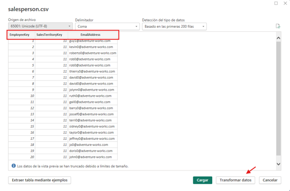
Imagen4e.png

4. Seleccione **Transformar datos** para abrir el Editor de Power Query.

> **Nota:** Seleccionar **Transformar datos** en lugar de **Cargar** permite cambiar el nombre de la columna antes de cargarla en el modelo.

### **Cambiar el nombre de la columna**

En esta tarea, se cambia el nombre de la EmailAddress columna a **UPN** (User Principal Name) para aclarar su propósito como campo de identidad para RLS dinámico.

1. En el Editor de Power Query, haga clic con el botón derecho en el EmailAddress encabezado de la columna y seleccione **Cambiar nombre** .  
2. Reemplaza el texto con UPN y pulsa **Intro** .

*UPN significa Nombre Principal de Usuario. Los valores de esta columna coinciden con los nombres de cuenta de Microsoft Entra, que es lo que devuelve la función DAX USERPRINCIPALNAME().*

3. En la pestaña **Inicio** , seleccione **Cerrar y aplicar** para cargar la tabla en el modelo.

### **Crear y configurar la relación**

En esta tarea, se crea una relación entre la Salesperson tabla y la Sales Territory tabla, y luego se configura para que los filtros de seguridad se propaguen en ambas direcciones.

1. Cambiar a la vista **Modelo** .  
2. Arrastra el SalesTerritoryKey campo de la Salesperson tabla al SalesTerritoryKey campo correspondiente en la Sales Territory tabla para crear una relación.

> **Nota:** Si la relación se creó automáticamente al cargar la tabla, puede omitir el paso de arrastrar y soltar y proceder a configurar sus propiedades.

3. Haga clic con el botón derecho en la línea de relación entre Salesperson y Sales Territory, y luego seleccione **Propiedades** .  
4. En la ventana **Editar relación** , configure **la dirección del filtro cruzado** en **Ambos** .  
5. Marque la casilla **Aplicar filtro de seguridad en ambas direcciones** y **haga clic en Aceptar** .

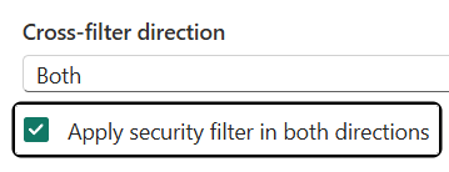

Imagen5.png

La Sales Territory tabla tiene una relación de uno a muchos con la Salesperson tabla. Por defecto, los filtros solo fluyen del lado "uno" ( Sales Territory) al lado "muchos" ( Salesperson).

Para que un filtro de seguridad se Salesperson propague hacia atrás Sales Territory y luego hacia abajo Sales, debe habilitar el filtrado cruzado bidireccional con la opción de filtro de seguridad.

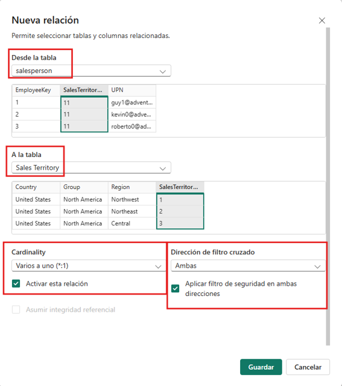

Imagen5b.png

### **Ocultar la tabla Vendedor**

En esta tarea, ocultarás la Salesperson tabla para que no aparezca en las herramientas de creación de informes ni en la sección de preguntas y respuestas.

1. En la vista Modelo, seleccione el Salesperson encabezado de la tabla.  
2. Haga clic con el botón derecho y seleccione **Ocultar en la vista de informe** (o seleccione el icono del ojo en la parte superior derecha de la tabla).

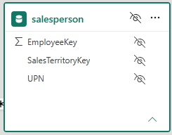

Imagen5c.png

*La Salesperson tabla existe únicamente para controlar los permisos de datos. Ocultarla impide que los autores de informes la utilicen accidentalmente en visualizaciones o que expongan UPN datos.*

## **Crear el rol dinámico**

La seguridad a nivel de fila dinámica evita la creación y el mantenimiento de un rol por región. Un único rol puede servir a todos los usuarios filtrando las filas según la identidad del usuario que ha iniciado sesión.

En esta sección, se crea un rol dinámico que filtra la Salesperson tabla por nombre principal de usuario.

1. En la cinta **de opciones Modelado** , en el grupo **Seguridad** , seleccione **Administrar roles** .

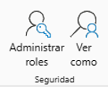

Imagen6.png

2. Seleccione **\+ Nuevo** , asigne un nombre al rol Salespeople, seleccione la Salesperson tabla y, a continuación, seleccione **Cambiar al editor DAX** .

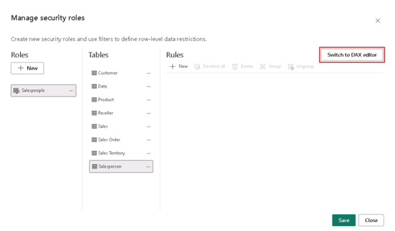

Imagen7.png

3. Introduzca la siguiente expresión:

**código**

 \[UPN\] \= USERPRINCIPALNAME()

4. Seleccione **Guardar** .

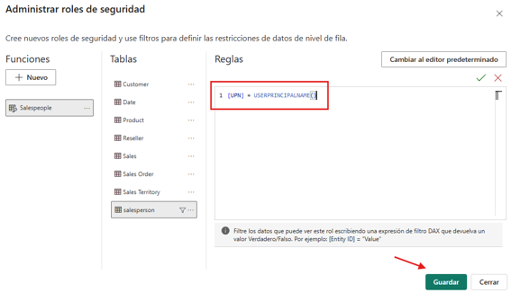

Imagen7b.png

Esta expresión conserva únicamente las filas cuyo UPN valor coincide con la identidad del usuario autenticado. Debido al filtro de seguridad bidireccional que configuró anteriormente, este filtro se propaga de Salesperson\-\> Sales Territory\-\> Sales, restringiendo al usuario a los datos de su región asignada.

## **Validar el rol dinámico**

En esta sección, se prueba el rol dinámico para un usuario asignado y un usuario no asignado para demostrar cómo un mismo rol devuelve resultados diferentes en función de la identidad del usuario.

### **Prueba el rol como otro usuario modelo.**

En esta tarea, usted confirma que el mismo rol devuelve un resultado filtrado diferente cuando se evalúa para otra identidad.

1. En la cinta **de opciones Modelado** , seleccione **Ver como** .  
2. Seleccione **Otro usuario** e ingrese michael9@adventure-works.com.  
3. Verifique el Salespeople rol y luego seleccione **Aceptar** .

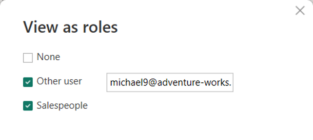

Imagen8.png

4. Verifique que el informe ahora muestre datos solo para la Northeast región (territorio asignado a michael9). 
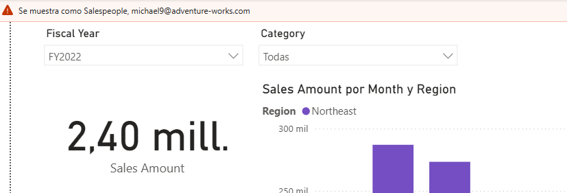

Imagen8b.png

5. Seleccione **Detener visualización** .

 

### **Prueba como usuario no asignado**

En esta tarea, usted confirma que el RLS dinámico rechaza los datos cuando no existe ninguna fila UPN coincidente.

1. Seleccione **Ver como** \> **Otro usuario** .  
2. Introduzca nomatch@adventure-works.com, marque Salespeople y seleccione **Aceptar** .  
3. Verifique que el informe no muestre datos.

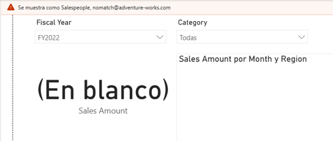

Imagen9.png

4. Seleccione **Detener visualización** .

## **Limpiar los recursos**

1. Cierre Power BI Desktop sin guardar.

