# Laboratorio 1: Implementar Continuous Integration and Continuous Delivery (CI-CD) en Microsoft Fabric

## Índice
* [Objetivos](#objetivos)
* [Requisitos Previos](#requisitos-previos)
* [1. Crear Espacios de Trabajo (Workspaces)](#1-crear-espacios-de-trabajo-workspaces)
* [2. Crear una Canalización de Despliegue (Deployment Pipeline)](#2-crear-una-canalización-de-despliegue-deployment-pipeline)
* [3. Asignar Espacios de Trabajo a las Etapas](#3-asignar-espacios-de-trabajo-a-las-etapas)
* [4. Crear Contenido](#4-crear-contenido)
* [5. Desplegar Contenido entre Fases](#5-desplegar-contenido-entre-fases)
* [6. Limpieza](#6-limpieza)

## Objetivos
* Configurar una estrategia de ALM mediante la creación de tres entornos aislados (Desarrollo, Prueba y Producción).
* Crear y configurar un Deployment Pipeline para enlazar los entornos.
* Promocionar un artefacto (Lakehouse) entre las diferentes etapas del ciclo de vida.

## Requisitos Previos
* Ser miembro del rol de administrador del espacio de trabajo de Fabric.
* Acceso a una capacidad de pago o de prueba (Trial) de Fabric.

> [!IMPORTANT]
> Solo las áreas de trabajo respaldadas por una capacidad Fabric (F SKUs) o Premium (P SKUs) pueden participar en un Deployment Pipeline. Un área de trabajo en modo "Pro" no funcionará.

---

## 1. Crear Espacios de Trabajo (Workspaces)
Para aislar los entornos, crearemos tres contenedores físicos:

1. Navega a la [página principal de Microsoft Fabric](https://app.fabric.microsoft.com/home?experience=fabric) e inicia sesión.
2. En la barra lateral izquierda, selecciona **Espacios de trabajo** (icono 🗇).
3. Crea un nuevo espacio de trabajo llamado **Desarrollo**, seleccionando un modo de licencia que incluya capacidad de Fabric.
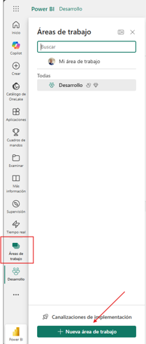

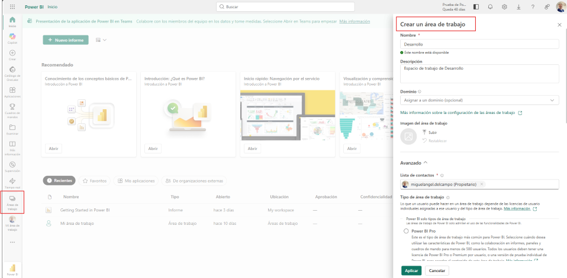

4. Repite el proceso para crear los espacios **Pruebas_PRD_WS** y **Produccion_PRD_WS**.

> [!TIP]
> En entornos reales, utiliza nomenclatura estricta (ej. [Proyecto]_DEV_WS, [Proyecto]_PRD_WS) y segrega los permisos: acceso total en Desarrollo, solo lectura en Prueba, y acceso restringido en Producción.

---

## 2. Crear una Canalización de Despliegue (Deployment Pipeline)
Define la ruta lógica de promoción y vincula los contenedores físicos:

1. En la barra de menú izquierda, selecciona **Espacios de trabajo** > **Pipelines de despliegue** > **Nuevo pipeline**.
2. Nombra la canalización como `PlineDestoTesttoProd` y selecciona **Crear y continuar**.

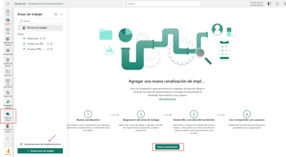

---

## 3. Asignar Espacios de Trabajo a las Etapas
1. Selecciona la canalización creada en el menú lateral.
2. En cada etapa (Development, Test, Production), despliega las opciones de **Asignar un espacio de trabajo** y selecciona el área correspondiente.
3. Confirma la asignación seleccionando la marca de verificación.

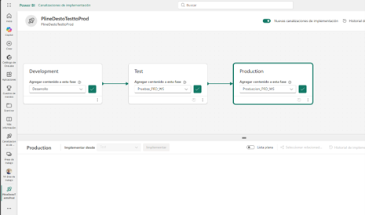

---

## 4. Crear Contenido
Generaremos un artefacto para someterlo al proceso de despliegue:

1. Navega al espacio de trabajo **Desarrollo**.
2. Selecciona **Nuevo elemento** > **Lakehouse**, nómbralo `LabLakehouse` y selecciona **Crear**.

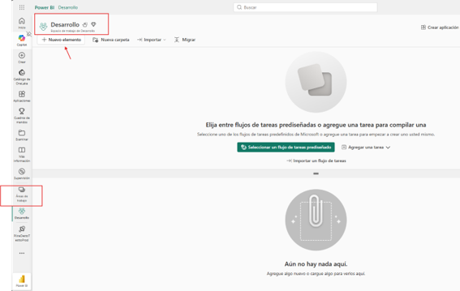
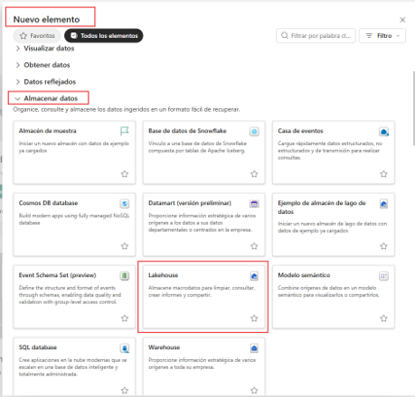
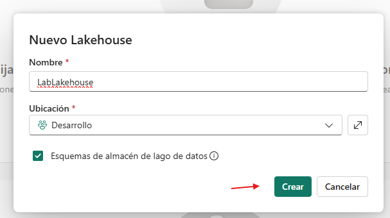

3. En el explorador del Lakehouse, selecciona **Empezar con datos de muestra**.

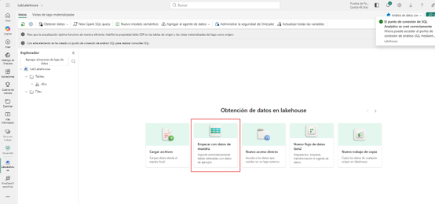

> [!NOTE]
> Los Deployment Pipelines de Fabric solo copian metadatos, no los datos físicos. Al desplegar el Lakehouse, la estructura y los esquemas se replicarán, pero los datos de muestra permanecerán exclusivamente en Desarrollo.

---

## 5. Desplegar Contenido entre Fases
Promocionaremos el artefacto desde Desarrollo hasta Producción:

1. Selecciona la etapa **Test** en la canalización y haz clic en **Desplegar** para copiar el Lakehouse.

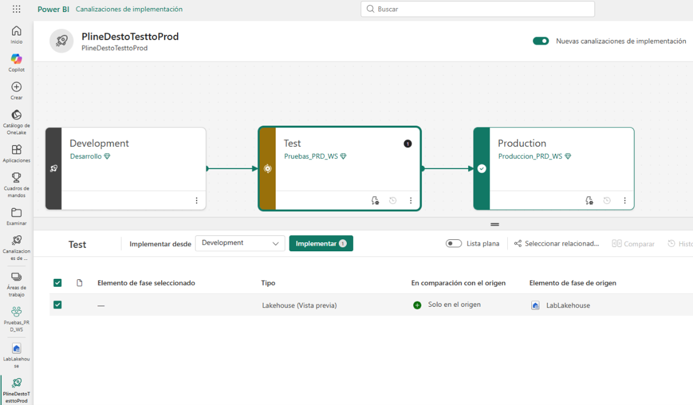
2. Una vez sincronizado, selecciona la etapa **Production** y repite el proceso de despliegue.

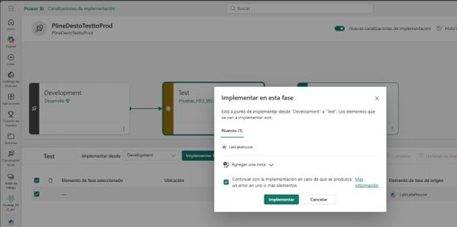

3. Verifica que las marcas verdes indiquen que todas las fases están sincronizadas.

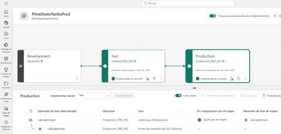
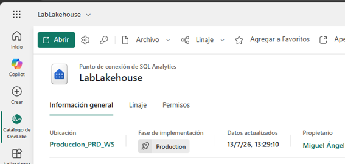

> [!IMPORTANT]
> El significado de los iconos es crítico:
> * **X roja/círculo:** Diferencia de metadatos (Drift).
> * **Check verde:** Artefactos idénticos.
> * **Icono de advertencia:** Fallo en el último despliegue o elemento no soportado.

---

## 6. Limpieza
Para finalizar el laboratorio, elimina los recursos creados:
1. Elimina la canalización de despliegue desde el menú de configuración.

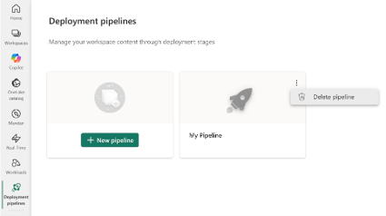
2. Elimina los espacios de trabajo creados desde la **Configuración del espacio de trabajo** > **Eliminar este espacio de trabajo**.

---

⬅️ [Anterior](../readmeLab.md) | 🏠 [Inicio](../../Readmedp-700.md) | ➡️ [Siguiente](../2.Get_started_with_Copilot_in_Microsoft_Fabric_for_Data_Warehouse/readme2.md)

```