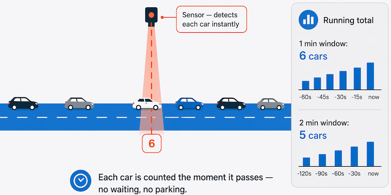
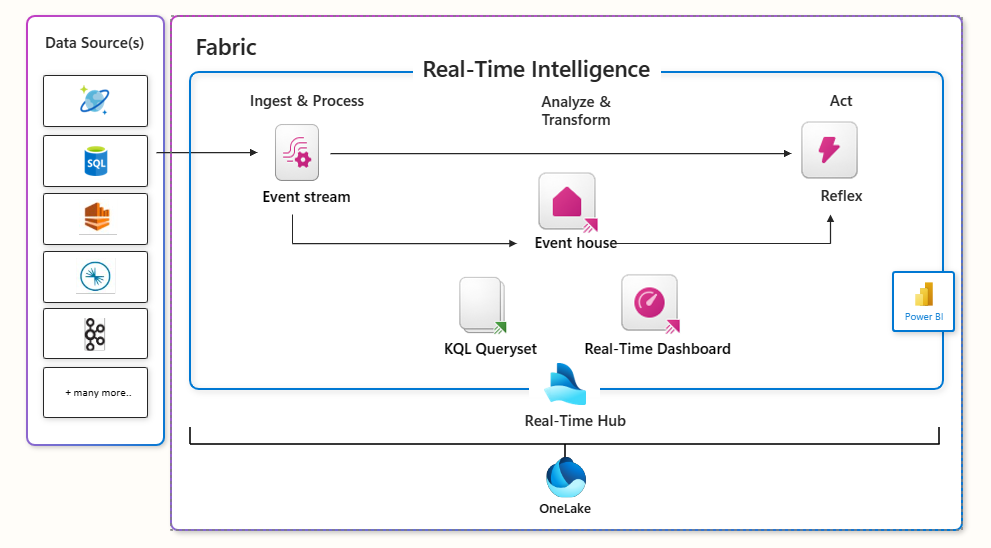

# Explora los fundamentos del análisis en tiempo real

## Índice

- [Introducción](#introducción)
- [Comprender el procesamiento por lotes y en tiempo real](#comprender-el-procesamiento-por-lotes-y-en-tiempo-real)
- [Comprender el procesamiento de flujos](#comprender-el-procesamiento-de-flujos)
- [Comprender las diferencias entre los datos por lotes y los datos en tiempo real](#comprender-las-diferencias-entre-los-datos-por-lotes-y-los-datos-en-tiempo-real)
- [Combine el procesamiento por lotes y el procesamiento en tiempo real](#combine-el-procesamiento-por-lotes-y-en-tiempo-real)
- [Explorar los elementos comunes de la arquitectura de procesamiento de flujos](#explorar-los-elementos-comunes-de-la-arquitectura-de-procesamiento-de-flujos)
- [Explore la inteligencia en tiempo real de Microsoft Fabric](#explore-la-inteligencia-en-tiempo-real-de-microsoft-fabric)
- [Explora el streaming estructurado de Apache Spark](#explora-el-streaming-estructurado-de-apache-spark)
- [Ejercicio: Explorar la inteligencia en tiempo real de Microsoft Fabric](#ejercicio-explorar-la-inteligencia-en-tiempo-real-de-microsoft-fabric)
- [Resumen](#resumen)

---

## Introducción

Aprenda los conceptos básicos del procesamiento de flujos de datos y los servicios de Microsoft Azure que puede utilizar para implementar soluciones de análisis en tiempo real.

### Objetivos de aprendizaje
En este módulo aprenderás a:
- Compare el procesamiento por lotes y el procesamiento en tiempo real.
- Describa los elementos comunes de las soluciones de transmisión de datos.
- Describa las características y capacidades de la inteligencia en tiempo real en Microsoft Fabric.
- Describa las características y capacidades de Apache Spark Structured Streaming en Azure.
- Explore las analíticas en tiempo real en Microsoft Fabric.

El mayor uso de la tecnología por parte de individuos, empresas y otras organizaciones, junto con la proliferación de dispositivos inteligentes y el acceso a Internet, ha dado lugar a un crecimiento masivo en el volumen de datos que se pueden generar, capturar y analizar. 

Gran parte de estos datos se pueden procesar en tiempo real (o casi en tiempo real) como un flujo continuo de información, lo que permite crear sistemas que revelan información y tendencias al instante, o que toman medidas inmediatas ante los eventos a medida que ocurren.

> [!NOTE]
> Este módulo está diseñado para presentar una visión general conceptual del procesamiento en tiempo real y describir los servicios de Azure que se pueden usar para crear soluciones de análisis en tiempo real. No pretende enseñar detalles de implementación para crear una solución de procesamiento de flujos de datos.

> [!NOTE]
> Reconocemos que cada persona aprende de manera diferente. Puedes completar este módulo en formato de video o leer el contenido en formato de texto e imágenes. El texto contiene más detalles que los videos, por lo que en algunos casos te resultará útil como material complementario a la presentación en video.

---

## Comprender el procesamiento por lotes y en tiempo real

El procesamiento de datos es simplemente la conversión de datos brutos en información significativa a través de un proceso. Existen dos formas generales de procesar datos:
- **Procesamiento por lotes:** En el que se recopilan y almacenan múltiples registros de datos antes de procesarlos conjuntamente en una sola operación.
- **Procesamiento de flujos de datos:** En el que una fuente de datos se supervisa y procesa constantemente en tiempo real a medida que se producen nuevos eventos de datos.

### Comprender el procesamiento por lotes (batch)
En el procesamiento por lotes, los elementos de datos que llegan se recopilan y almacenan, y todo el grupo se procesa conjuntamente como un lote. El momento exacto en que se procesa cada grupo se puede determinar de varias maneras. Por ejemplo, se pueden procesar los datos según un intervalo de tiempo programado (por ejemplo, cada hora), o bien, se puede activar cuando llega una cierta cantidad de datos, o como resultado de algún otro evento.

Por ejemplo, supongamos que desea analizar el tráfico rodado contando el número de coches en un tramo de carretera. Un método de procesamiento por lotes para esto requeriría que recoja los coches en un aparcamiento y luego los cuente en una sola operación mientras están parados.

Si la carretera está muy transitada, con un gran número de coches circulando a intervalos frecuentes, este método puede resultar poco práctico; y tenga en cuenta que no obtendrá ningún resultado hasta que haya aparcado un grupo de coches y los haya contado.

Un ejemplo real de procesamiento por lotes es la forma en que las compañías de tarjetas de crédito gestionan la facturación. El cliente no recibe una factura por cada compra individual realizada con tarjeta de crédito, sino una única factura mensual por todas las compras de ese mes.

| Aspecto | Ventajas del procesamiento por lotes | Desventajas del procesamiento por lotes |
| :--- | :--- | :--- |
| **Capacidad de procesamiento** | Es posible procesar grandes volúmenes de datos de forma eficiente y en el momento más conveniente. | Todos los datos de entrada deben estar completamente preparados antes de que pueda comenzar el procesamiento. |
| **Uso del sistema** | Los trabajos pueden programarse durante los periodos de inactividad o de baja actividad (como por la noche), lo que mejora la utilización de los recursos. | Suele haber un retraso entre la introducción de datos y la recepción de los resultados. |
| **Fiabilidad y gestión de errores** | — | Los errores en los datos, los bloqueos del sistema o los fallos del programa pueden detener todo el proceso por lotes. |
| **Validación de datos** | — | Los datos de entrada deben revisarse cuidadosamente antes de volver a ejecutar el trabajo por lotes. |
| **Impacto de los errores menores** | — | Incluso pequeños errores en los datos pueden impedir que todo el proceso por lotes se ejecute correctamente. |

---

## Comprender el procesamiento de flujos

En el procesamiento de flujos de datos, cada nuevo dato se procesa al llegar. A diferencia del procesamiento por lotes, no hay que esperar al siguiente intervalo de procesamiento: los datos se procesan como unidades individuales en tiempo real, en lugar de procesarse por lotes. El procesamiento de flujos de datos resulta beneficioso en escenarios donde se generan datos nuevos y dinámicos de forma continua.

Por ejemplo, un mejor enfoque para nuestro hipotético problema de conteo de automóviles podría ser aplicar un enfoque de transmisión continua, contando los automóviles en tiempo real a medida que pasan:

Con este método, no es necesario esperar a que todos los coches estén aparcados para empezar a procesarlos, y se pueden agregar los datos en intervalos de tiempo; por ejemplo, contando el número de coches que pasan cada minuto.

Algunos ejemplos reales de transmisión de datos include:
- Una institución financiera realiza un seguimiento de los cambios en el mercado de valores en tiempo real, calcula el valor en riesgo y reequilibra automáticamente las carteras en función de las fluctuaciones del precio de las acciones.
- Una empresa de juegos en línea recopila datos en tiempo real sobre las interacciones de los jugadores con el juego y los introduce en su plataforma de juego. A continuación, analiza los datos en tiempo real y ofrece incentivos y experiencias dinámicas para mantener a sus jugadores entretenidos.
- Un sitio web inmobiliario que rastrea un subconjunto de datos de dispositivos móviles y realiza recomendaciones de propiedades en tiempo real para visitar en función de su ubicación geográfica.

El procesamiento de datos en tiempo real es ideal para operaciones críticas que requieren una respuesta inmediata. Por ejemplo, un sistema que monitorea un edificio para detectar humo y calor necesita activar alarmas y desbloquear puertas para permitir que los residentes escapen de inmediato en caso de incendio.

---

## Comprender las diferencias entre los datos por lotes y los datos en tiempo real

Además de la forma en que el procesamiento por lotes y el procesamiento en tiempo real manejan los datos, existen otras diferencias:
- **Alcance de los datos:** El procesamiento por lotes puede procesar todos los datos del conjunto de datos. El procesamiento en tiempo real normalmente solo tiene acceso a los datos recibidos más recientes o dentro de una ventana de tiempo móvil (los últimos 30 segundos, por ejemplo).
- **Tamaño de los datos:** El procesamiento por lotes es adecuado para manejar grandes conjuntos de datos de manera eficiente. El procesamiento en tiempo real está diseñado para registros individuales o microlotes que constan de pocos registros.
- **Rendimiento:** La latencia es el tiempo que tardan los datos en recibirse y procesarse. La latencia para el procesamiento por lotes suele ser de unas pocas horas. El procesamiento en tiempo real generalmente se produce de forma inmediata, con una latencia del orden de segundos o milisegundos.
- **Análisis:** Normalmente, el procesamiento por lotes se utiliza para realizar análisis complejos. El procesamiento en tiempo real se utiliza para funciones de respuesta simples, agregaciones o cálculos como promedios móviles.

---

## Combine el procesamiento por lotes y el procesamiento en tiempo real

Muchas soluciones analíticas a gran escala incluyen una combinación de procesamiento por lotes y en tiempo real, lo que permite el análisis de datos históricos y en tiempo real. Es común que las soluciones de procesamiento en tiempo real capturen datos en tiempo real, los procesen filtrándolos o agregándolos y los presenten a través de paneles y visualizaciones en tiempo real (por ejemplo, mostrando el total acumulado de automóviles que han pasado por una carretera en la hora actual), al tiempo que almacenan los resultados procesados ​​en un repositorio de datos para el análisis histórico junto con los datos procesados ​​por lotes (por ejemplo, para permitir el análisis de los volúmenes de tráfico durante el último año).

Cuando no se requiere análisis o visualización de datos en tiempo real, las tecnologías de transmisión se utilizan a menudo para capturar datos en tiempo real y almacenarlos en un repositorio de datos para su posterior procesamiento por lotes (esto equivale a redirigir todos los coches que circulan por una carretera a un aparcamiento antes de contarlos).

El siguiente diagrama muestra una **arquitectura lambda**, un patrón común para combinar el procesamiento por lotes y el procesamiento en tiempo real en una solución de análisis de datos a gran escala.

1. Los eventos de datos procedentes de una fuente de datos en tiempo real se capturan en tiempo real.
2. Los datos procedentes de otras fuentes se introducen en un almacén de datos (a menudo un Data Lake) para su procesamiento por lotes.
3. Si no se requieren análisis en tiempo real, los datos de transmisión capturados se escriben en el almacén de datos para su posterior procesamiento por lotes.
4. Cuando se requiere análisis en tiempo real, se utiliza una tecnología de procesamiento de flujos de datos para preparar los datos en tiempo real para su análisis o visualización; a menudo, filtrando o agregando los datos en ventanas temporales.
5. Los datos que no se transmiten en tiempo real se procesan periódicamente por lotes para prepararlos para el análisis, y los resultados se almacenan en un repositorio de datos analíticos (a menudo denominado Almacén de datos o Data Warehouse) para el análisis histórico.
6. Los resultados del procesamiento de flujos de datos también pueden almacenarse en el repositorio de datos analíticos para respaldar el análisis histórico.
7. Se utilizan herramientas analíticas y de visualización para presentar y explorar los datos históricos y en tiempo real.

> [!NOTE]
> Las arquitecturas de solución más utilizadas para el procesamiento combinado de datos por lotes y en tiempo real incluyen las arquitecturas Lambda y Delta. La arquitectura Kappa es una alternativa más sencilla que elimina por completo la capa de procesamiento por lotes independiente, tratando todos los datos como un flujo continuo y reproduciéndolos cuando se requiere reprocesamiento histórico. Plataformas modernas como Microsoft Fabric y Apache Kafka hacen que las soluciones de estilo Kappa sean cada vez más prácticas. Los detalles de estas arquitecturas quedan fuera del alcance de este curso.

---

## Explorar los elementos comunes de la arquitectura de procesamiento de flujos

Existen muchas tecnologías que se pueden utilizar para implementar una solución de procesamiento de flujos de datos, pero si bien los detalles específicos de la implementación pueden variar, la mayoría de las arquitecturas de procesamiento de flujos de datos comparten elementos comunes.

### Una arquitectura general para el procesamiento de flujos de datos
En su forma más simple, una arquitectura de alto nivel para el procesamiento de flujos de datos se ve así:

- **Eventos:** Un evento genera datos. Esto puede ser una señal emitida por un sensor, un mensaje publicado en redes sociales, una entrada en un archivo de registro o cualquier otro suceso que genere datos digitales.
- **Source / Queue (Fuente / Cola):** Los datos generados se capturan en una fuente de transmisión para su procesamiento. En casos sencillos, la fuente puede ser una carpeta en un almacén de datos en la nube o una tabla en una base de datos. En soluciones de transmisión más robustas, la fuente puede ser una cola que encapsula la lógica para garantizar que los datos de los eventos se procesen en orden y que cada evento se procese solo una vez.
- **Perpetual Query (Consulta continua):** Los datos del evento se procesan, a menudo mediante una consulta continua que opera sobre los datos del evento para seleccionar datos para tipos específicos de eventos, proyectar valores de datos o agregar valores de datos durante períodos temporales (o ventanas), por ejemplo, contando el número de emisiones de sensores por minuto.
- **Sink (Destino):** Los resultados de la operación de procesamiento de flujo se escriben en una salida (o destino), que puede ser un archivo, una tabla de base de datos, un panel visual en tiempo real u otra cola para su posterior procesamiento mediante una consulta posterior.

### Servicios de análisis en tiempo real
Microsoft admite varias tecnologías que puede utilizar para implementar análisis en tiempo real de datos en streaming, entre las que se incluyen:
- **Microsoft Fabric Real-Time Intelligence:** Un conjunto completo e integrado de herramientas para datos en tiempo real, incorporado a Microsoft Fabric. Incluye Eventstreams (para ingerir, enrutar y transformar datos de transmisión), Eventhouse (una base de datos optimizada para datos de series temporales y eventos, consultada mediante KQL — Kusto Query Language, un lenguaje de consulta diseñado para el análisis rápido de registros y telemetría), Real-Time Dashboards (para la visualización de datos en vivo) y Activator (para activar acciones automatizadas cuando los datos de transmisión cumplen las condiciones definidas). La asistencia de IA en Fabric Real-Time Intelligence le ayuda a generar consultas KQL a partir de preguntas en lenguaje natural.
- **Spark Structured Streaming:** Una biblioteca de código abierto que permite desarrollar soluciones de streaming complejas en servicios basados ​​en Apache Spark, como Azure Databricks y Microsoft Fabric.
- **Azure Stream Analytics:** Una solución de plataforma como servicio (PaaS) que permite definir trabajos de streaming que ingieren datos de una fuente de streaming, aplican una consulta continua y escriben los resultados en una salida. Es una opción sólida para escenarios de streaming independientes o híbridos fuera de Fabric.

### Fuentes para el procesamiento de flujos
Los siguientes servicios se utilizan habitualmente para la ingesta de datos para el procesamiento de flujos en Azure:
- **Azure Event Hubs:** Un servicio de ingesta de datos que puede utilizar para administrar colas de datos de eventos, para garantizar que cada evento se procese en orden y exactamente una vez.
- **Azure IoT Hub:** Un servicio de ingesta de datos similar a Azure Event Hubs, pero optimizado para administrar datos de eventos de dispositivos de Internet de las cosas (IoT).
- **Azure Data Lake Store Gen 2:** Un servicio de almacenamiento altamente escalable que se utiliza a menudo en escenarios de procesamiento por lotes, pero que también puede utilizarse como fuente de datos en tiempo real.
- **Apache Kafka:** Una solución de ingesta de datos de código abierto que se usa comúnmente junto con Apache Spark.

### Sumideros para el procesamiento de flujos
El resultado del procesamiento de flujos de datos se suele enviar a los siguientes servicios:
- **Azure Event Hubs:** Se utiliza para poner en cola los datos procesados ​​para su posterior procesamiento.
- **Azure Data Lake Store Gen 2, Microsoft OneLake o Azure Blob Storage:** Se utilizan para conservar los resultados procesados ​​como un archivo.
- **Azure SQL Database, Azure Databricks o Microsoft Fabric:** Se utilizan para almacenar los resultados procesados ​​en una tabla para su consulta y análisis.
- **Microsoft Power BI:** Se utiliza para generar visualizaciones de datos en tiempo real en informes y paneles de control.

---

## Explore la inteligencia en tiempo real de Microsoft Fabric

Microsoft Fabric Real-Time Intelligence es un conjunto de herramientas integradas en Microsoft Fabric para la ingesta, el procesamiento y el análisis de datos en tiempo real. Abarca todo el proceso, desde la llegada de los datos hasta su visualización y la automatización de acciones: permite conectarse a fuentes de eventos, almacenar y conocer los datos entrantes, crear paneles en tiempo real y configurar alertas que se activan cuando se cumplen ciertas condiciones, todo ello dentro del mismo espacio de trabajo de Fabric.

### Centro de control en tiempo real (Real-Time Hub)
El centro de datos en tiempo real de Microsoft Fabric funciona como un catálogo centralizado para su organización. Simplifica el acceso, la adición, la exploración y el intercambio de datos. Al catalogar las fuentes de datos de toda la organización, proporciona un único lugar para descubrir y compartir datos en tiempo real. El centro permite que los datos estén disponibles y accesibles para su consulta y análisis. Puede compartir datos en tiempo real de múltiples fuentes para respaldar el análisis en diferentes equipos y dominios.

### Exploración de datos con inteligencia en tiempo real
Para explorar datos con Real-Time Intelligence, primero seleccione un flujo de datos de su organización o de fuentes externas/internas conectadas y, a continuación, podrá utilizar las herramientas de Real-Time Intelligence para explorar datos y visualizar patrones, anomalías y cantidades de pronóstico.

Los paneles en tiempo real simplifican la comprensión de los datos, accesibles para todos mediante herramientas visuales, lenguaje natural y Copilot. Posteriormente, puede convertir la información en acciones configurando alertas de Activator para que reaccionen en tiempo real.

> [!NOTE]
> Para obtener más información sobre las capacidades de Microsoft Fabric Real-Time Intelligence, consulte la documentación de Real-Time Intelligence en Microsoft Fabric.

---

## Explora el streaming estructurado de Apache Spark

Apache Spark es un potente motor de procesamiento de datos diseñado para gestionar grandes cantidades de datos rápidamente. En lugar de procesar los datos en un solo ordenador, Spark distribuye el trabajo entre varias máquinas (un clúster), de modo que todo se ejecuta en paralelo. Puedes usar Spark en Microsoft Azure en los siguientes servicios:
- Microsoft Fabric
- Azure Databricks

Spark admite código escrito en Python, Scala o Java, y puede gestionar tanto el procesamiento por lotes como el procesamiento en tiempo real.

### Streaming estructurado de Spark (Spark Structured Streaming)
Spark Structured Streaming es una biblioteca integrada en Spark que simplifica el trabajo con datos en tiempo real. Imagínelo como una forma de tratar un flujo de datos en vivo de la misma manera que trabajaría con una tabla en una hoja de cálculo, con la diferencia de que la tabla crece en tiempo real a medida que llegan nuevos datos.

Así es como funciona en la práctica:
1. Te conectas a una fuente de transmisión; por ejemplo, una cola de mensajes como Azure Event Hubs, una carpeta de archivos o una fuente de red.
2. Spark lee los datos entrantes y los almacena en un DataFrame, que es esencialmente una tabla de filas y columnas que se llena continuamente con nuevos datos a medida que llegan los eventos.
3. Se escribe una consulta sobre ese DataFrame; por ejemplo, para contar eventos por minuto o calcular un promedio móvil.
4. Los resultados de la consulta se escriben en una salida (un destino), como un archivo, una base de datos o un panel de control.

Spark Structured Streaming es una buena opción cuando ya se utiliza Spark para el procesamiento de datos y se desea ampliar ese trabajo para incluir flujos de datos en tiempo real.

> [!NOTE]
> Para obtener más información sobre Spark Structured Streaming, consulte la guía de programación de Spark Structured Streaming.

### Lago Delta (Delta Lake)
Delta Lake es un formato de almacenamiento de código abierto que mejora la forma en que se almacenan los datos en un lago de datos. Por defecto, un lago de datos es simplemente una colección de archivos; no existe una forma integrada de garantizar que los datos sean completos, consistentes o estén correctamente estructurados. Delta Lake añade esas garantías, haciendo que el almacenamiento en lagos de datos se comporte de forma más similar a una base de datos tradicional.

Entre los principales beneficios del lago Delta se incluyen:
- **Fiabilidad:** Se realiza un seguimiento de los cambios en los datos, por lo que las escrituras parciales o fallidas no corrompen sus datos.
- **Aplicación del esquema:** Los datos deben coincidir con una estructura definida antes de ser aceptados, lo que evita que se cuelen registros desordenados o incompatibles.
- **Procesamiento unificado por lotes y en tiempo real:** La misma tabla Delta puede servir tanto como destino para el procesamiento en tiempo real (los datos se escriben en ella en tiempo real) como origen para consultas por lotes, por lo que no necesita un almacenamiento separado para los datos históricos y los datos en tiempo real.

Los entornos de ejecución de Spark en Microsoft Fabric y Azure Databricks incluyen soporte integrado para Delta Lake.

Delta Lake combinado con Spark Structured Streaming es una buena solución cuando se busca un almacén de datos único y consistente que funcione tanto para la ingesta en tiempo real como para el análisis histórico.

> [!NOTE]
> Para obtener más información sobre Delta Lake, consulte las tablas de Lakehouse y Delta Lake.

---

## Ejercicio: Explorar la inteligencia en tiempo real de Microsoft Fabric

Ahora tiene la oportunidad de explorar Microsoft Fabric Real-Time Intelligence en una solución de ejemplo para configurar y utilizar las principales funciones de Real-Time Intelligence con un conjunto de datos de muestra.

> [!NOTE]
> Para completar este laboratorio, necesitas una cuenta de Microsoft Fabric o, si aún no tienes una, regístrate para una prueba gratuita. Para obtener más información sobre cómo empezar a usar Microsoft Fabric, consulte la sección "Primeros pasos con Fabric".

Inicie el ejercicio y siga las instrucciones.

---

## Resumen

El procesamiento en tiempo real es un elemento común en las soluciones de análisis de datos empresariales. Microsoft Azure ofrece una variedad de servicios que puede utilizar para implementar el procesamiento de flujos de datos y el análisis en tiempo real.

En este módulo, aprendiste a:
- Comparación entre el procesamiento por lotes y el procesamiento en tiempo real.
- Describa los elementos comunes de las soluciones de transmisión de datos.
- Describa las características y capacidades de Microsoft Fabric Real-Time Intelligence.
- Describa las características y capacidades de Spark Structured Streaming en Azure.
- Explora el análisis en tiempo real en Microsoft Fabric.

---

⬅️ **Anterior:** [01. Explora los fundamentos del análisis a gran escala](../01_Explora_los_fundamentos_del_análisis_a_gran_escala/01_Explora_los_fundamentos_del_análisis_a_gran_escala.md)

🏠 **Inicio del módulo:** [README](../README.md)

➡️ **Siguiente:** [03. Explora los fundamentos de la visualización de datos](../03_Explora_los_fundamentos_de_la_visualización_de_datos/03_Explora_los_fundamentos_de_la_visualización_de_datos.md)