# DP-900 - Lab 01 - Azure Database for MySQL
## Provisionar un recurso de Azure Database for MySQL

## Resumen Ejercicio
Este laboratorio detalla el proceso integral para el aprovisionamiento, la administración técnica y la gobernanza de una solución relacional de código abierto mediante el servicio Azure Database for MySQL. 
A través de una implementación basada en la arquitectura de Servidor Flexible (Flexible Server), se demuestra cómo desplegar un motor de base de datos relacional optimizado para entornos de desarrollo y pruebas con un estricto control de costes.
El documento abarca la configuración del plano de control, la seguridad perimetral mediante reglas de cortafuegos por dirección IP, el escalado dinámico de recursos computacionales y de almacenamiento, así como las estrategias fundamentales de continuidad de negocio (respaldos y alta disponibilidad) y gobernanza (roles IAM y bloqueos de seguridad).
### 1. Despliegue de Arquitectura Flexible y Control de Costes
* **Selección del Motor:** Se aprovisiona el servicio administrado **Azure Database for MySQL** seleccionando específicamente la opción de **Servidor Flexible**. Esta arquitectura ofrece un control máximo sobre la base de datos, escalado de IOPS y ventanas de mantenimiento personalizadas.
* **Parámetros del Entorno de Pruebas:** Para optimizar el presupuesto, se parametriza la carga de trabajo como **Dev/Test**. Esto asigna un nivel de computación de tipo **Burstable (B1ms)** con 1 vCore, 2 GiB de memoria RAM y un disco base de 20 GiB con IOPS de escalado automático.
* **Disponibilidad Estándar:** En esta configuración de bajo coste, la alta disponibilidad se mantiene desactivada, operando bajo un Acuerdo de Nivel de Servicio (**SLA**) base del **99.9%**.

### 2. Seguridad, Perímetro y Conectividad
* **Firewall Basado en IP:** Se implementa un control de acceso perimetral en la capa de red agregando la **dirección IP pública del cliente actual** a las reglas del cortafuegos. Esto restringe el puerto nativo de MySQL (`3306`) protegiendo el punto de conexión público de tráfico externo no autorizado.
* **Cifrado Obligatorio:** El servicio impone por defecto conexiones seguras mediante el protocolo **TLS/SSL (versión 1.2)**, requiriendo el uso de certificados para encriptar los datos en tránsito.
* **Cadenas de Conexión:** La sección *Connect* unifica y proporciona las *connection strings* formateadas de forma nativa para su integración en aplicaciones desarrolladas en Java, .NET, PHP y Python.

### 3. Ajustes del Motor y Escalabilidad Dinámica
* **Escalado Vertical Activo:** A través del panel de *Compute + storage*, la plataforma permite modificar en caliente el nivel de cómputo (migrar de *Burstable* a *General Purpose* o *Memory Optimized*) y expandir la capacidad del disco físico según la demanda de la carga de trabajo.
* **Variables del Servidor:** El menú *Server parameters* expone la interfaz de gestión de las variables globales del motor (equivalentes al archivo local `my.cnf` o `my.ini`), permitiendo tunear búferes, zonas horarias, conjuntos de caracteres (`utf8mb4`) y modos SQL directamente desde la consola de Azure.
* **Réplicas de Lectura:** El sistema permite configurar arquitecturas distribuidas (*Read Replicas*) en la misma región o en regiones cruzadas para desviar las consultas analíticas o de reportes y liberar de carga al servidor principal.

### 4. Resiliencia, Mantenimiento y Continuidad de Negocio
* **Actualizaciones Automatizadas:** El apartado *Maintenance* permite delegar o programar la ventana de tiempo semanal para la aplicación de parches de seguridad críticos y actualizaciones del sistema operativo por parte de Microsoft, mitigando el impacto en producción.
* **Failover en Espera:** En niveles superiores a *Burstable*, el menú *High availability* permite activar la redundancia de zona, configurando de forma transparente un servidor en estado de espera (*standby server*) en una zona física diferente para conmutación automática en caso de caída.
* **Recuperación Point-in-Time (PITR):** Se gestiona la retención de las copias de seguridad automáticas diarias (ajustables de 7 a 35 días), proporcionando la capacidad de restaurar la base de datos a cualquier segundo específico del pasado mediante la creación de un nuevo servidor lógico.

### 5. Gobernanza y Plano de Control
* **Control de Acceso (IAM):** Se centraliza la seguridad administrativa del recurso mediante el control de acceso basado en roles de Azure (RBAC), limitando los privilegios de modificación o lectura mediante los roles de Propietario (*Owner*), Colaborador (*Contributor*) y Lector (*Reader*).
* **Bloqueos contra Accidentes:** Se implementa el uso de *Locks* a nivel de infraestructura para prevenir la eliminación accidental (*Delete lock*) o la manipulación indebida (*Read-only lock*) de los servidores de datos empresariales.

## Ejecución Ejercicio

### Paso 1: Crear un nuevo recurso
* Ingresa al portal de Azure. Portal de Azure.
* Selecciona + Crear un recurso en la esquina superior izquierda.
* En el buscador, escribe Azure Database for MySQL.
* Selecciona la opción que aparece y haz clic en Crear.

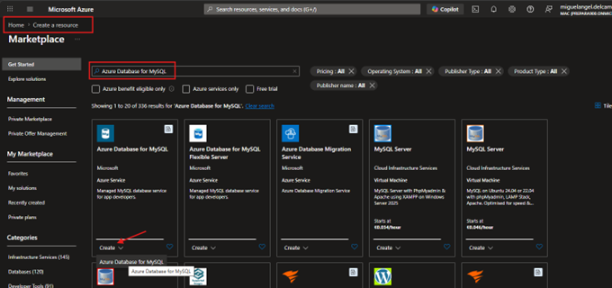

### Paso 2: Seleccionar tipo de recurso
* Revisa las opciones disponibles para Azure Database for MySQL. En Tipo de recurso, selecciona Servidor flexible.
* Haz clic en Creación rápida o avanzado (nuestro caso avanzada).

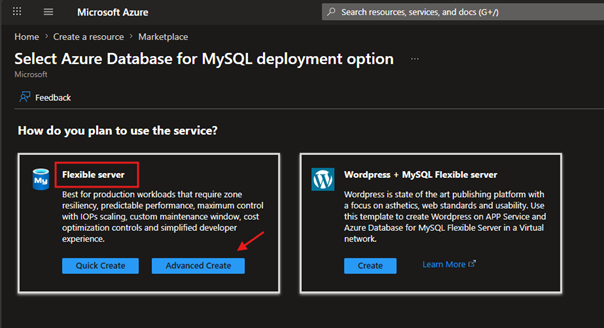

### Paso 3: Configurar la base de datos
En la página Crear base de datos SQL, introduce los siguientes valores:
* **Suscripción:** selecciona tu suscripción activa de Azure.
* **Grupo de recursos:** crea un nuevo grupo RGbdMYSQL.
* **Nombre del servidor:** escribe un nombre único para el servidor srvdbsqldatabase.
* **Región:** Spain Central.
* **Versión de MySQL:** déjala sin cambios. 8.4.
* **Tipo de carga de trabajo:** selecciona para proyectos de desarrollo o hobby. Dev/Test.
* **Computación + almacenamiento:** déjalo sin cambios. Burstable, B1ms 1 vCores, 2 GiB RAM, 20 GiB storage, Auto scale IOPS Geo-redundancy: Not supported.
* **Zona de disponibilidad:** déjalo sin cambios. No Preference.
* **Habilitar alta disponibilidad:** déjalo sin cambios. Disabled (99.9% SLA).
* **Nombre de usuario del administrador:** ingresa el nombre de usuario que quieras usar.
* **Contraseña y Confirmar contraseña:** establece una contraseña segura. Luego, selecciona Siguiente: Redes.

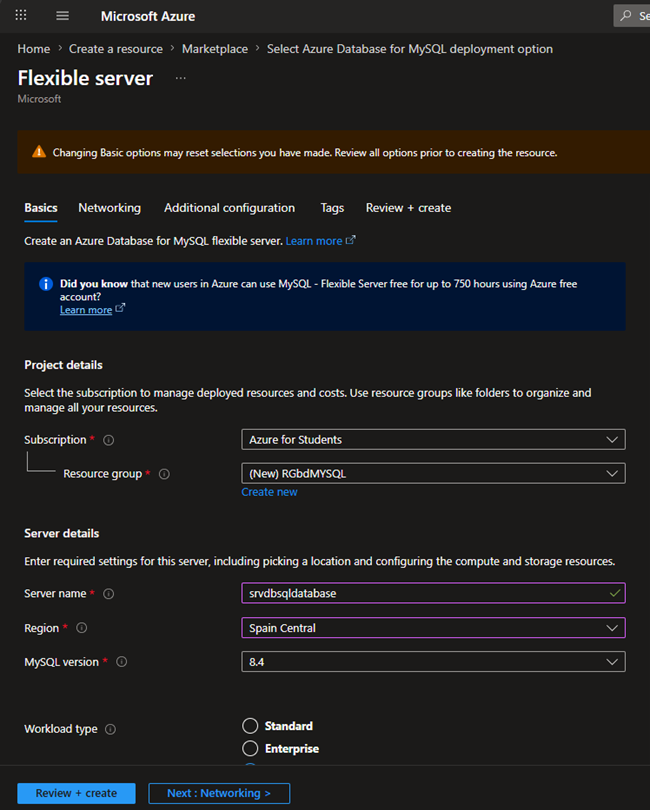
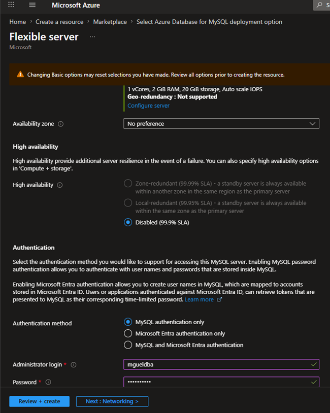

### Paso 4: Configurar reglas de firewall
En la sección Reglas de firewall, selecciona + Agregar dirección IP del cliente actual para permitir el acceso desde tu equipo.

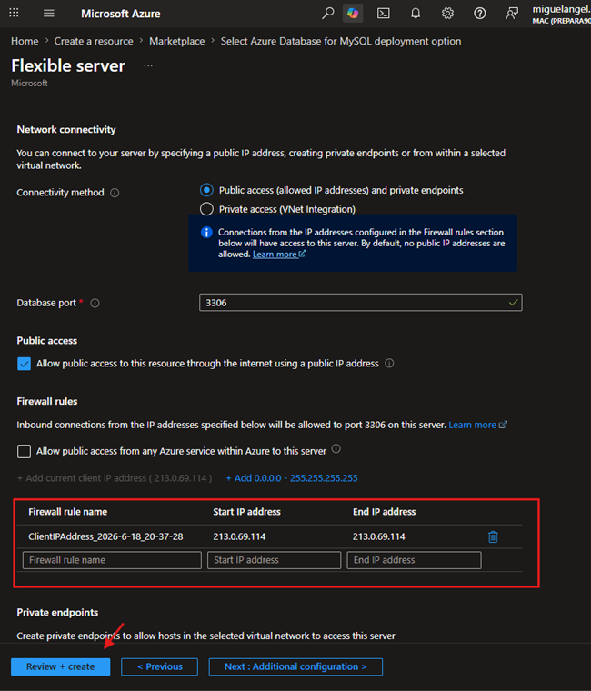

### Paso 5: Revisar y crear
Selecciona Revisar + Crear para validar la configuración. Luego, haz clic en Crear para iniciar la implementación.

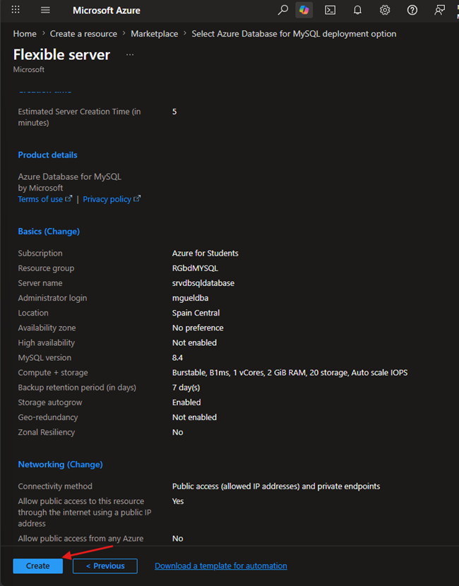

### Paso 6: Esperar a la implementación
Espera a que la implementación se complete. Cuando termine, selecciona Ir al recurso para acceder al servidor MySQL recién creado.

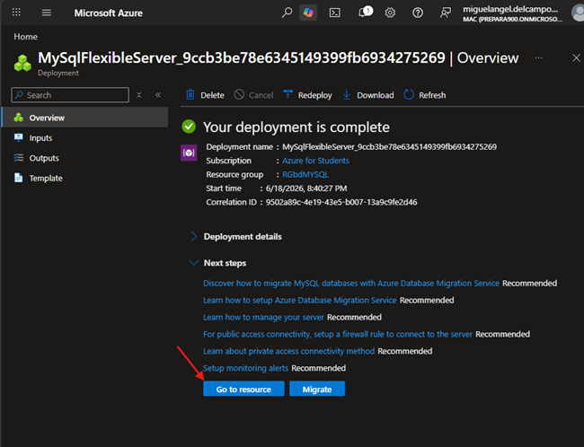

### Paso 7: Explorar y administrar el recurso
Desde la página del recurso, puedes revisar todas las opciones para administrar tu Azure Database for MySQL.

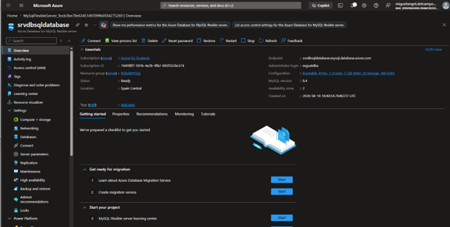

#### 7.1. Configuración de Infraestructura y Rendimiento (Settings)

##### 7.1.1. Compute + storage:
Permite escalar verticalmente la base de datos de forma dinámica. Puedes modificar el tipo de cómputo (por ejemplo, pasar de Burstable a General Purpose), aumentar los vCores, la memoria RAM, el espacio de almacenamiento físico o los IOPS configurados.

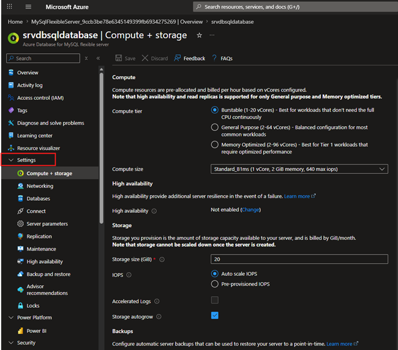

##### 7.1.2. Databases:
Administra, crea o elimina las bases de datos lógicas individuales que viven dentro de esta instancia de servidor de MySQL.

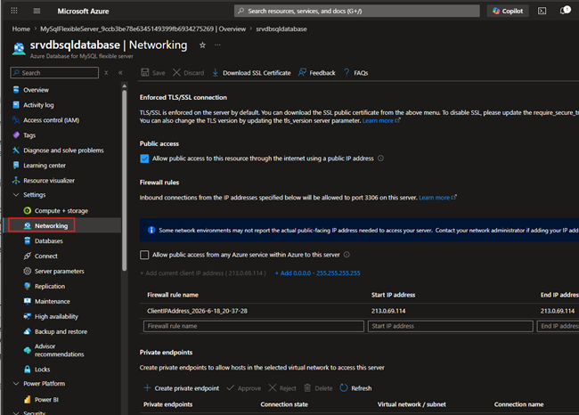

#### 7.2. Seguridad, Redes y Conectividad

##### 7.2.1. Networking:
Configura las reglas de acceso perimetral. Permite administrar si el servidor tiene acceso público protegido mediante reglas de firewall (bloqueo/desbloqueo de direcciones IP) o si se integra de forma privada en una red virtual mediante un Private Endpoint / VNet Integration.

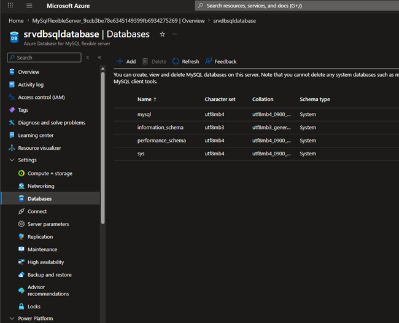

##### 7.2.2. Connect:
Proporciona las cadenas de conexión formateadas (connection strings) para diferentes lenguajes de programación (Java, .NET, PHP, Python) y los certificados SSL/TLS obligatorios para cifrar el tráfico.

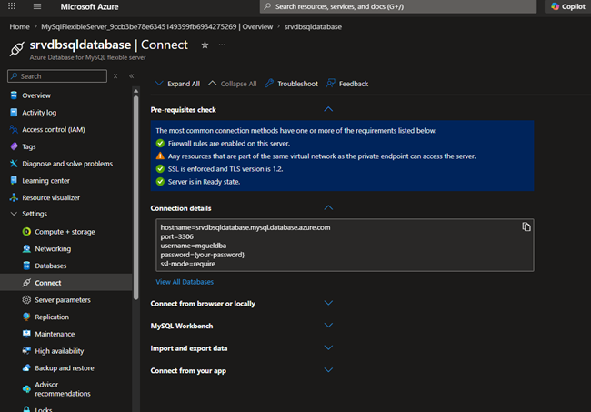

#### 7.3. Ajustes del Motor y Comportamiento de Datos

##### 7.3.1. Server parameters:
Administra las variables de configuración nativas de MySQL (los equivalentes al archivo my.cnf o my.ini), como los tamaños de búfer, zonas horarias, configuraciones de caracteres, modos SQL, etc.

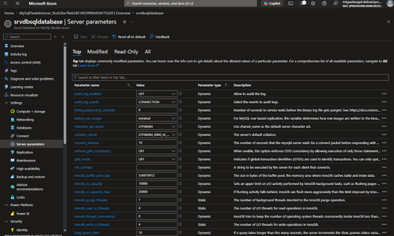

##### 7.3.2. Replication:
Configura y administra réplicas de lectura (Read Replicas). Permite crear instancias secundarias de solo lectura en la misma región o en regiones cruzadas para distribuir la carga analítica o de reportes.

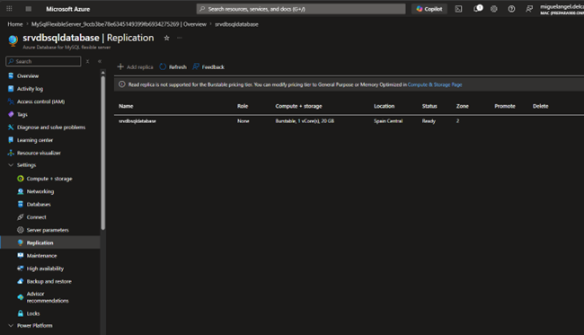

#### 7.4. Resiliencia, Mantenimiento y Continuidad de Negocio

##### 7.4.1. Maintenance:
Permite programar las ventanas de mantenimiento automático semanales (el día y la hora exacta en que Microsoft puede aplicar parches de seguridad y actualizaciones del sistema operativo con el menor impacto posible).

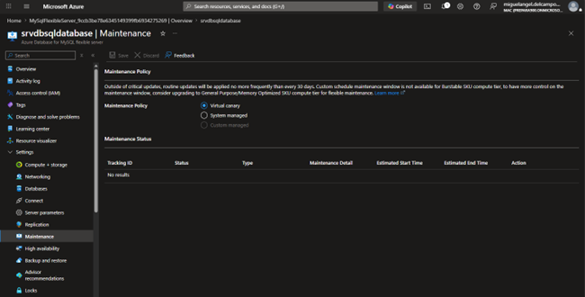

##### 7.4.2. High availability:
Permite activar o desactivar la alta disponibilidad con redundancia de zona. Configura una arquitectura de failover automático con un servidor en espera (standby server) en otra zona de disponibilidad (como la zona 3 de Spain Central).

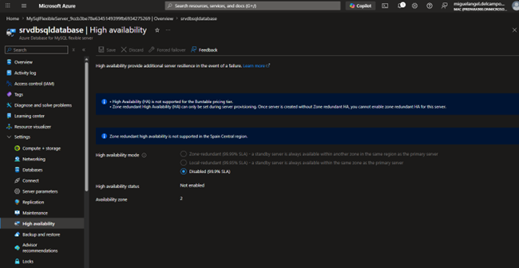

##### 7.4.3. Backup and restore:
Gestiona la retención de las copias de seguridad automatizadas (de 7 a 35 días) y permite iniciar una restauración a un punto en el tiempo (Point-in-Time Restore - PITR) creando un servidor nuevo a partir de un estado anterior.

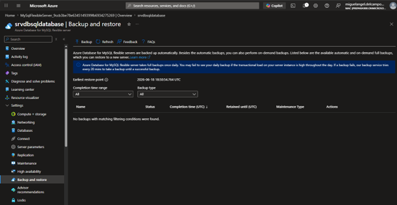

#### 7.5. Gobernanza y Control General (Plano de Control)
* **Access control (IAM):** Administra los roles de Azure (RBAC) para definir quién puede modificar, ver o eliminar este recurso (Owner, Contributor, Reader).
* **Locks:** Permite añadir bloqueos de recursos para evitar que usuarios con altos privilegios eliminen (Delete lock) o modifiquen (Read-only lock) el servidor de producción por accidente.