# Explore data analytics in Microsoft Fabric

## Índice

- [1. Objetivo del laboratorio](#1-objetivo-del-laboratorio)
- [2. Antecedentes sobre el conjunto de datos NYC Taxi](#2-antecedentes-sobre-el-conjunto-de-datos-nyc-taxi)
- [3. Aspectos importantes](#3-aspectos-importantes)
- [4. Ejecución](#4-ejecución)
  - [4.1 Crea un espacio de trabajo](#41-crea-un-espacio-de-trabajo)
  - [4.2 Crea una casa en el lago (lakehouse)](#42-crea-una-casa-en-el-lago-lakehouse)
  - [4.3 Ingesta de datos](#43-ingesta-de-datos)
  - [4.4 Consulta de datos en una casa del lago (lakehouse)](#44-consulta-de-datos-en-una-casa-del-lago-lakehouse)
- [5. Limpieza de recursos](#5-limpieza-de-recursos)

---

## 1. Objetivo del laboratorio

En esta práctica, aprenderás a integrar y evaluar información con **Microsoft Fabric**, una solución analítica unificada que centraliza todo el flujo de trabajo, desde el almacenamiento hasta la creación de paneles. 

Operarás sobre un **Lakehouse** (casa en el lago), un entorno que permite guardar archivos sin procesar junto con tablas estructuradas que pueden ser consultadas mediante SQL. Posteriormente, emplearás un **trabajo de copia** (un método guiado y automático para transferir información) para importar un registro real de trayectos de taxi de Nueva York. Finalizarás lanzando consultas SQL para extraer conclusiones de negocio.

Al finalizar este ejercicio, habrás logrado:
- **Entender el concepto de Lakehouse en Fabric:** Aprenderás a desplegar áreas de trabajo y casas en el lago, pilares fundamentales para la organización analítica.
- **Integrar datos mediante trabajos de copia:** Usarás asistentes automáticos para importar fuentes externas hacia tu entorno sin necesidad de programar rutinas.
- **Explorar mediante SQL:** Analizarás la información importada usando sentencias relacionales nativas, obteniendo métricas directamente en Fabric.
- **Gobernanza de recursos:** Adquirirás buenas prácticas para eliminar los entornos de prueba y prevenir cargos innecesarios en la suscripción.

---

## 2. Antecedentes sobre el conjunto de datos NYC Taxi

La muestra de datos denominada *"NYC Taxi - Green"* abarca registros precisos sobre viajes en taxi dentro de la ciudad de Nueva York, detallando fechas y horas de inicio y fin, rutas, distancias de viaje, costes y cantidad de ocupantes. Es un recurso muy popular en el sector para analizar la movilidad urbana, pronosticar picos de demanda y descubrir tendencias atípicas. Utilizarás esta base de datos real para afianzar tus conocimientos de ingesta en Microsoft Fabric.

⏱️ Duración aproximada: **30 minutos**

---

## 3. Aspectos importantes

> [!NOTE]
> Para realizar esta práctica es imprescindible contar con una licencia activa de Microsoft Fabric. Puedes consultar la guía de inicio oficial de Fabric para activar una evaluación gratuita. Se requiere utilizar una cuenta corporativa o educativa. En caso de no poseer una, es posible registrarse previamente en una prueba de Microsoft Office 365 E3 o superior.

> [!TIP]
> Al acceder por primera vez a los distintos menús de Microsoft Fabric, es probable que el sistema te muestre ventanas emergentes con ayudas visuales y consejos. Puedes omitirlas y cerrarlas con seguridad.

> [!TIP]
> Emplea la ruta de *Archivos (Files)* para guardar la información sin tratar o en fase de preparación, y reserva el apartado de *Tablas (Tables)* para las colecciones ya curadas y preparadas para ser consultadas. Estas tablas se benefician de la tecnología Delta Lake subyacente, garantizando un rendimiento óptimo.

---

## 4. Ejecución

### 4.1 Crea un espacio de trabajo

Antes de manipular la información, debes aprovisionar un área de trabajo con la evaluación de Fabric habilitada. Un área de trabajo funciona como la carpeta de tu proyecto principal, agrupando tus creaciones (pipelines, lakehouses, informes, etc.). Asignarle capacidad de Fabric le dota de los recursos de cómputo necesarios para operar.

1. Entra a la web principal de Microsoft Fabric desde tu navegador e identifícate. La URL de acceso es `https://app.fabric.microsoft.com/home?experience=fabric`.
2. En la esquina inferior izquierda encontrarás el selector de entorno. Si aparece activo el icono de Power BI, haz clic y escoge **Fabric** para habilitar las herramientas de ingeniería de datos.

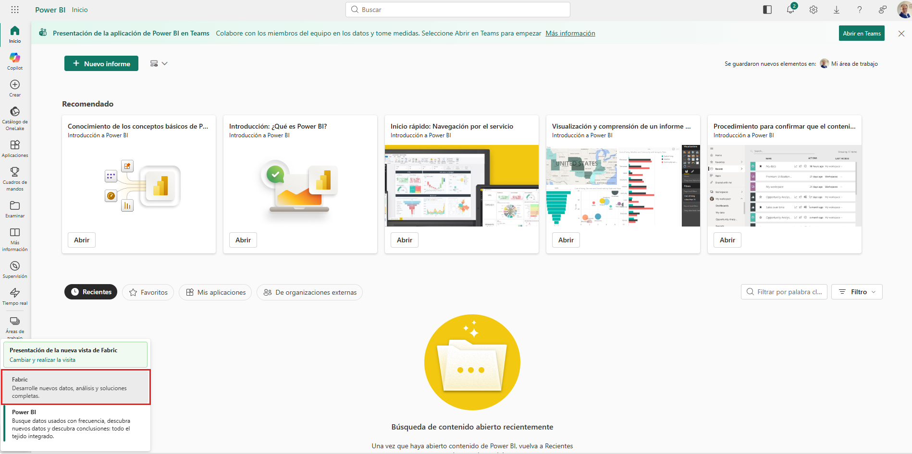

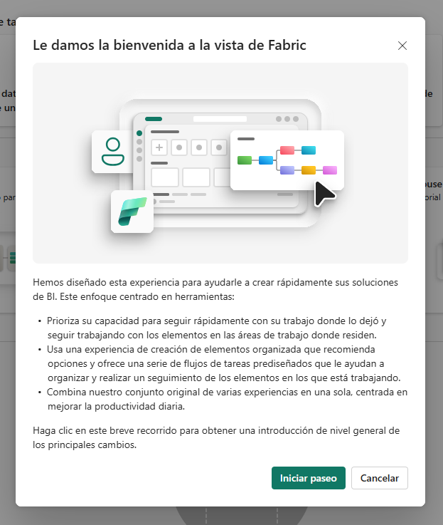

3. En el panel lateral de navegación, presiona **Espacios de trabajo** (identificado con el icono 🗇).


4. Haz clic en el botón **+ Nuevo espacio de trabajo**, asígnale el identificador `dp900-fabric-lakehouse` y, en el apartado **Avanzada**, verifica que el modo de licencia incluya capacidad de computación para Fabric (Prueba, Premium o Fabric). Seguidamente, pulsa **Aplicar**.

> [!TIP]
> Asignar una capacidad dedicada garantiza que el entorno cuente con los motores requeridos para las tareas de este laboratorio. Además, trabajar en un espacio de prueba aislado facilita enormemente la limpieza final.

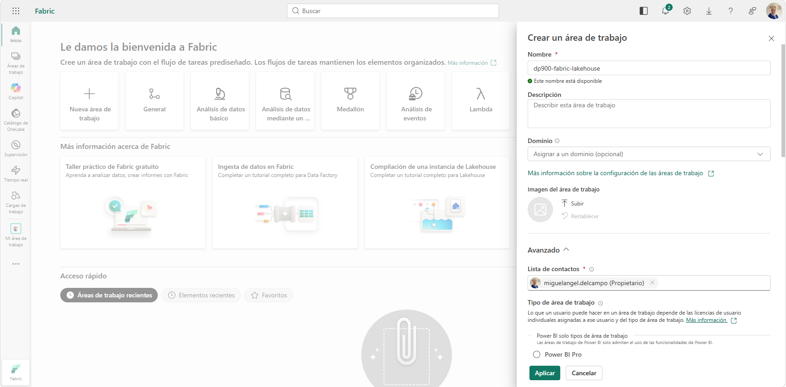

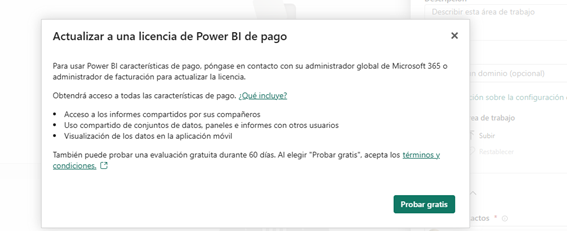

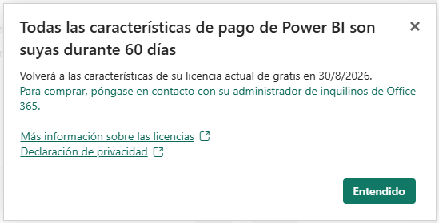

5. Una vez generado, el sistema te redirigirá a la vista general de tu nuevo espacio, el cual aparecerá en blanco.

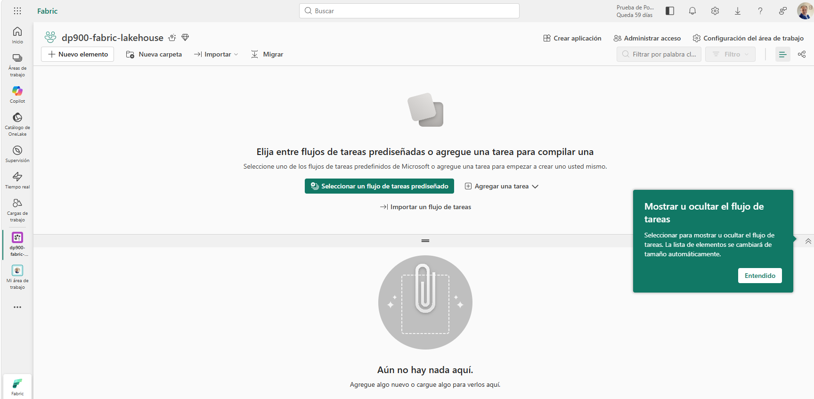

### 4.2 Crea una casa en el lago (lakehouse)

Con el área ya aprovisionada, el siguiente paso es instanciar tu Lakehouse. Este elemento es un repositorio unificado que soporta ficheros planos y tablas estructuradas. La zona tabular permite lanzar sentencias SQL (exactamente igual que en una base de datos clásica), mientras que la zona de archivos admite formatos crudos variados. 

1. Desde la barra de herramientas principal de tu espacio, pulsa **+ Nuevo elemento**. En el buscador central de componentes, localiza y selecciona la tarjeta de **Lakehouse**.

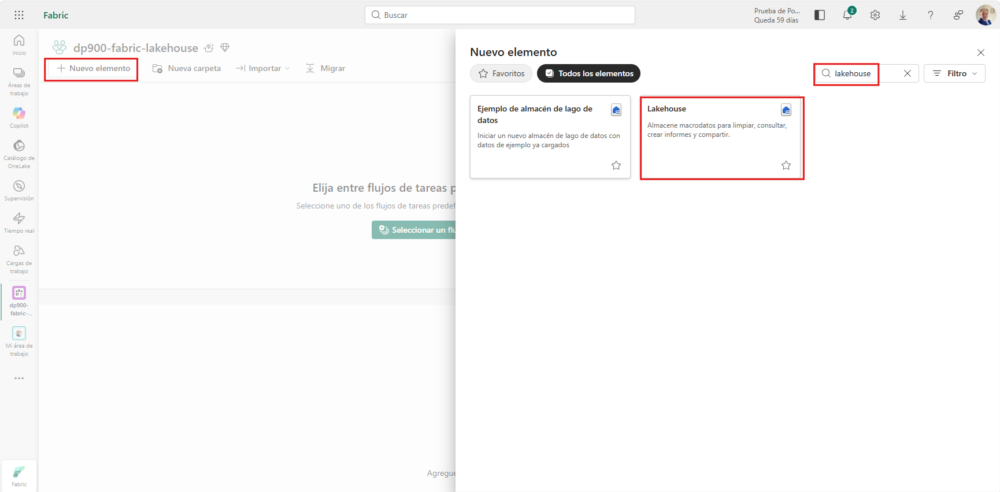

2. En la ventana emergente de creación, escribe `taxi_lakehouse` como nombre, mantén activa la casilla de verificación referida a los esquemas y presiona **Crear**.

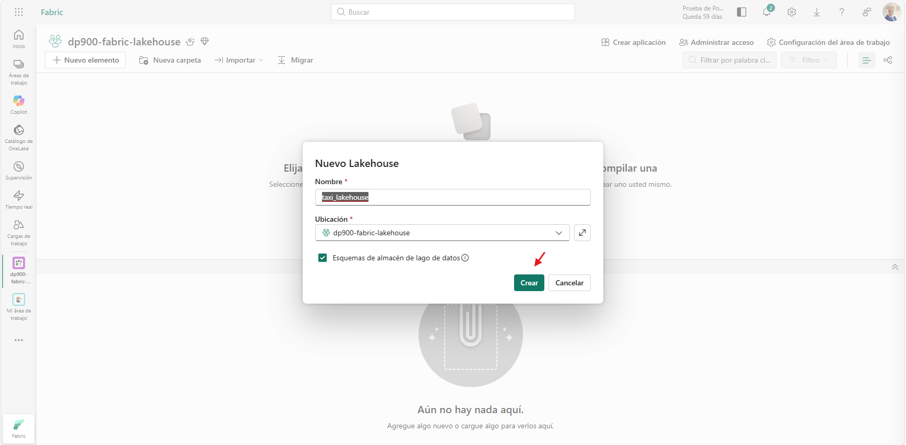

3. Tras una breve espera, el componente quedará inicializado.
4. Dentro de la interfaz de tu nuevo Lakehouse, fíjate en el menú **Explorador** situado en la barra lateral izquierda:
   - El directorio **Tablas** aloja las estructuras consultables vía SQL, ordenadas bajo un esquema por defecto llamado `dbo`. Estas colecciones utilizan el estándar abierto Delta Lake, el formato nativo de Apache Spark.
   - El directorio **Archivos** guarda documentos en crudo dentro de la infraestructura de almacenamiento OneLake, sin formato gestionado. Desde este punto también puedes generar accesos directos (*shortcuts*) a otras nubes.
5. En este momento inicial, ambas rutas se encontrarán vacías.

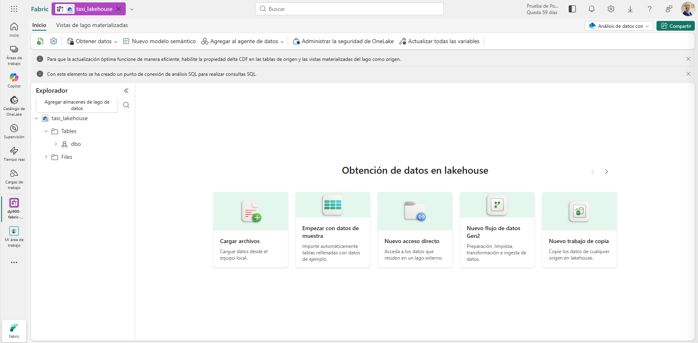

### 4.3 Ingesta de datos

La vía más directa y robusta para volcar información es mediante una actividad de copia guiada. Este mecanismo traslada grandes volúmenes de datos desde un origen directo hacia una tabla gestionada sin necesidad de redactar rutinas complejas.

1. En la vista de inicio del Lakehouse, despliega el menú desplegable **Obtener datos** y haz clic en **Nuevo trabajo de copia**.

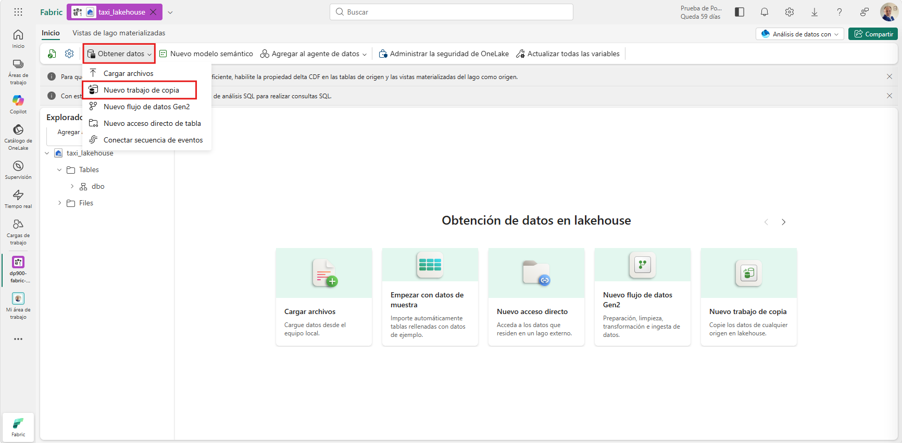

2. En el panel de configuración de ingesta, define el nombre `Ingest Data` en el campo superior y confirma presionando **Crear**.

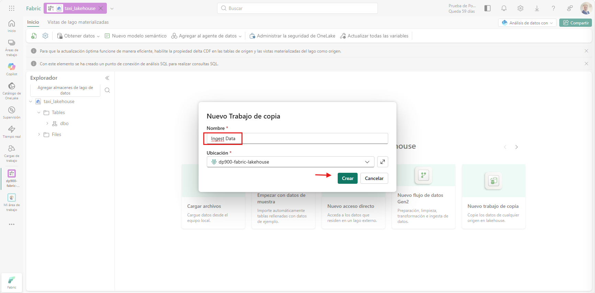

3. Cuando aparezca la pantalla de elección de orígenes, navega hasta la sección superior y haz clic en la pestaña **Datos de muestra**.

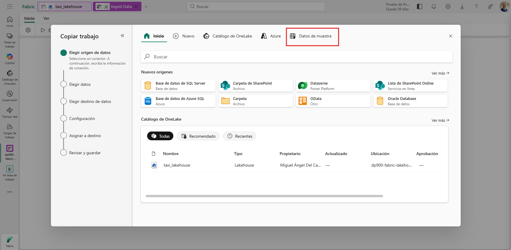

4. Identifica y escoge la tarjeta correspondiente a **NYC Taxi - Green**.

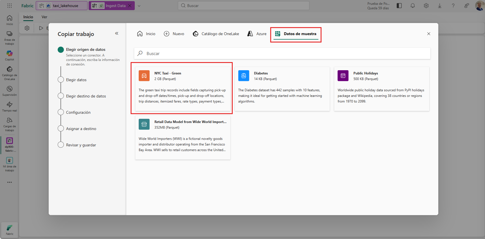

5. La siguiente interfaz mostrará una previsualización de las columnas y los registros. Tras realizar la comprobación visual, presiona **Siguiente**.

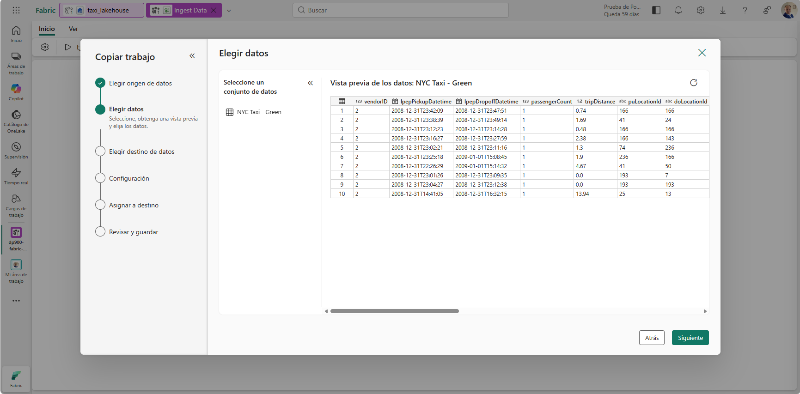

6. En la pestaña de opciones de copiado, verifica que el método de lectura marcado sea **Copia completa** y que la ruta de destino apunte hacia **Tablas**. Prosigue pulsando **Siguiente**. (Configurarlo de esta manera asegura que todo el histórico se vuelque en una única operación transaccional hacia una tabla Delta lista para ser consultada).

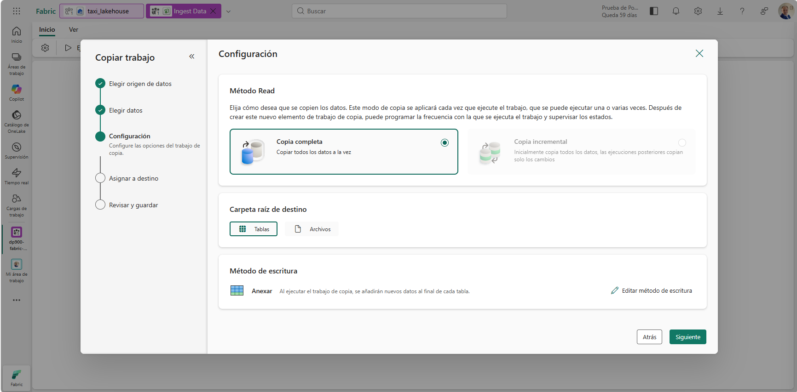

7. En la pantalla de mapeo y asignación, define manualmente `dbo` como el esquema de destino y `taxi_rides` como el nombre definitivo de la tabla. Continúa con **Siguiente**.

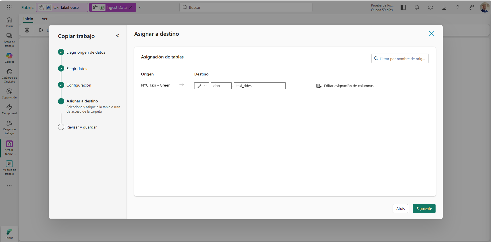

8. En el último paso correspondiente al sumario y guardado, activa la casilla inferior **Iniciar la transferencia de datos inmediatamente**, corrobora que la opción de ejecución esté en **Ejecutar una vez** y haz clic en **Guardar y ejecutar**.

> [!TIP]
> Al lanzar la ejecución de manera inmediata, el sistema te permitirá monitorizar el progreso en tiempo real y validar que la información se asienta en destino correctamente.

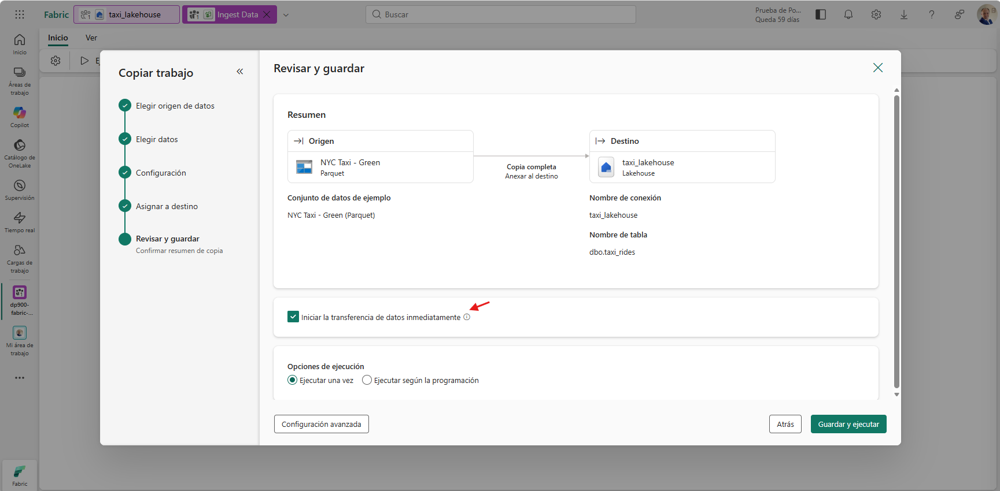

9. El proceso de movimiento de datos se pondrá en marcha en segundo plano. En el monitor central de resultados, aguarda hasta que el indicador global de estado marque **Correcto** y el recuento de operaciones refleje `1/1`.

> [!NOTE]
> Dado que los registros originales provienen de un empaquetado optimizado (Parquet), es muy habitual que las métricas informativas de *Filas leídas* y *Filas escritas* marquen `0`, a pesar de que el volcado de la tabla se haya materializado de forma exitosa.

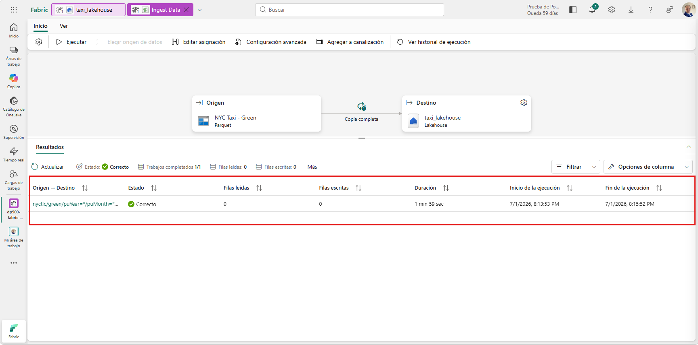

10. Regresa a la ventana principal de tu Lakehouse (usando la ruta de migas de pan superior). En el árbol izquierdo del explorador, despliega **Tablas > dbo** y haz clic en la nueva entidad **taxi_rides** para visualizar los registros cargados.

> [!TIP]
> Si la estructura de la tabla no se muestra al instante, sitúa el cursor sobre el icono de los tres puntos `...` junto a la carpeta Tablas y escoge la opción de **Actualizar**.

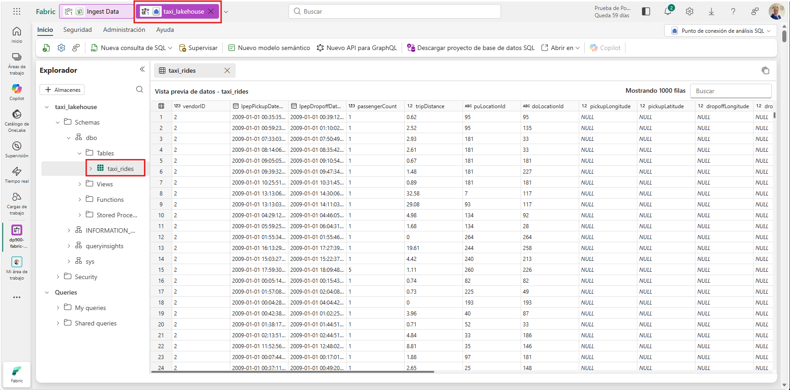

### 4.4 Consulta de datos en una casa del lago (lakehouse)

Con los registros persistidos en formato tabular optimizado, ya es posible lanzar sentencias relacionales convencionales para extraer valor de negocio.

> [!TIP]
> Las colecciones gestionadas del Lakehouse soportan sintaxis SQL de forma nativa. Esto te facilita el análisis inmediato del ecosistema sin requerir engorrosas exportaciones a plataformas externas.

1. En la barra superior derecha de la interfaz general, despliega el botón **Análisis de datos con** y selecciona la funcionalidad **Punto de conexión de análisis SQL**.

> [!TIP]
> Este punto de conexión habilita un motor de base de datos optimizado para sentencias analíticas, exponiendo un canal para la conexión desde clientes T-SQL estándar.

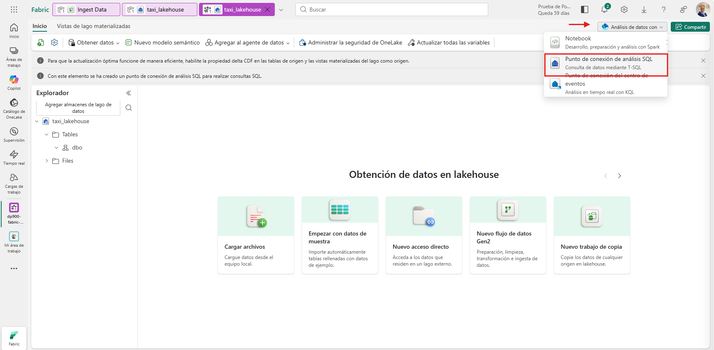

2. Presiona el botón **Nueva consulta de SQL** en la cinta superior de opciones. En el editor de código en blanco que se abrirá, introduce la siguiente instrucción relacional:

```sql
SELECT DATENAME(dw, lpepPickupDatetime) AS Day,
       AVG(tripDistance) AS AvgDistance
FROM taxi_rides 
GROUP BY DATENAME(dw, lpepPickupDatetime);
```

3. Haz clic en el botón de **▷ Ejecutar** para procesar la instrucción en el motor del clúster. La ventana inferior de resultados presentará el promedio de la distancia recorrida clasificado automáticamente por cada día de la semana.

> [!TIP]
> Este script representa un caso de uso sencillo de agregación. Agrupa todo el histórico de trayectos en función del nombre del día (obtenido mediante una función de fechas) y calcula la media, sirviendo como fundamento para lógicas analíticas de mayor complejidad.

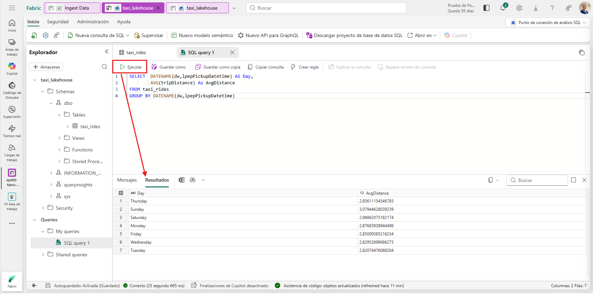

---

## 5. Limpieza de recursos

Una vez finalizada la exploración de las características de Microsoft Fabric, es altamente recomendable eliminar el entorno que aprovisionaste para este laboratorio.

> [!TIP]
> Suprimir el área de trabajo completa en un solo paso garantiza la destrucción en cascada de todos los artefactos generados (lakehouse, pipelines, tablas), previniendo cargos continuados imprevistos en tu suscripción a la nube.

1. En la franja de navegación lateral izquierda, haz clic en el icono y nombre de tu área de trabajo (`dp900-fabric-lakehouse`) para visualizar su contenido raíz.
2. En la zona superior de la interfaz, presiona **Configuración del espacio de trabajo**.
3. Dentro del panel lateral que se abre (en la pestaña **General**), haz scroll hasta la parte inferior y selecciona el botón rojo que dice **Quitar esta área de trabajo** (o *Eliminar este espacio de trabajo*). Confirma la advertencia de seguridad para iniciar el borrado definitivo.

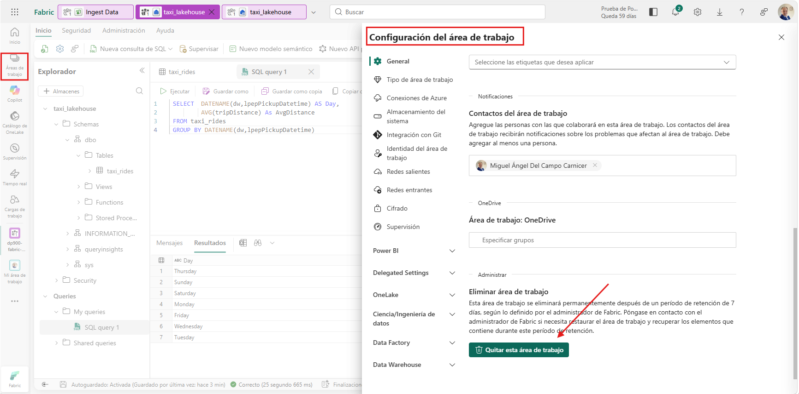

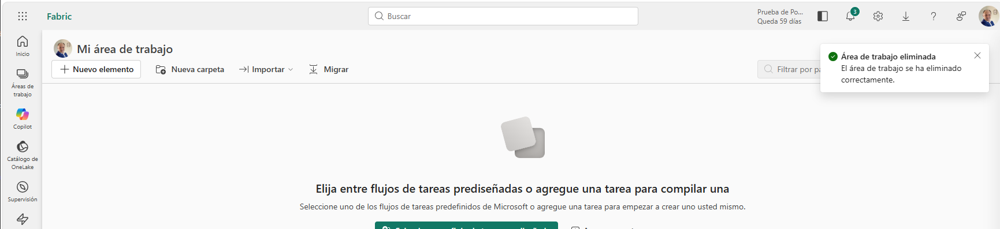

---

⬅️ **Anterior:** [Explore Azure Cosmos DB](../Explore_Azure_Cosmos_DB/Explore_Azure_Cosmos_DB.md)

🏠 **Inicio del módulo:** [README](../../Lab04readme.md)

➡️ **Siguiente:** [Explore real-time analytics in Microsoft Fabric](../Explore_real_time_analytics_in_Microsoft_Fabric/Explore_real_time_analytics_in_Microsoft_Fabric.md)