# Explore fundamentals of data visualization with Power BI

## Índice

- [1. Objetivo del laboratorio](#1-objetivo-del-laboratorio)
- [2. Puntos clave a tener en cuenta](#2-puntos-clave-a-tener-en-cuenta)
- [3. Ejecución del laboratorio](#3-ejecución-del-laboratorio)
  - [3.1 Instalar Power BI Desktop](#31-instalar-power-bi-desktop)
  - [3.2 Ingesta de datos importados](#32-ingesta-de-datos-importados)
  - [3.3 Exploración y modelado de datos](#33-exploración-y-modelado-de-datos)
  - [3.4 Creación de un informe interactivo](#34-creación-de-un-informe-interactivo)
- [4. Limpieza de recursos](#4-limpieza-de-recursos)
- [5. Resumen del ejercicio](#5-resumen-del-ejercicio)

---

## 1. Objetivo del laboratorio

El propósito fundamental de esta práctica es aprender a transformar datos sin procesar en información visual interactiva empleando **Microsoft Power BI Desktop**. 

Configurarás un entorno básico de Inteligencia de Negocios (BI) mediante la importación de múltiples fuentes de ventas (clientes, productos y pedidos). Además, crearás relaciones para establecer un modelo semántico unificado y diseñarás un panel de reportes con tablas, gráficos de barras y mapas geográficos interactivos. Power BI te permite descubrir patrones y contar historias con la información, en lugar de limitarte a revisar extensas filas de números.

⏱️ Duración aproximada: **30 minutos**

> [!NOTE]
> Para completar esta práctica necesitas disponer de un equipo con sistema operativo Windows, ya que la aplicación Power BI Desktop es exclusiva de este entorno.

---

## 2. Puntos clave a tener en cuenta

- **Dependencia del Sistema Operativo:** La herramienta Power BI Desktop está desarrollada únicamente para entornos Windows; no dispone de un instalador nativo para sistemas macOS o Linux.
- **Flujo de Trabajo Estructurado en BI:** Este ejercicio refleja de forma clara el ciclo de vida estándar del análisis en Power BI: Obtención de datos (*Get Data*) $\rightarrow$ Modelado y categorización (*Data Model*) $\rightarrow$ Diseño visual interactivo (*Report*).
- **Activación Obligatoria de Mapas:** Las visualizaciones geoespaciales (Mapas y Mapas coropléticos) suelen estar desactivadas por defecto en ciertos entornos corporativos o educativos por cuestiones de privacidad. Es estrictamente necesario habilitarlas en la configuración global antes de intentar procesar ubicaciones.
- **Importancia de la Categorización del Dato:** Para que el mapa emplace correctamente la información, no basta con tener una columna de texto con nombres de ciudades. Se debe indicar de forma explícita al motor de Power BI la categoría de datos "geográfica" para que interprete correctamente las coordenadas.
- **Interactividad Nativa:** Todos los elementos visuales de un panel de Power BI se encuentran interconectados desde su creación. Al hacer clic sobre una barra de un gráfico o en una burbuja del mapa, el resto de las visualizaciones de la página se filtrarán automáticamente en tiempo real.

---

## 3. Ejecución del laboratorio

### 3.1 Instalar Power BI Desktop

Si aún no dispones de Microsoft Power BI Desktop en tu equipo, debes proceder con su descarga e instalación gratuita. Esta aplicación de escritorio es el entorno principal donde construirás tus modelos e informes de forma local, los cuales posteriormente podrías publicar en el servicio en la nube para compartirlos.

1. Navega hasta la página de descarga oficial: `https://aka.ms/power-bi-desktop`.
2. Ejecuta el archivo descargado y sigue las instrucciones del asistente de instalación. Este proceso puede demorar un par de minutos.

### 3.2 Ingesta de datos importados

Una vez completada la instalación, iniciarás la aplicación para importar los conjuntos de datos que darán vida a tu informe.

1. Inicia **Power BI Desktop**. En la primera pantalla de bienvenida, la interfaz se presentará de la siguiente forma:

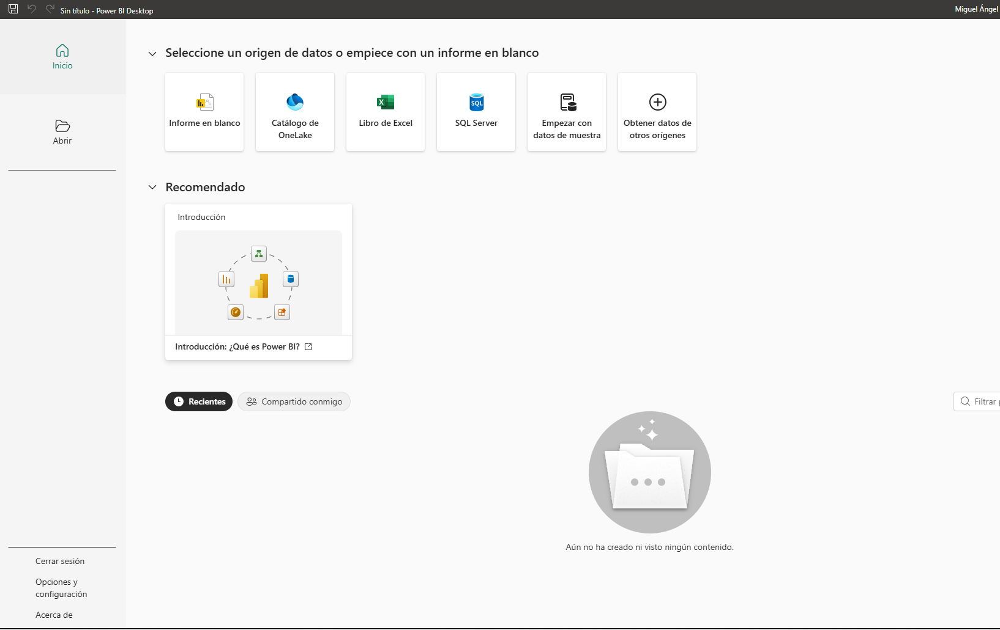

2. Selecciona la opción **Obtener datos de otros orígenes**. En la ventana emergente, escoge la categoría **Web** y haz clic en **Conectar**.

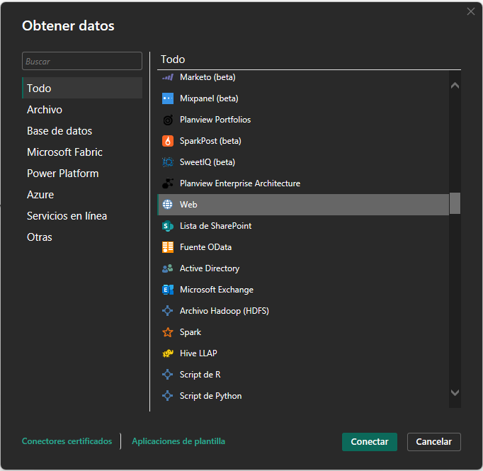

3. En la caja de diálogo que solicita la URL, copia y pega el siguiente enlace correspondiente al archivo de clientes, y pulsa **Aceptar**:

```text
[https://github.com/MicrosoftLearning/DP-900T00A-Azure-Data-Fundamentals/raw/master/power-bi/customers.csv](https://github.com/MicrosoftLearning/DP-900T00A-Azure-Data-Fundamentals/raw/master/power-bi/customers.csv)
```

> [!TIP]
> Emplear el conector web apuntando directamente a archivos CSV públicos garantiza que trabajes con datos limpios y estandarizados, evitando la necesidad de descargar archivos localmente o lidiar con credenciales complejas.

4. Aparecerá una ventana de previsualización mostrando el contenido del conjunto de datos de los clientes. Selecciona **Cargar** para incorporar la tabla al modelo.

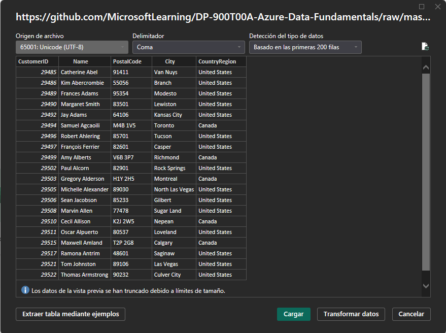

5. Repite el proceso para los siguientes archivos. Desde la cinta superior (pestaña *Inicio*), despliega **Obtener datos** y elige **Web**.

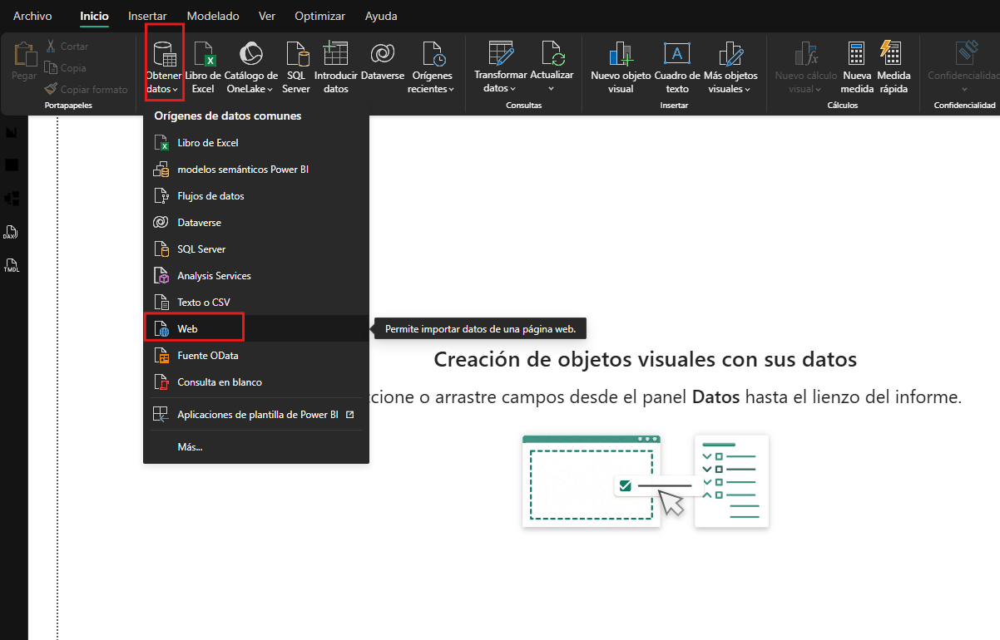

6. Introduce el enlace para importar la tabla de productos y selecciona **Cargar**:

```text
[https://github.com/MicrosoftLearning/DP-900T00A-Azure-Data-Fundamentals/raw/master/power-bi/products.csv](https://github.com/MicrosoftLearning/DP-900T00A-Azure-Data-Fundamentals/raw/master/power-bi/products.csv)
```

7. Repite la acción una vez más para importar el histórico de pedidos con este enlace:

```text
[https://github.com/MicrosoftLearning/DP-900T00A-Azure-Data-Fundamentals/raw/master/power-bi/orders.csv](https://github.com/MicrosoftLearning/DP-900T00A-Azure-Data-Fundamentals/raw/master/power-bi/orders.csv)
```

> [!TIP]
> Integrar entidades distintas (clientes, productos y pedidos) permite estructurar un modelo relacional realista, el cual resulta fundamental para realizar cruces de información, como analizar los ingresos de una categoría de producto específica dentro de una ciudad determinada.

### 3.3 Exploración y modelado de datos

Al finalizar la carga, las tres tablas formarán parte de tu modelo interno. El modelado de datos consiste en establecer las propiedades adecuadas y las conexiones lógicas entre las diferentes tablas para que Power BI pueda cruzar la información sin errores.

1. Dirígete a la barra lateral izquierda y haz clic en la pestaña **Vista de Modelo** (icono de diagramas). Reorganiza visualmente las cajas de las tablas para verlas con claridad. Puedes contraer los paneles laterales derechos si necesitas más espacio.
2. En la caja de la tabla de pedidos (*orders*), haz clic sobre el campo **Ingresos** (*Revenue*). En el panel de **Propiedades** lateral, localiza la sección de formato y cambia el tipo a **Moneda**.

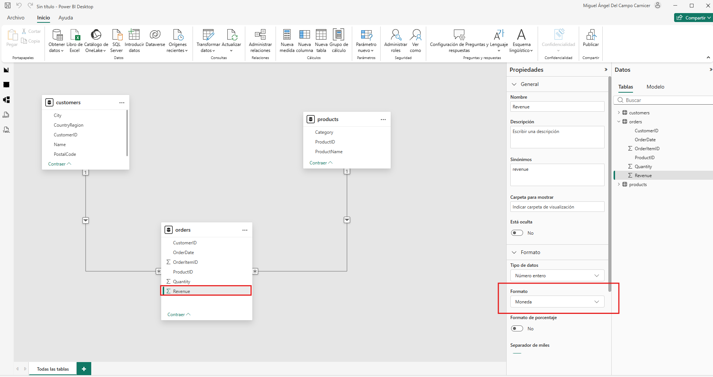

> [!TIP]
> Aplicar el formato correcto a las métricas mejora enormemente la legibilidad de los informes y alinea la presentación de los números con las expectativas visuales de los usuarios de negocio.

3. En la caja de productos (*products*), pulsa con el botón derecho sobre el campo **Categoría** y selecciona **Crear jerarquía**.

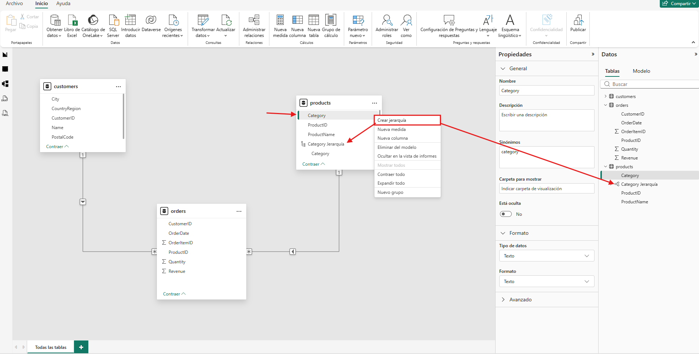

4. Seguidamente, haz clic derecho sobre el campo **Nombreproducto** (*ProductName*), escoge la opción **Agregar a la jerarquía** y dirígelo hacia la jerarquía recién creada.

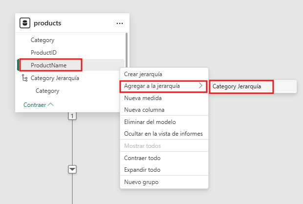

5. Dirígete al panel de **Datos** en el margen derecho, localiza la nueva jerarquía, pulsa con el botón derecho para renombrarla y llámala `Producto Categorizado`.

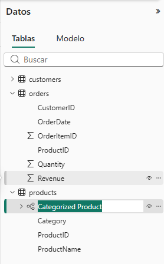

> [!TIP]
> Construir una jerarquía estructurada (Categoría $\rightarrow$ Producto) habilita la función de navegación en profundidad (*drill-down*) en los gráficos, permitiendo a los usuarios ir desde un nivel de resumen genérico hasta el máximo detalle del artículo.

6. Cambia a la **Vista de Tabla** (icono de hoja de cálculo en la barra izquierda). Selecciona la tabla de clientes (*customers*).
7. Haz clic sobre el encabezado de la columna **Ciudad** (*City*). En la cinta de opciones superior, ubica el menú de **Categoría de datos** y cámbialo de *Sin clasificar* a **Ciudad**.

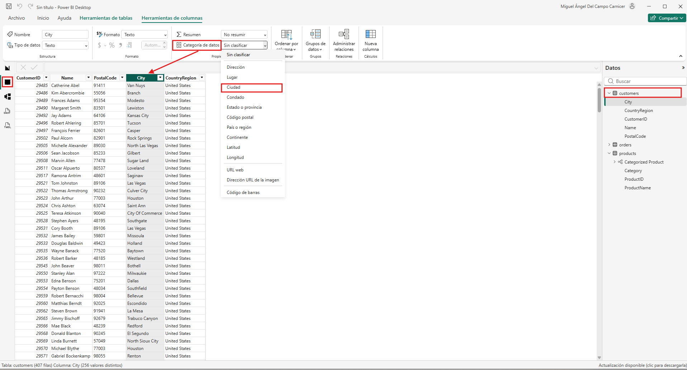

> [!TIP]
> Asignar metadatos geográficos es un paso crítico. Ayuda a que el motor de mapas de Power BI geocodifique los textos correctamente y posicione las ubicaciones en las coordenadas exactas del globo.

### 3.4 Creación de un informe interactivo

Con el modelo debidamente afinado, estás en disposición de diseñar la interfaz gráfica del reporte.

1. Primero, verifica los ajustes de seguridad. Accede a **Archivo** $\rightarrow$ **Opciones y configuración** $\rightarrow$ **Opciones**. En el apartado **Seguridad**, asegúrate de que la casilla **Uso de elementos visuales de mapa y mapa coroplético** se encuentre activada, y presiona **Aceptar**.

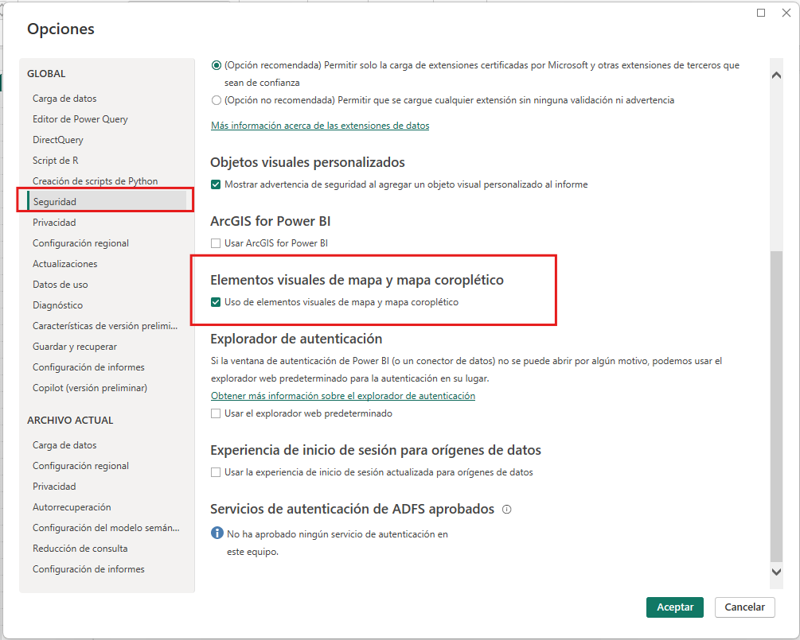

2. Regresa a la vista de diseño haciendo clic en la pestaña **Vista de informe** en el panel izquierdo.

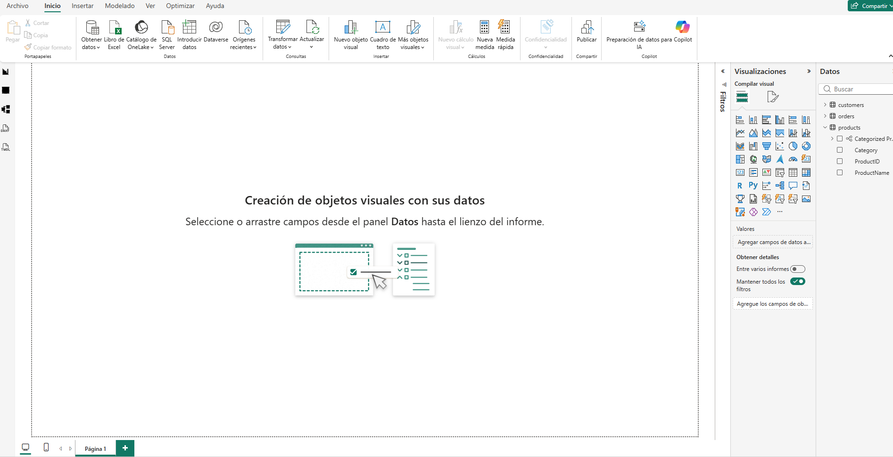

3. Desde la pestaña *Insertar* de la cinta superior, agrega un **Cuadro de texto**. Escribe el título `Informe de Ventas` y aplícale un formato destacado (Negrita, tamaño de fuente 32).

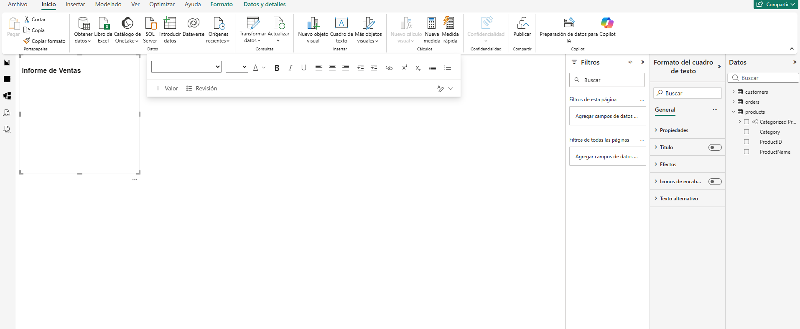

> [!TIP]
> Los títulos prominentes y descriptivos facilitan que la audiencia comprenda el propósito del panel de control de forma inmediata.

4. Haz clic en el fondo blanco del lienzo para deseleccionar el texto. En el panel de **Datos** derecho, despliega la tabla de productos y marca la casilla de la jerarquía **Producto Categorizado**. Aparecerá una tabla básica en el reporte.

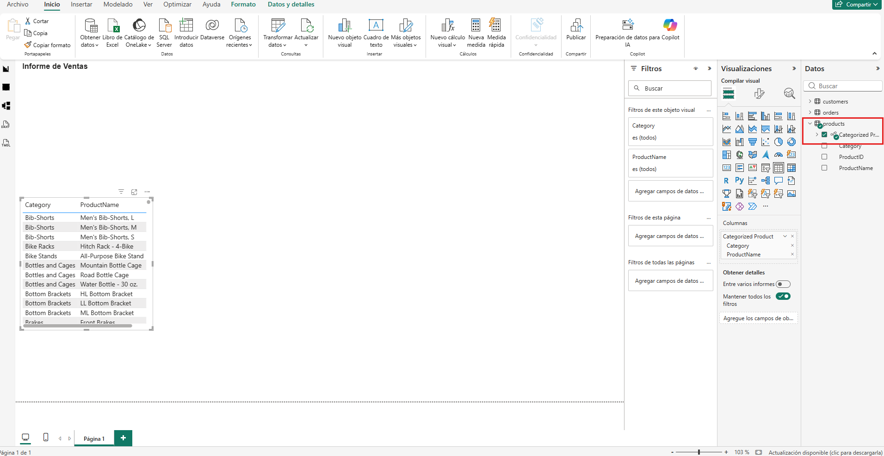

5. Con esta tabla seleccionada, marca la métrica **Ingresos** (*Revenue*) ubicada en la tabla de pedidos. La tabla se actualizará incorporando una columna monetaria formateada.

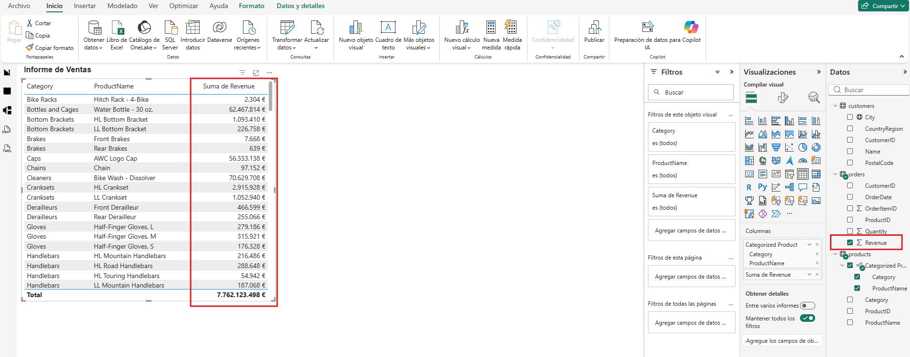

6. Manteniendo la selección, dirígete al panel de **Visualizaciones** y haz clic sobre el icono de **Gráfico de columnas agrupadas**. La información se transformará en un diagrama de barras verticales.

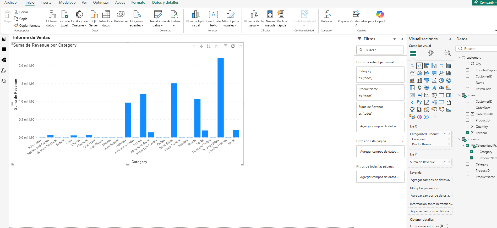

> [!TIP]
> Los gráficos de barras son ideales para comparar diferentes dimensiones (como categorías) de un solo vistazo.

7. En la esquina superior derecha del gráfico, pulsa el icono de la flecha descendente (↓) para habilitar la exploración en profundidad (*Drill down*). Haz clic sobre la barra de una categoría específica para desglosar y observar las ventas a nivel de producto individual.

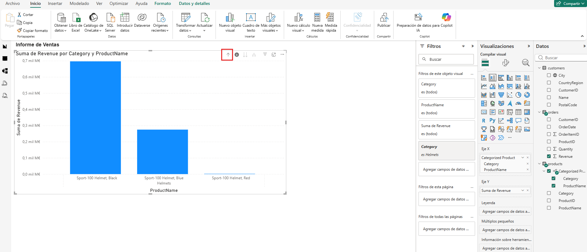

> [!TIP]
> El desglose permite descubrir información oculta bajo demanda sin necesidad de sobrecargar el diseño principal con un exceso de datos.

8. Para retroceder, emplea el icono de la flecha ascendente (↑) y vuelve al nivel general. Apaga la función de exploración desactivando la flecha descendente.
9. Pincha nuevamente en el fondo vacío del lienzo. Esta vez, marca la métrica de **Cantidad** (*Quantity*) de la tabla de pedidos y la **Categoría** de la tabla de productos. 
10. Con el nuevo gráfico seleccionado, cambia su formato a **Gráfico circular** (pastel) desde el panel de visualizaciones. Ajusta su tamaño y ubícalo al lado del gráfico principal.

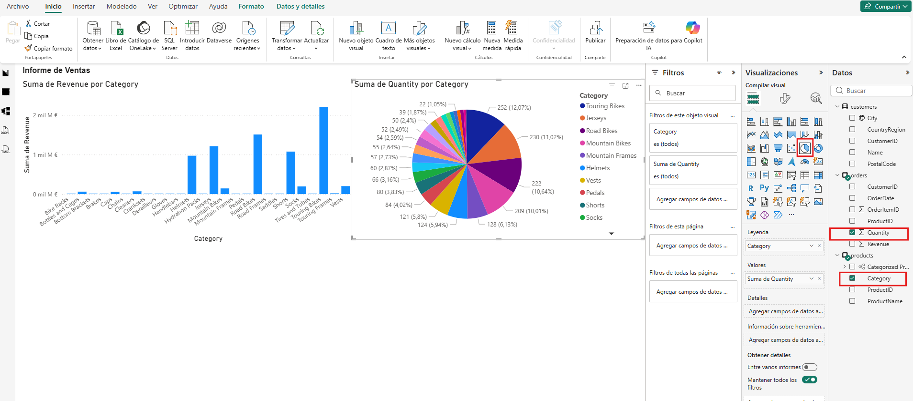

> [!TIP]
> Los diagramas circulares son muy efectivos para visualizar la contribución proporcional porcentual de cada sector, sirviendo como un gran complemento al diagrama de ingresos absolutos.

11. Vuelve a seleccionar el lienzo en blanco. Escoge ahora el campo **Ciudad** (*City*) de los clientes y la métrica de **Ingresos** (*Revenue*) de los pedidos. Al haber categorizado previamente la ciudad, el motor renderizará automáticamente un mapa de burbujas geoespacial. Redimensiona los paneles a tu gusto para que ocupen armónicamente la pantalla.

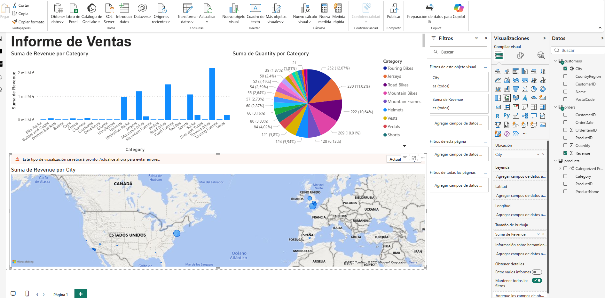

> [!TIP]
> El mapeo de información introduce una capa analítica geoespacial invaluable, permitiendo desvelar concentraciones y patrones territoriales que serían invisibles en tablas planas.

12. Prueba la interactividad: Puedes hacer zoom sobre el mapa usando la rueda del ratón. Si haces clic sobre la burbuja de una ciudad concreta (como Londres), observarás cómo los gráficos de barras y circulares se atenúan o reajustan para mostrar exclusivamente la proporción de ventas correspondiente a esa localidad.

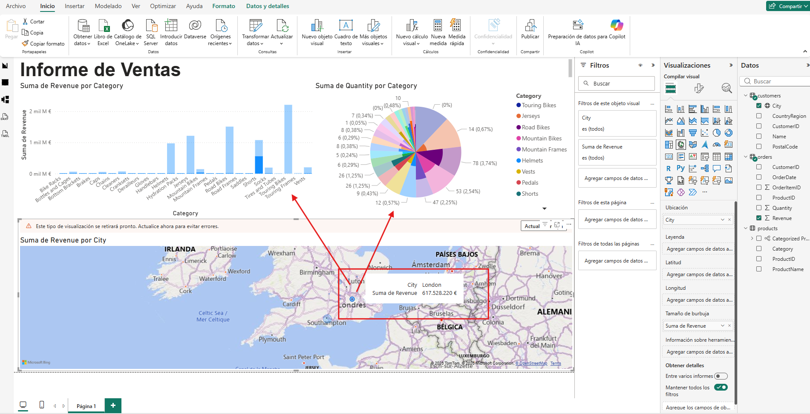

> [!TIP]
> El filtrado cruzado es la característica estrella de Power BI. Convierte lo que sería una simple fotografía estática en una herramienta dinámica de diagnóstico y exploración analítica.

13. Ve al menú **Archivo** y pulsa **Guardar**. Almacena tu trabajo localmente con la extensión nativa `.pbix`.

> [!TIP]
> El archivo `.pbix` empaqueta internamente el modelo de datos, la lógica relacional y la capa de presentación. Así podrás reanudar tus iteraciones de diseño o publicarlo en el servicio web de Power BI para colaborar con tu equipo en el futuro.

---

## 4. Limpieza de recursos

A diferencia de otros módulos orientados a la computación en la nube o el aprovisionamiento de bases de datos, **este laboratorio no ha generado ningún tipo de infraestructura de pago en Azure ni en Fabric**. 

Todo el desarrollo (carga, modelado e interfaz) se ha ejecutado de manera local en tu estación de trabajo y ha quedado almacenado en tu archivo `.pbix`. Por consiguiente, no es necesario eliminar grupos de recursos ni desactivar suscripciones para evitar costes.

---

## 5. Resumen del ejercicio

¡Enhorabuena! Has dado tus primeros pasos transformando información cruda en visualizaciones impactantes. A lo largo del laboratorio has consolidado tu aprendizaje sobre:
- **Preparación y Adquisición:** Habilitación de componentes geográficos y conexión directa a repositorios web para extraer información en bruto (ETL ligero).
- **Modelado Relacional Semántico:** Identificación de tablas, ajustes de formato financiero y categorización de metadatos (jerarquías y tipos de datos geográficos).
- **Presentación Analítica:** Orquestación de diferentes elementos visuales (cuadros de texto, barras, tartas y mapas) interconectados de forma nativa mediante filtrado cruzado.

---

⬅️ **Anterior:** [Explore real-time analytics in Microsoft Fabric](../Explore_real_time_analytics_in_Microsoft_Fabric/Explore_real_time_analytics_in_Microsoft_Fabric.md)

🏠 **Inicio del módulo:** [README](../../README.md)