# Explore real-time analytics in Microsoft Fabric

## Índice

- [1. Introducción](#1-introducción)
- [2. Puntos clave a tener en cuenta](#2-puntos-clave-a-tener-en-cuenta)
- [3. Ejecución del laboratorio](#3-ejecución-del-laboratorio)
  - [3.1 Crea un espacio de trabajo](#31-crea-un-espacio-de-trabajo)
  - [3.2 Crear un flujo de eventos (eventstream)](#32-crear-un-flujo-de-eventos-eventstream)
  - [3.3 Crea una casa de eventos (eventhouse) y almacena el stream](#33-crea-una-casa-de-eventos-eventhouse-y-almacena-el-stream)
  - [3.4 Consulta los datos capturados](#34-consulta-los-datos-capturados)
- [4. Limpieza de recursos](#4-limpieza-de-recursos)
- [5. Resumen del ejercicio](#5-resumen-del-ejercicio)

---

## 1. Introducción

Gran parte del análisis de información se fundamenta en datos recopilados en el pasado. Sin embargo, la analítica en tiempo real se diferencia al operar directamente sobre la información a medida que se va generando, segundo a segundo. Imagina una transmisión continua de viajes en taxi, en la cual los nuevos trayectos no dejan de registrarse de forma ininterrumpida.

En esta práctica, utilizarás las herramientas de Inteligencia en Tiempo Real de Microsoft Fabric para interceptar un flujo de datos en vivo de taxis, guardarlo y, posteriormente, ejecutar consultas para observar cómo se actualizan los resultados conforme entra información nueva. No hay problema si estos conceptos son novedosos para ti, ya que se detallarán paso a paso durante el proceso.

⏱️ Duración aproximada: **30 minutos**

> [!NOTE]
> Para completar este ejercicio es requisito indispensable contar con un tenant y una evaluación activa de Microsoft Fabric.

---

## 2. Puntos clave a tener en cuenta

- **Diferencia entre Batch y Streaming:** En contraposición a los procesos analíticos convencionales que leen lotes fijos (Batch) provenientes de un archivo estático, este laboratorio se enfoca en la captura ininterrumpida de información tal cual fluye en el mundo real.
- **El Rol de Eventstream y KQL:** El componente Eventstream opera como el conducto o "tubería" que recibe y dirige las ráfagas de datos. Por su parte, la base de datos KQL es un motor especializado en indexar telemetría estructurada y semiestructurada a grandísima escala, habilitando búsquedas ultrarrápidas que las bases de datos relacionales tradicionales no podrían soportar ante tal nivel de escritura constante.
- **Actualización Automática Visual:** Los paneles clásicos de inteligencia de negocios a menudo necesitan de recargas programadas. En el entorno de Real-Time Intelligence de Fabric, las visualizaciones se conectan directamente al torrente de OneLake, consiguiendo que los indicadores de negocio se actualicen de manera prácticamente instantánea.

---

## 3. Ejecución del laboratorio

### 3.1 Crea un espacio de trabajo

Antes de operar con datos, debes configurar un área de trabajo con la capacidad de Fabric habilitada. Piensa en esto como una carpeta maestra que albergará todos los componentes que construyas (flujos, casas de eventos, consultas, etc.). Esta capacidad otorga la potencia de procesamiento y cómputo requerida.

1. Ingresa a la página oficial de Microsoft Fabric desde tu explorador web y valídate con tus credenciales (`https://app.fabric.microsoft.com/home?experience=fabric`).
2. Dirígete a la parte inferior de la barra lateral izquierda y abre el selector de entornos. Si indica Power BI, haz clic y selecciona **Fabric** para desbloquear todas las características de inteligencia en tiempo real.


3. En el menú lateral, haz clic en **Espacios de trabajo** (cuyo icono se asemeja a unas carpetas apiladas 🗇).

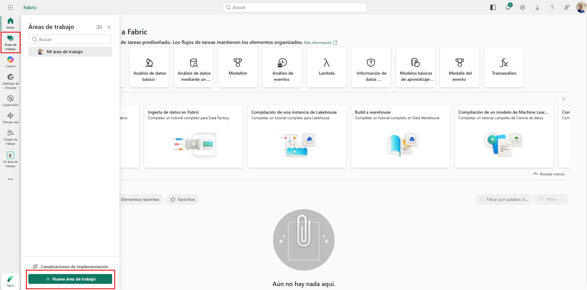

4. Selecciona el botón **+ Nuevo espacio de trabajo** e introduce un identificador único (por ejemplo, `dp900-realtime`). En la sección **Avanzada**, escoge un tipo de licencia que proporcione capacidad de Fabric (Prueba, Premium o Fabric) y presiona **Aplicar**.

> [!TIP]
> Emplear una capacidad que incluya Fabric asegura la disponibilidad de los motores analíticos necesarios para las tareas de ingesta continua. Además, trabajar en un espacio dedicado aísla los recursos de la práctica, facilitando enormemente su posterior limpieza.

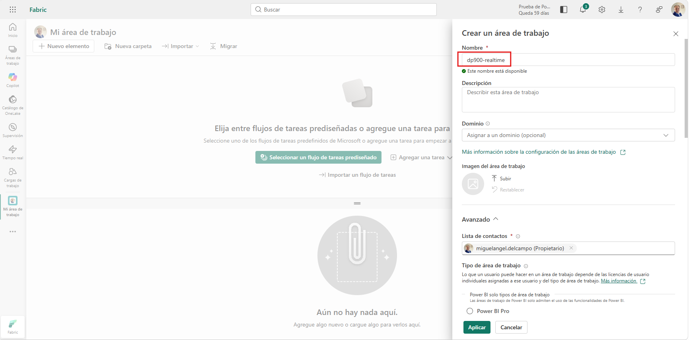

5. Tras el despliegue de la infraestructura, el área de trabajo aparecerá completamente vacía en pantalla.

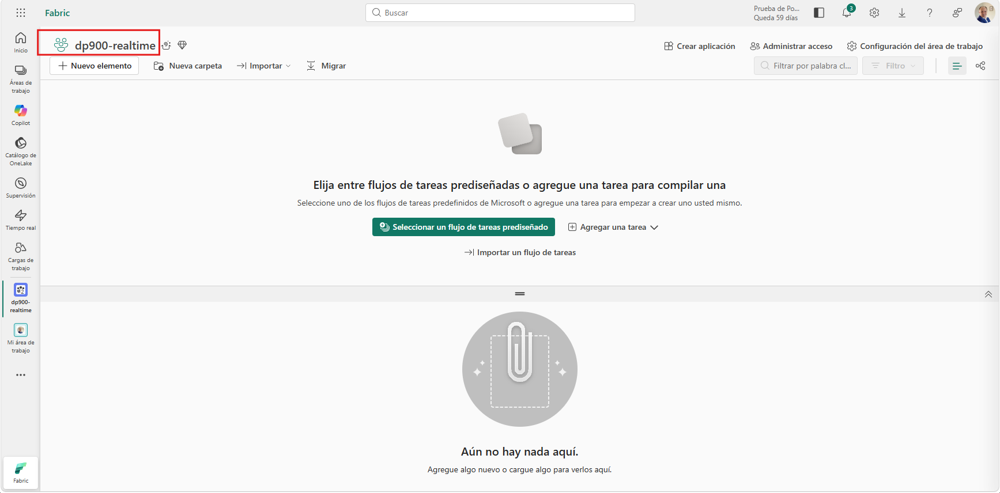

### 3.2 Crear un flujo de eventos (eventstream)

El siguiente paso consiste en localizar y capturar los eventos en movimiento provenientes de un origen de transmisión, utilizando para ello el Real-Time Hub.

Un flujo de eventos (*eventstream*) es la herramienta encargada de enlazarse a una fuente de emisión en directo y transportar dicha información hacia un destino de almacenamiento definitivo. El Real-Time Hub actúa como el catálogo central para descubrir y gestionar estas conexiones.

> [!TIP]
> Durante tu primer acceso al Real-Time Hub, es posible que el sistema despliegue algunas sugerencias o guías de introducción. Puedes descartarlas para continuar.

1. En el menú de navegación izquierdo, selecciona **Tiempo real** (Real-Time Hub).

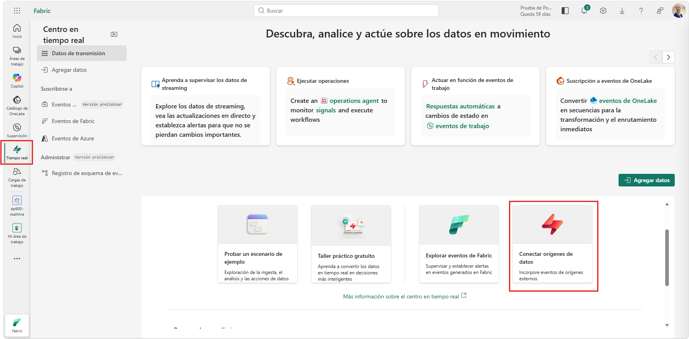

2. Dentro del Hub, busca la sección para incorporar información y selecciona **Fuentes de datos** (o Conectar orígenes de datos). Automáticamente se cargará un listado con conectores en vivo.
3. Localiza la tarjeta correspondiente a la muestra del **Taxi amarillo** y haz clic en la opción de conectar.

> [!NOTE]
> Este origen de prueba del taxi amarillo consiste en un canal seguro y de libre acceso, lo que significa que no se exigen credenciales complejas para su utilización.

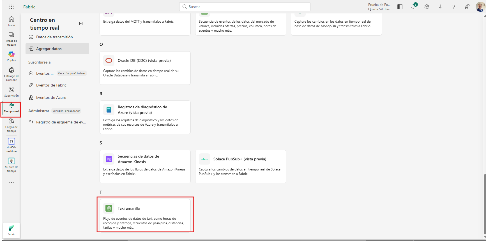

4. En la ventana del asistente de configuración, fíjate en el panel de detalles derecho. Despliega el campo referido al área de trabajo y selecciona la que acabas de crear (por ejemplo, `dp900-realtime`), sustituyendo la selección por defecto. Puedes cerrar cualquier aviso adicional sobre la evaluación de Fabric que se interponga.

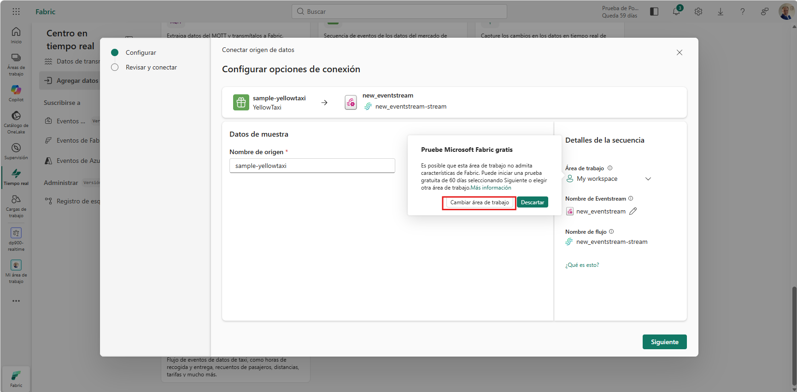
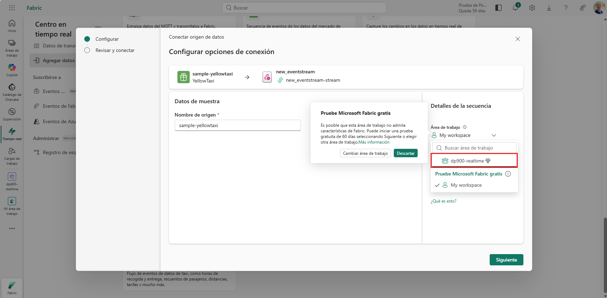

5. Configura el nombre del origen escribiendo `taxi`. A continuación, modifica el nombre sugerido para la herramienta Eventstream a `taxi-data`. El nombre técnico del flujo interno se ajustará automáticamente a `taxi-data-stream`.

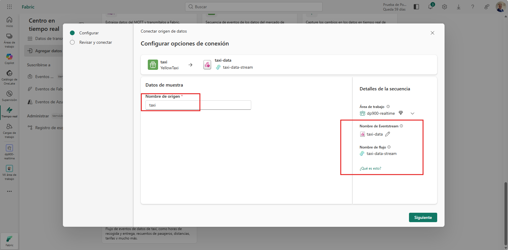

6. Pulsa **Siguiente**. En la pantalla resumen, valida la conexión trazada entre la fuente y el flujo, y haz clic en **Conectar**.

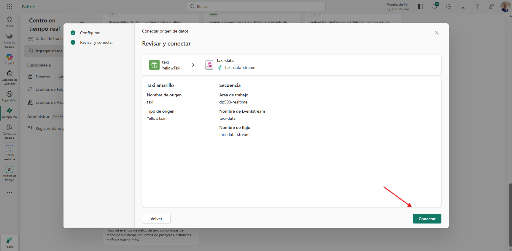

7. Aguarda un instante hasta que las tareas de creación marquen un estado **Correcto**. Finalizado este proceso, presiona **Abrir Eventstream**.

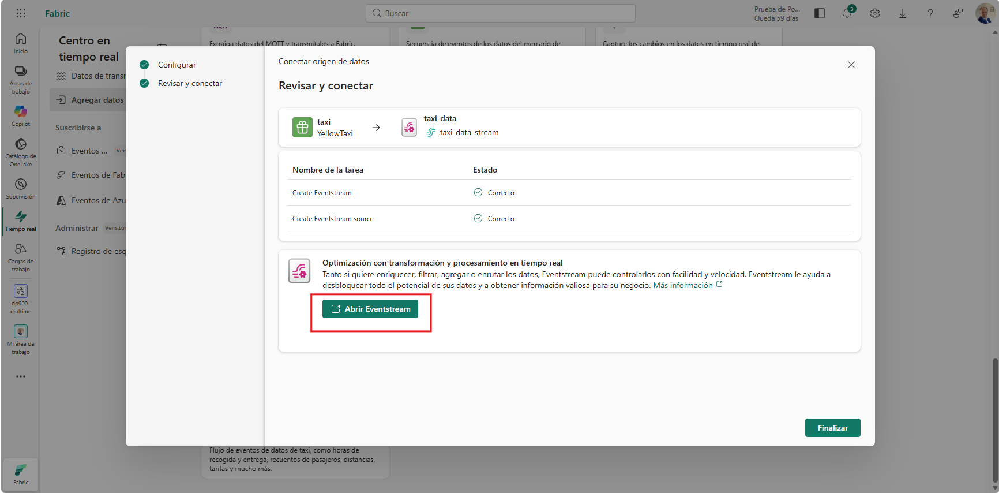

8. Se desplegará el lienzo de diseño principal de la herramienta, ilustrando visualmente la vinculación activa entre la fuente y el flujo de datos que acabas de configurar.

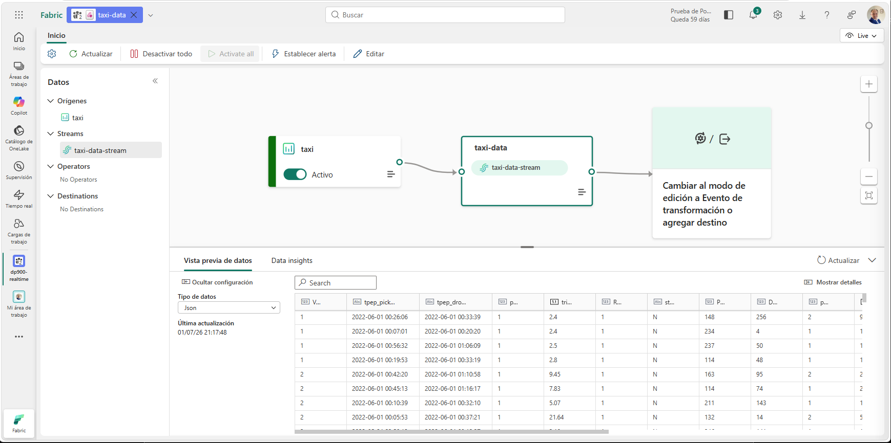

### 3.3 Crea una casa de eventos (eventhouse) y almacena el stream

En esta fase de la arquitectura, el flujo está captando de manera activa la información de los taxis, pero no la está persistiendo en ninguna ubicación. Para guardarla y hacerla consultable, es necesario añadir una **Eventhouse** (casa de eventos) como destino final.

Una casa de eventos es un almacén duradero, cimentado específicamente para cargas de trabajo en tiempo real, el cual incluye una base de datos KQL en su interior. KQL (Kusto Query Language) es un lenguaje ágil diseñado para filtrar e inspeccionar volúmenes gigantescos de datos secuenciales a máxima velocidad.

1. Con la vista del flujo de datos activa en el lienzo (asegúrate de estar en modo Edición), dirígete a la cinta superior, pulsa **Agregar destino** y elige **Eventhouse**.

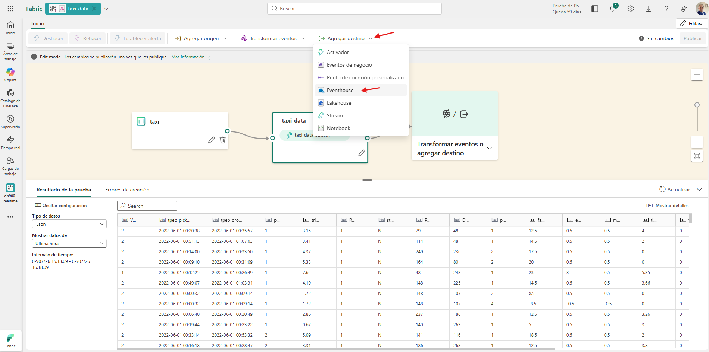

2. En el panel lateral derecho que aparecerá, configura los siguientes parámetros de ingesta:
   - **Modo de procesamiento:** Opta por *Procesamiento de eventos antes de la ingesta*.
   - **Nombre de destino:** Conserva el valor predeterminado `Eventhouse`.
   - **Área de trabajo:** Revisa que coincida con tu entorno (`dp900-realtime`).
   - **Eventhouse:** Pincha en *Crear*, nombra la instancia como `taxi-eventhouse` y clica en *Listo*. De manera automática, la base de datos heredará esta misma nomenclatura.

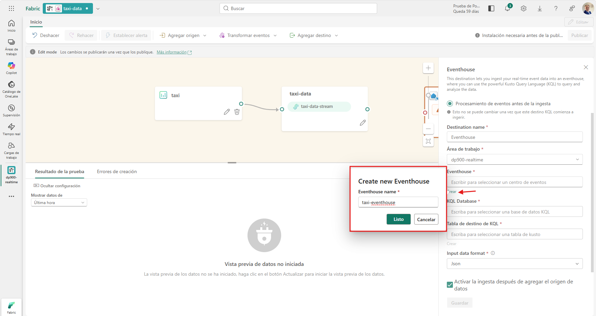

3. En el campo de la tabla destino, clica de nuevo en *Crear*, denomínala `yellow-taxi` y acepta el cambio.
4. Verifica que la casilla para activar la ingesta tras agregar el origen esté marcada y pulsa **Guardar**.

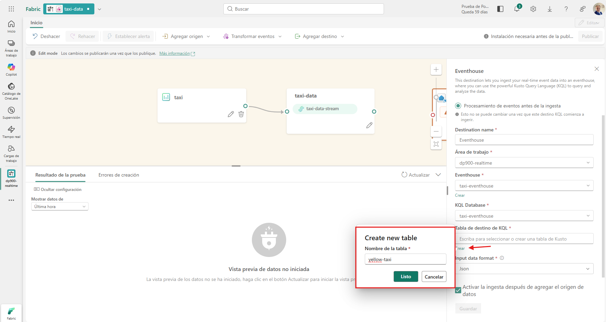

5. Podrás observar cómo un nuevo bloque correspondiente a la casa de eventos se inserta en tu lienzo. Asegúrate de que exista una línea que lo enlace al nodo del flujo; de no ser así, arrastra una conexión manualmente desde el punto de anclaje del flujo hacia la casa de eventos.
6. En la parte superior de la interfaz, selecciona **Publicar** para consolidar los cambios en el servidor.

> [!TIP]
> Cualquier ajuste que realices sobre el lienzo permanece en estado de borrador (modo Edición) hasta el momento en el que decides publicarlo. La acción de publicar activa el modo *Live*, provocando que la información empiece a fluir físicamente hacia la base de datos.

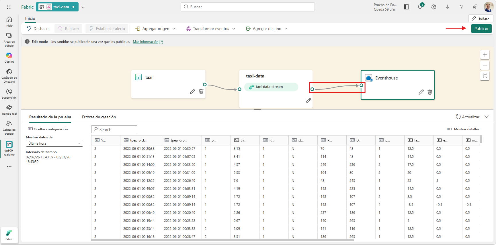

7. Una vez publicado, los tres componentes de la arquitectura mostrarán una etiqueta verde de estado **Activo**.
8. Selecciona el cajón visual de la Eventhouse y, en la consola situada bajo el lienzo, navega hasta la pestaña **Vista previa de datos**.
9. Puede requerir un par de minutos hasta que los primeros registros aterricen en destino. Usa el botón **Actualizar** periódicamente hasta visualizar las filas con los detalles de los trayectos.

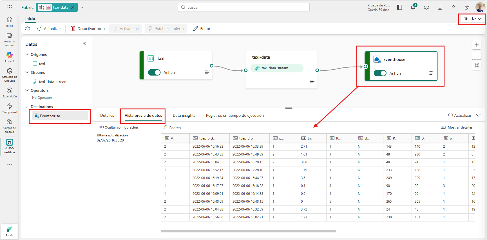

### 3.4 Consulta los datos capturados

Dado que la ingesta ya está poblando constantemente la tabla `yellow-taxi`, ha llegado el momento de usar código para extraer valor de la misma.

> [!TIP]
> El lenguaje KQL está altamente optimizado para el análisis exploratorio de registros con marcas de tiempo (series temporales). Utilizar consultas directas permite validar que el sistema de ingesta funciona correctamente y fomenta una exploración inmediata.

1. Ve a la barra lateral izquierda, abre tu espacio de trabajo (`dp900-realtime`) y pulsa sobre el artefacto correspondiente a la base de datos KQL (`taxi-eventhouse`).

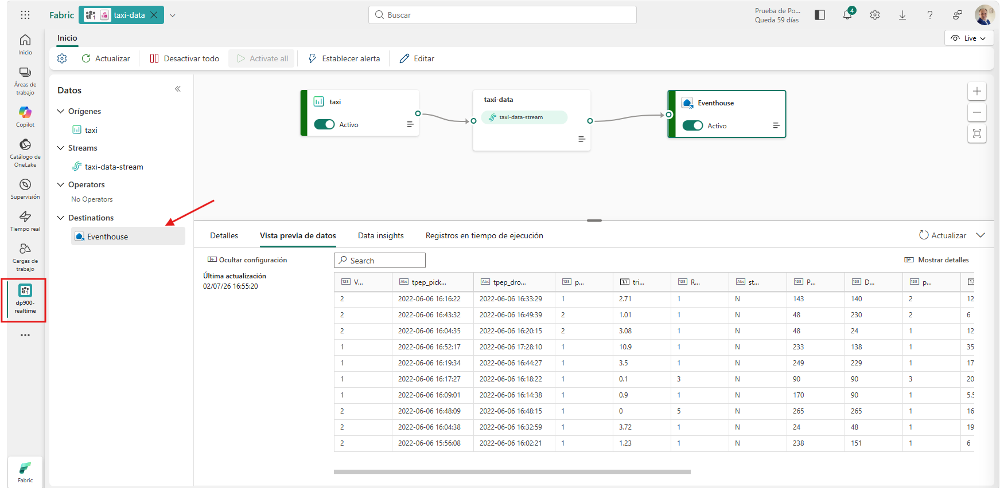

2. Al entrar, observarás que tu entorno posee la tabla que definiste (`yellow-taxi`) junto con un archivo de consultas sugeridas (`taxi-eventhouse_queryset`).

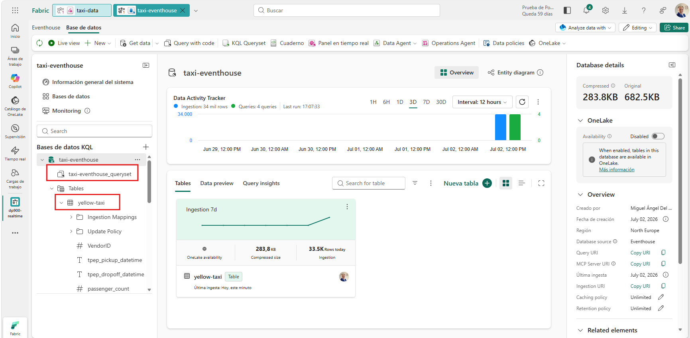

3. Selecciona el elemento `taxi-eventhouse_queryset` en el árbol de navegación. Se abrirá un editor de texto con código de demostración.

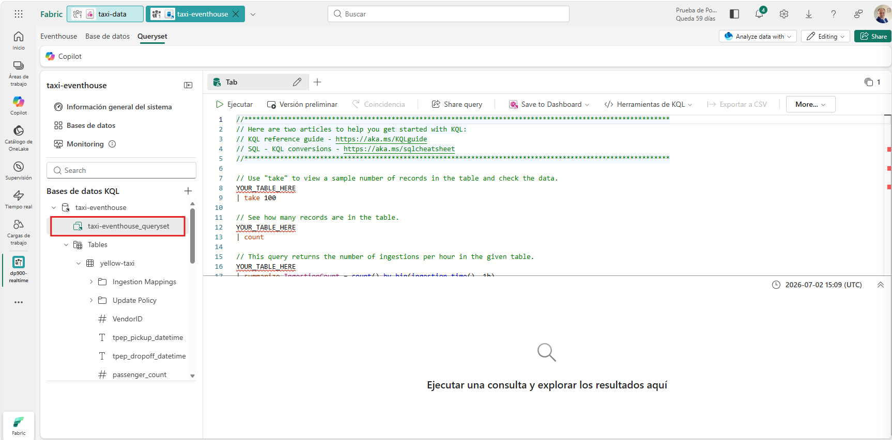

4. Elimina la totalidad del código sugerido en el editor.
5. Copia, pega el siguiente bloque en el lienzo de consultas y haz clic en **Ejecutar** para recuperar una muestra de los últimos 100 eventos almacenados:

```kusto
['yellow-taxi']
| take 100
```

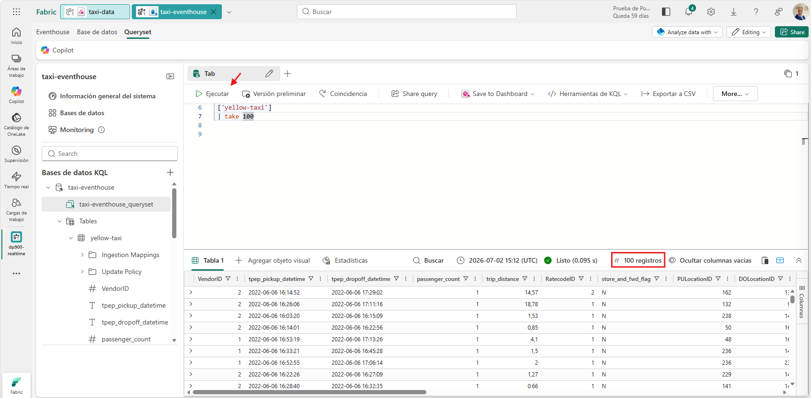

> [!NOTE]
> La tabla se invoca entre corchetes y comillas simples `['...']` debido a la presencia del guion medio. Esta es la sintaxis imperativa de KQL para nombres que incluyen caracteres especiales.

> [!TIP]
> La sentencia `take 100` resulta sumamente útil como chequeo rápido de salud (sanity check). Permite comprobar el formato de las columnas sin desencadenar un escaneo masivo sobre el total de la base de datos.

6. Borra la consulta anterior, introduce el siguiente fragmento para agrupar y contar el volumen de viajes por franja horaria y presiona **Ejecutar**:

```kusto
['yellow-taxi']
| summarize PickupCount = count() by bin(todatetime(tpep_pickup_datetime), 1h)
```

En el panel inferior emergerá un resumen indicando la fecha, la hora y el conteo de servicios asociados a dicho intervalo.

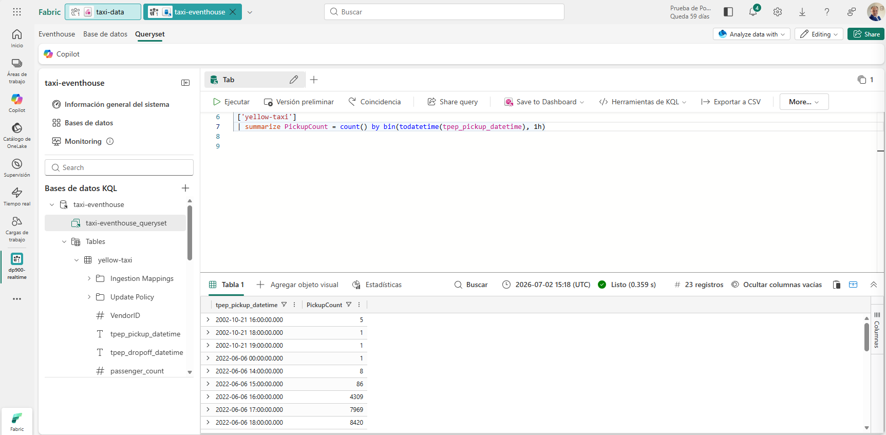

> [!TIP]
> La instrucción `bin(..., 1h)` segmenta temporalmente los datos en cubos de sesenta minutos, simplificando drásticamente el proceso de descubrir tendencias y picos a lo largo del día.

7. Para generar un reporte visual, haz clic en el menú desplegable junto a "Tabla 1" en la franja de resultados y solicita agregar un objeto visual.
8. En el menú de formato de la parte derecha, escoge **Gráfico de columnas** como tipología gráfica. Aparecerá un diagrama de barras reflejando las agrupaciones calculadas.

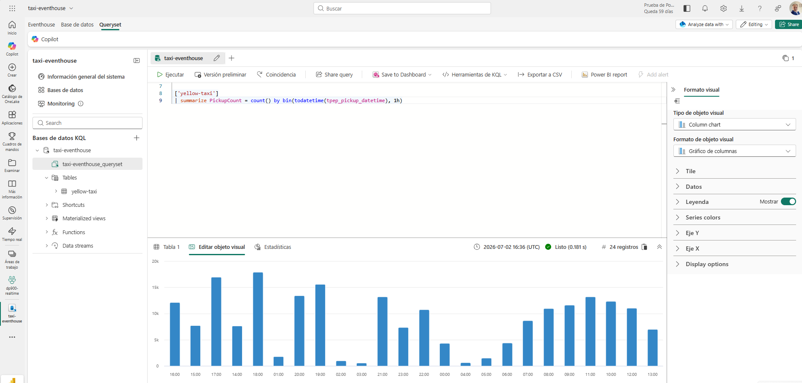

9. Si esperas varios segundos y ejecutas de nuevo la consulta de la gráfica, constatarás que los totales fluctúan de forma dinámica, demostrando que tu arquitectura sigue asimilando registros vivos de forma paralela a tu análisis.

---

## 4. Limpieza de recursos

Tras haber cumplido satisfactoriamente con todos los hitos referidos a la exploración de inteligencia en tiempo real dentro de Fabric, procede a desmantelar el escenario aprovisionado.

> [!TIP]
> La eliminación a nivel de espacio de trabajo aniquila de una sola vez la base de datos, el flujo continuo y cualquier reporte subyacente, impidiendo que el motor de la nube genere gastos imprevistos.

1. Pincha sobre el nombre de tu área de trabajo en el margen izquierdo para visualizar sus elementos.
2. En la barra superior, localiza y pulsa en **Configuración del área de trabajo**.
3. Accede al apartado **General**, navega hasta el fondo de las opciones y presiona el botón para **Quitar esta área de trabajo** (o Eliminar este espacio de trabajo). Acepta la advertencia del sistema para confirmar el borrado de los activos.

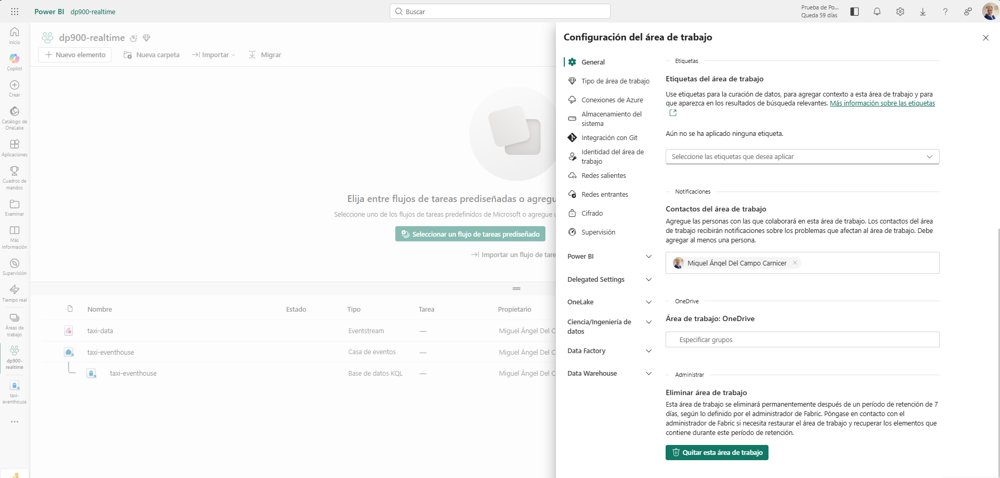

---

## 5. Resumen del ejercicio

Este laboratorio ha supuesto un recorrido integral por el procesamiento de analítica de flujos mediante las siguientes etapas:
- **Aprovisionamiento del Entorno Real-Time:** Construcción de un ecosistema (Workspace) dotado de capacidad analítica continua bajo el paraguas de Microsoft Fabric.
- **Configuración de la Ingesta (Eventstream):** Parametrización de un motor de mensajería para escuchar e interceptar telemetría en constante movimiento.
- **Creación de la Base de Datos Analítica (KQL Database):** Despliegue de una estructura de almacenamiento especializada capaz de ingerir y asimilar registros JSON a altísima velocidad.
- **Consulta y Visualización en Tiempo Real:** Interrogación de los datos en caliente usando lenguaje Kusto (KQL), derivando en visualizaciones agregadas que evolucionan en vivo al ritmo de la ingesta.

---

⬅️ **Anterior:** [Explore data analytics in Microsoft Fabric](../Explore_data_analytics_in_Microsoft_Fabric/Explore_data_analytics_in_Microsoft_Fabric.md)

🏠 **Inicio del módulo:** [README](../../Lab04readme.md)

➡️ **Siguiente:** [Explore fundamentals of data visualization with Power BI](../Explore_fundamentals_of_data_visualization_with_Power_BI/Explore_fundamentals_of_data_visualization_with_Power_BI.md)