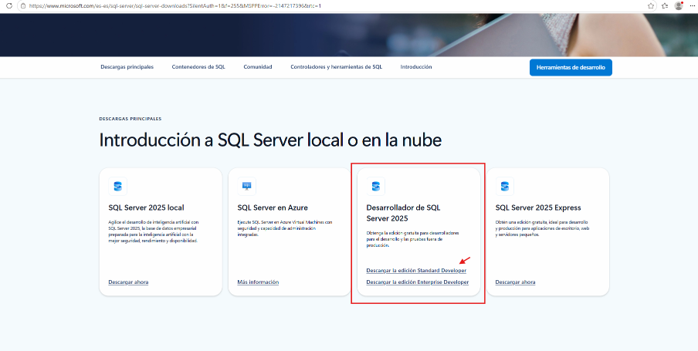
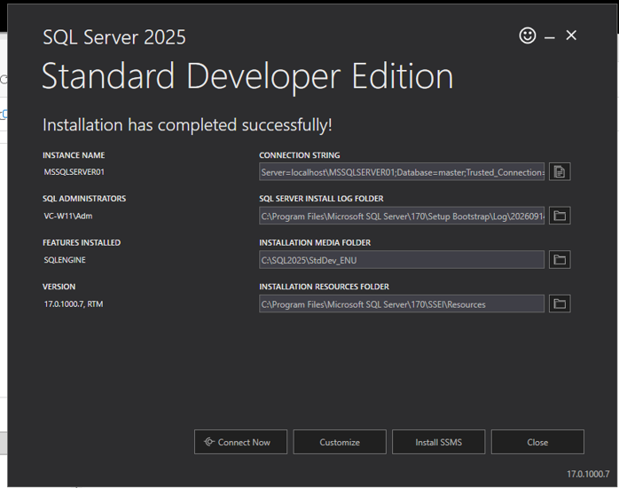
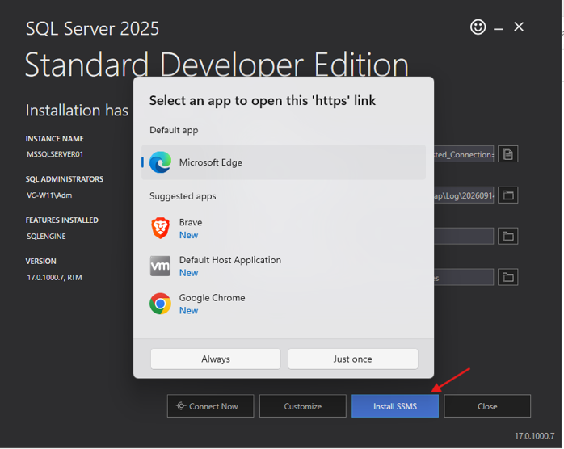
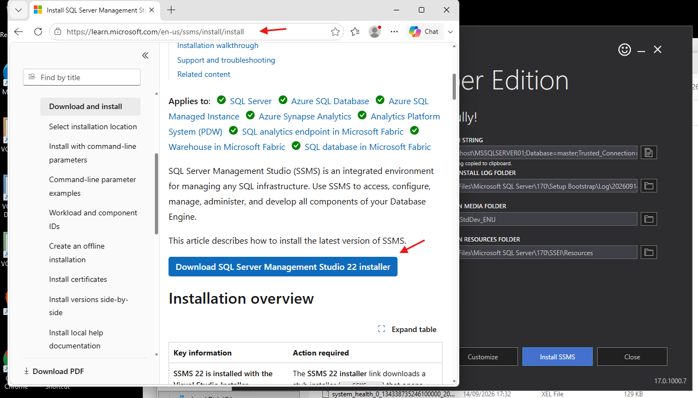
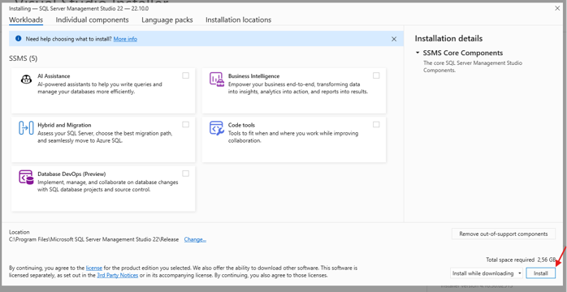
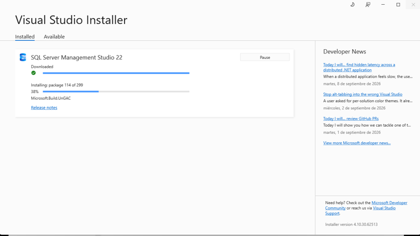
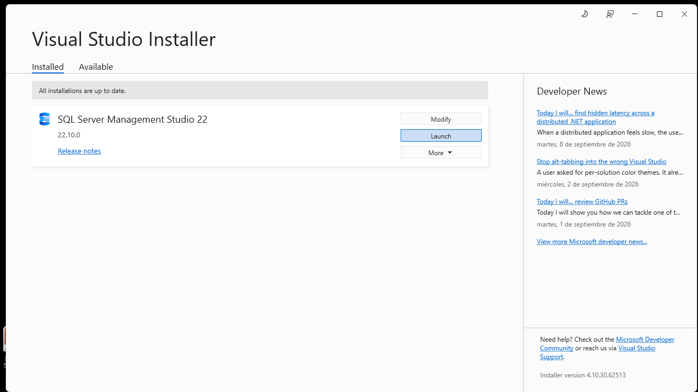
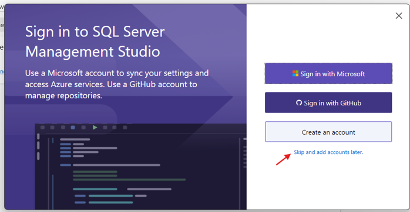
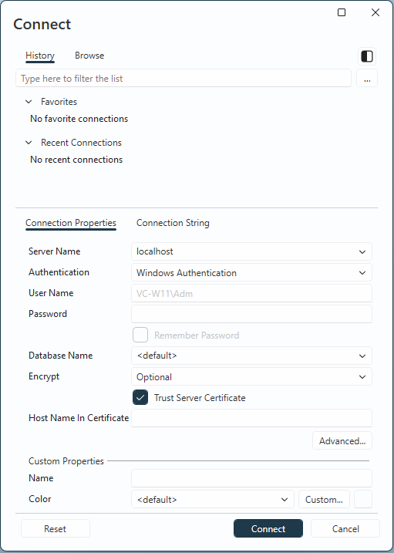
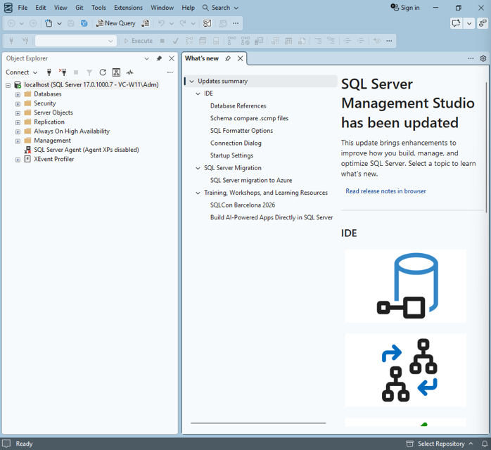

# **PL-300-Microsoft-Power-BI-Data-Analyst**

## **Setup local lab environment | PL-300-Microsoft-Power-BI-Data-Analyst**

Ideally, you should complete these labs in a hosted lab environment. If you want to complete them on your own computer, you can do so by installing the following software.

* All setup and resource files can be downloaded from GitHub.  
  * Extract the ‘AllFilesDownload’ folder to D:/ and rename it to ‘D:\\Allfiles'.

> [!IMPORTANT]
> You may experience unexpected dialogs and behavior when using your own environment. Due to the wide range of possible local configurations, the course team cannot support issues you may encounter in your own environment.

---

## 📑 Índice del Laboratorio
- [Instructions using Windows 11](#instructions-using-windows-11)
- [Power BI Desktop](#power-bi-desktop)
- [Microsoft 365 Developer account](#microsoft-365-developer-account)
- [SQL Server Database Engine](#sql-server-database-engine)
- [SQL Server Management Studio (SSMS)](#sql-server-management-studio-ssms)

---

## Instructions using Windows 11
The instructions below are for a Windows 11 computer. Connecting from a different OS may not result in the same experience.

## Power BI Desktop
1. Download and install from the Microsoft store. If you do not have access to the Microsoft store, download from the web. Power BI Desktop is the primary application for these labs.  
   * Use the default options in the installer.

## **Microsoft 365 Developer account**
For some of the exercises, you will need to log into Power BI with an organizational account. You can use your own, but if you don’t have access, you can create a free Microsoft 365 Developer account.

---

## SQL Server Database Engine
1. The lab connects to a localhost SQL Server instance. The following instructions will help you install SQL Server and configure the default options. You only need to install the Database Engine feature.  
   * Download the free Developer copy of install media.  
   * Install SQL Server from the Installation Wizard (Setup).

> [!NOTE]
> You can use an existing SQL Server instance if you have access, instead of installing a local version. However, you’ll need to modify the connection string from “localhost” to your instance name.

---


Imagen1.png


Imagen2.png

**Instancia- Cadena de conexión**
```text
Server=localhost\MSSQLSERVER01;Database=master;Trusted_Connection=True;
```

CARPETA DE LOG DE SQL SERVER
```text
C:\Program Files\Microsoft SQL Server\170\Setup Bootstrap\Log\20260914_173053
```

CARPETA DE INSTALACION
```text
C:\SQL2025\StdDev_ENU
```


Imagen3.png

[https://learn.microsoft.com/en-us/ssms/install/install](https://learn.microsoft.com/en-us/ssms/install/install)


Imagen4.png


Imagen5.png


Imagen6.png


Imagen7.png


Imagen8.png


Imagen9.png

---

## SQL Server Management Studio (SSMS)
los parámetros ya están configurados con los valores idóneos:

* **Server Name:** localhost  
* **Authentication:** Windows Authentication  
* **User Name:** VC-W11\Adm (tu usuario local de la VM con permisos de administrador)  
* **Trust Server Certificate:** Marcado con el *check* (imprescindible en las versiones recientes de SSMS para evitar errores de certificados SSL autofirmados locales).

**¿Qué debes hacer ahora?**

Haz clic en el botón **Connect** abajo a la derecha.


Imagen10.png

Esto confirma que:

1. El motor de SQL Server está activo y escuchando en la instancia por defecto.  
2. La autenticación de Windows funciona con tu usuario actual.  
3. Power BI Desktop podrá conectarse a localhost sin requerir configuraciones de red adicionales.

---

⬅️ **Anterior:** [Inicio del Repositorio](../../Readmedp-700.md)

🏠 **Índice de Laboratorios:** [Laboratorios](../readmeLab.md)

➡️ **Siguiente:** [Get data in Power BI](../02_get_data_in_power_bi/readme2.md)

```