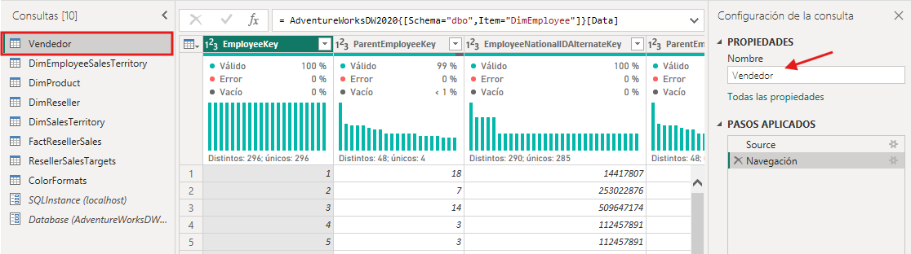

# Limpiar, transformar y cargar datos en Power BI

## Historia del laboratorio

En este laboratorio, utilizarás técnicas de limpieza y transformación de datos para empezar a dar forma a tu modelo de datos. Luego aplicarás las consultas para cargar cada una como una tabla en el modelo semántico.

En este laboratorio, aprendes cómo:

* Aplica diversas transformaciones de datos.  
* Carga consultas en el modelo semántico.

**Este laboratorio debería durar aproximadamente 45 minutos.**

## Empieza

Para completar este ejercicio, primero abre un navegador web e introduce la siguiente URL para descargar la carpeta zip:

https://github.com/MicrosoftLearning/PL-300-Microsoft-Power-BI-Data-Analyst/raw/Main/Allfiles/Labs/02-transform-data-power-bi/02-transform-data.zip

Extrae la carpeta a la **carpeta C:\\Users\\Student\\Downloads\\02-transform-data**.

Abre el archivo **02-Starter-Sales Analysis.pbik**.

***Nota:** Puede que veas un diálogo de inicio de sesión mientras carga el archivo. Selecciona **Cancelar** para cerrar el cuadro de inicio de sesión. Cierra cualquier otra ventana informativa. Selecciona **Solicitar más tarde**, si se le pide aplicar cambios.*

## Configurar la consulta del Comercial

En esta tarea, usarás Power Query Editor para configurar la consulta **de Salesperson**.

***Importante**: Cuando se indica que renombres columnas, es importante que las renombres exactamente como se describe.*

1. Para abrir la ventana **del Editor de Power Querys**, en la pestaña de **la cinta de inicio**, desde dentro del **grupo de Consultas**, selecciona el icono **Transformar datos**.  
   ![Transformar datos en la cinta de inicio][image1]  
2. En la ventana **del Editor de Power Consultas**, en el panel **de Consultas**, selecciona la **consulta DimEmployee**.  
   ![Imagen 1][image2]  
3. **Nota:** Si recibes un mensaje de advertencia pidiendo especificar cómo conectarte, selecciona **Editar credenciales**, conéctate usando las credenciales actuales y **selecciona OK** para usar una conexión sin cifrar.  
4. Para renombrar la consulta, en el panel **de Configuración de la consulta** (ubicado a la derecha), en el cuadro **de Nombre**, sustituye el texto por **Vendedor** y luego pulsa **Enter**. Luego verifica que el nombre se haya actualizado en **el panel de Consultas**.  

5. *El nombre de la consulta determina el nombre de la tabla de modelos. Se recomienda definir nombres concisos y fáciles de usar.*  
6. Para localizar una columna específica, en la pestaña de **la cinta de inicio**, desde dentro del grupo **Gestionar columnas**, selecciona la flecha **descendente Elegir** columnas y luego **selecciona Ir a columna**.  
7. ***Ir a Columna** es una función útil con muchas columnas. Si no, puedes desplazarte horizontalmente para encontrar columnas.*  
8. *![Gestionar columnas \> Elegir columnas \> Ir a columna][image3]*  
9. En la ventana **Ir a columna**, para ordenar la lista por nombre de columna, selecciona el botón **de ordenar AZ** y luego **selecciona Nombre**.  
   ![Ve a las opciones de ordenación de columnas][image4]  
10. Localiza la columna **SalesPersonFlag**, luego filtra la columna para seleccionar solo Salespeople (es decir, **TRUE**) y haz **clic en OK**.  
11. En el panel **de Configuración de Consulta**, en la lista **de Pasos Aplicados**, observa la adición del paso **Filas Filtradas**.  
12. *Cada transformación que creas da lugar a una lógica de paso más. Es posible editar o eliminar pasos. También es posible seleccionar un paso para previsualizar los resultados de la consulta en esa fase de la transformación de la consulta.*  
13. *![Pasos aplicados][image5]*  
14. Para eliminar columnas, en la pestaña de **cinta de inicio**, desde dentro del **grupo Gestionar columnas**, selecciona el icono **Elegir columnas**.  
15. En la ventana **Elegir columnas**, para desmarcar todas las columnas, desmarque el elemento **(Seleccionar todas las columnas**).  
16. Para incluir columnas, revisa las siguientes seis columnas:  
    * EmployeeKey  
    * EmployeeNationalIDAlternateKey  
    * Nombre  
    * Apellido  
    * Título  
    * Dirección de correo electrónico  
17. En la lista **de Pasos Aplicados**, observa la adición de otro paso de consulta.  
    ![Eliminado otro paso de columnas][image6]  
18. To create a single name column, first select the **FirstName** column header. While pressing the **Ctrl** key, select the **LastName** column.  
    ![Multi-select two columns to create single column][image7]  
19. Right-click either of the select column headers, and then in the context menu, select **Merge Columns**.  
20. *Many common transformations can be applied by right-clicking the column header, and then choosing them from the context menu. Note that additional transformations are available in the ribbon.*  
21. In the **Merge Columns** window, in the **Separator** dropdown list, select **Space**.  
22. In the **New Column Name** box, replace the text with **Salesperson**.  
23. To rename the **EmployeeNationalIDAlternateKey** column, double-click the **EmployeeNationalIDAlternateKey** column header and replace the text with **EmployeeID**, and then press **Enter**.  
24. Rename the **EmailAddress** column to **UPN**.  
25. *UPN is an acronym for User Principal Name.*

**In the status bar at the bottom-left corner of the Power Query Editor, verify that the query has 5 columns and 18 rows.**

## Configure the SalespersonRegion query

In this task, you’ll configure the **SalespersonRegion** query.

1. In the **Queries** pane, select the **DimEmployeeSalesTerritory** query.  
2. In the **Query Settings** pane, rename the query to **SalespersonRegion**.  
3. To remove the last two columns, first select the **DimEmployee** column header.  
4. While pressing the **Ctrl** key, select the **DimSalesTerritory** column header.  
5. Right-click either of the select column headers, and then in the context menu, select **Remove Columns**.

**In the status bar, verify that the query has 2 columns and 39 rows.**

## Configure the Product query

In this task, you’ll configure the **Product** query.

***Important**: When detailed instructions have already been provided, lab steps will provide more concise instructions. If you need the detailed instructions, you can refer back to the steps of previous tasks.*

1. Select the **DimProduct** query and rename the query to **Product**.  
2. Locate the **FinishedGoodsFlag** column, and then filter the column to retrieve products that are finished goods (that is, TRUE).  
3. Remove all columns, **except** the following:  
   * ProductKey  
   * EnglishProductName  
   * StandardCost  
   * Color  
   * DimProductSubcategory  
4. Notice that the **DimProductSubcategory** column represents a related table (it contains **Value** links).  
5. In the **DimProductSubcategory** column header, at the right of the column name, select the expand button.  
   ![Column expand icon][image8]  
6. See the full list of columns, then select the **Select All Columns** box to unselect all columns.  
7. Select **EnglishProductSubcategoryName** and **DimProductCategory**, and uncheck the **Use Original Column Name as Prefix** checkbox before selecting **OK**.  
   ![Expand column][image9]  
8. *By selecting these two columns, a transformation will be applied to join to the **DimProductSubcategory** table, and then include these columns. The **DimProductCategory** column is, in fact, another related table in the data source.*  
9. *Query column names must always be unique. If left checked, this checkbox would prefix each column with the expanded column name (in this case **DimProductSubcategory**). Because it’s known that the selected column names don’t collide with column names in the **Product** query, the option is deselected.*  
10. Notice that the transformation resulted in the addition of two columns, and that the **DimProductSubcategory** column has been removed.  
11. Expande la columna **DimProductCategory** y luego introduce solo la columna **EnglishProductCategoryName**.  
12. Renombra las siguientes cuatro columnas:  
    * **EnglishProductoNombre** a **Producto**  
    * **Coste estándar** a **coste estándar** (incluye un espacio)  
    * **InglésSubcategoríaProducto Nombre** a **Subcategoría**  
    * **InglésProductoCategoríaNombre** a **Categoría**

**En la barra de estado, comprueba que la consulta tenga 6 columnas y 397 filas.**

## Configurar la consulta de revendedor

En esta tarea, configurarás la consulta **de revendedor**.

1. Selecciona la consulta **DimReseller** y cambia el nombre a **Revendedor**.  
2. Eliminar todas las columnas, **excepto** las siguientes:  
   * ResellerKey  
   * Tipo de negocio  
   * Nombre del Distribuidor  
   * DimGeography  
3. Amplía la columna **DimGeography** para **incluir solo** las siguientes tres columnas:  
   * Ciudad  
   * EstadoNombre de la Provincia  
   * InglésPaísPaísNombre  
4. En la cabecera **de columna BusinessType**, selecciona la flecha hacia abajo y luego revisa los valores distintos de las columnas, y observa ambos valores **como Almacén** y **Almacén**.  
5. Haz clic derecho en la cabecera **de la columna BusinessType** y luego **selecciona Reemplazar valores**.  
6. En la ventana **de Reemplazar Valores**, configura los siguientes valores:  
   * En la casilla **Valor para encontrar**, introduce **Warehouse**  
   * En la **caja Reemplazar con**, introduce **Almacén**

**![Cuadro de diálogo Reemplazar valores][image10]**

1. Renombra las siguientes cuatro columnas:  
   * **Tipo de negocio** a **tipo de negocio** (incluir un espacio)  
   * **Nombre del revendedor** al **revendedor**  
   * **EstadoProvinciaNombre** a **Estado-Provincia**  
   * **InglésPaísRegiónNombre** a **País-Región**

**En la barra de estado, verifica que la consulta tenga 6 columnas y 701 filas.**

## Configurar la consulta por región

En esta tarea, configurarás la consulta **de Región**.

1. Selecciona la consulta **DimSalesTerritory** y renombra la consulta a **Región**.  
2. Aplica un filtro a la columna **SalesTerritoryAlternateKey** para eliminar el valor 0 (cero).  
3. *Esto eliminará una fila.*  
4. Eliminar todas las columnas, **excepto** las siguientes:  
   * ClaveTerritorioVentas  
   * RegiónTerritorioVentas  
   * SalesTerritoryCountry  
   * SalesTerritoryGroup  
5. Renombra las siguientes tres columnas:  
   * **SalesTerritorioRegión** a **Región**  
   * **Territoriode ventasPaís** a **país**  
   * **SalesTerritoryGroup** to **Group to Group**

**En la barra de estado, verifica que la consulta tenga 4 columnas y 10 filas.**

## Configurar la consulta de ventas

En esta tarea, configurarás la consulta **de Ventas**.

1. Selecciona la consulta **FactResellerSales** y cámbela a **Ventas**.  
2. Eliminar todas las columnas, **excepto** las siguientes:  
   * Número de Venta  
   * Fecha de pedido  
   * ProductKey  
   * ResellerKey  
   * EmployeeKey  
   * ClaveTerritorioVentas  
   * OrderQuantity  
   * Precio unitario  
   * CosteProducto Total  
   * SalesAmount  
   * DimProduct  
3. ***Nota:** Puede que recuerdes en **el laboratorio Preparar Datos en Power BI Desktop** que un pequeño porcentaje de las filas **de FactResellerSales** tenían valores **TotalCostProducto** faltantes. La columna **DimProduct** se ha incluido para recuperar la columna de costes estándar del producto y así ayudar a corregir los valores faltantes.*  
4. Expande la columna **DimProduct**, desmarca todas las columnas e incluye solo la columna **Coste Estándar**.  
5. Para crear una columna personalizada, en la pestaña de **Añadir columna**, desde dentro del grupo **General**, selecciona **Columna Personalizada**.  
   ![Imagen 5664][image11]  
6. En la ventana **de Columna Personalizada**, en el cuadro **de Nombre de Nueva Columna**, sustituye el texto por **Coste**.  
7. En el cuadro **Fórmula de Columna Personalizada**, introduce la siguiente expresión (después del símbolo de iguales) y guarda la nueva columna:  
   ' si \[CostoProductoTotal\] \= nulo, entonces \[CantidadDeOrden\] \* \[CostoEstándar\] si no, \[CostoProductoTotal\] '  
8. ***Nota:** Puedes copiar la expresión del archivo **Snippets.txt** en la carpeta 02-transform-data.*  
9. *Esta expresión prueba si falta el valor **de CostoProducto Total**. Si falta, produce un valor multiplicando el **valor de Cantidad de Orden** por el valor **de Coste Estándar**; de lo contrario, utiliza el valor **TotalCostoProducto** existente.*  
10. Elimina las siguientes dos columnas:  
    * CosteProducto Total  
    * Coste Estándar  
11. Renombra las siguientes tres columnas:  
    * **OrdenCantidad** a **Cantidad**  
    * **Precio unitario** a **precio unitario** (incluye un espacio)  
    * **Ventas Cantidad** a **Ventas**  
12. Para modificar el tipo de dato de la columna, en la cabecera **de la columna Cantidad**, a la izquierda del nombre de la columna, selecciona el icono **1.2** y luego selecciona **Número Entero**.  
13. *Configurar el tipo de dato correcto es importante. Cuando la columna contiene valor numérico, también es importante elegir el tipo correcto si esperas realizar cálculos matemáticos.*  
14. *![Imagen 5667][image12]*  
15. Modificar los siguientes tres tipos de datos columnas a **Número Decimal Fijo**.  
16. *El tipo de dato de número decimal fijo permite 19 dígitos y permite mayor precisión para evitar errores de redondeo. Es importante usar el tipo de número decimal fijo para valores financieros o tipos de cambio (como los tipos de cambio).*  
    * Precio unitario  
    * Ventas  
    * Coste

**En la barra de estado, comprueba que la consulta tenga 10 columnas y 999+ filas.** Se *cargarán un máximo de 1000 filas como datos de vista previa para cada consulta.*

## Configurar la consulta de Targets

En esta tarea, configurarás la consulta **Targets**.

1. Selecciona la consulta **ResellerSalesTargets** y renombra a **Targets**.  
2. **Nota:** Si recibes un mensaje de advertencia pidiendo especificar cómo conectarte, selecciona **Editar credenciales** y usa acceso anónimo.  
3. Para despivotar las columnas de 12 meses (**M01-M12**), primero selecciona varias veces los encabezados **de las columnas Year** y **EmployeeID**.  
4. Haz clic derecho en cualquiera de las cabeceras de seleccionar columnas y, en el menú contextual, **selecciona Despivotar otras columnas**.  
5. Fíjate que los nombres de las columnas ahora aparecen en la columna **de Atributos**, y los valores en la columna **de Valor**.  
6. Aplica un filtro a la columna **Valor** para eliminar los valores del guion (-).  
7. *Quizá recuerdes que el carácter guion se usaba en el archivo CSV de origen para representar cero (0).*  
8. Renombra las siguientes dos columnas:  
   * **Atributo** a **Número de Mes** (no hay espacio)  
   * **Valor** para **el objetivo**  
9. Para preparar los valores de la columna **MonthNumber**, haz clic derecho en la cabecera **de la columna MonthNumber** y luego **selecciona Reemplazar valores**.  
10. *Ahora aplicarás transformaciones para producir una columna de fecha. La fecha se derivará de las columnas **Año** y **Número de Mes**. Crearás la columna usando la función **Columnas de Ejemplos**.*  
11. En la ventana **Reemplazar Valores**, en el cuadro **Valor A Encontrar**, introduce **M** y deja **Reemplazar con** vacío.  
12. Modifica el tipo de dato de la columna **Número de Mes** a **Número Entero**.  
13. En la pestaña **de Añadir columna**, desde el grupo **General**, selecciona el icono **La columna de ejemplos**.  
    ![Imagen 5675][image13]  
14. Fíjate que la primera fila corresponde al año **2017** y al mes **número 7**.  
15. En la columna **Columna1**, en la primera celda de la cuadrícula, comienza a introducir **el 1/7/2017** y luego pulsa **Enter**.  
16. ***Nota:** La máquina virtual utiliza configuraciones regionales de EE. UU., por lo que esta fecha es en realidad el 1 de julio de 2017\. Otros entornos regionales pueden requerir un **0** antes de la fecha.*  
17. Fíjate que las celdas de la cuadrícula se actualizan con los valores predichos.  
18. *La función ha predicho con precisión que estás combinando valores de las columnas **Año** y **Número de Mes**.*  
19. Fíjate también en la fórmula presentada sobre la cuadrícula de consulta.  
    ![Imagen 5679][image14]  
20. Para renombrar la nueva columna, haz doble clic en el encabezado **de la columna Fusionado** y cambia el nombre a la columna como **TargetMonth**.  
21. Elimina las siguientes columnas:  
    * Año  
    * Número de mes  
22. Modificar los siguientes tipos de datos de columna:  
    * **Objetivo** como número decimal fijo  
    * **TargetMonth** en la fecha  
23. Para multiplicar los valores **de Objetivo** por 1000, selecciona la cabecera de la columna **Destino** y, en la pestaña **de Transformar**, desde dentro del grupo **de Columnas de Números**, **selecciona Estándar** y después **selecciona Multiplicar**.  
24. *Quizá recuerdes que los valores objetivo se almacenaban en miles.*  
25. *![Imagen 5682][image15]*  
26. En la ventana **de Multiplicar**, en el cuadro **de Valor**, introduce **1000** y selecciona **OK.**

**En la barra de estado, verifica que la consulta tenga 3 columnas y 809 filas.**

## Configurar la consulta ColorFormats

En esta tarea, configurarás la consulta **ColorFormats**.

1. Selecciona la consulta **ColorFormatos** y observa que la primera fila contiene los nombres de las columnas.  
2. En la pestaña de **la cinta de inicio**, desde dentro del **grupo Transformar**, selecciona **Usar Primera Fila como Cabeceras**.  
   ![Imagen 5688][image16]

**En la barra de estado, verifica que la consulta tenga 3 columnas y 10 filas.**

## Actualizar la consulta del producto

En esta tarea, actualizarás la consulta **de Producto** fusionando la consulta **ColorFormats**.

1. Selecciona la consulta **de producto**.  
2. Para fusionar la consulta **ColorFormats**, en la pestaña de **cinta de inicio**, desde dentro del grupo **Combinar**, selecciona **Combinar consultas**.  
3. *La fusión de consultas permite integrar datos, en este caso de diferentes fuentes de datos (SQL Server y un archivo CSV).*  
4. *![Imagen 5654][image17]*  
5. En la ventana **de Fusionar**, en la cuadrícula **de consultas de Producto**, selecciona la cabecera de la columna **Color**.  
   ![Imagen 5655][image18]  
6. Debajo de la cuadrícula de **consultas de producto**, en la lista desplegable, selecciona la consulta **ColorFormats**.  
   ![Imagen 21][image19]  
7. En la cuadrícula **de consulta ColorFormatos**, selecciona el encabezado de columna **Color**.  
8. Cuando se abra la ventana **de Niveles de Privacidad**, para cada una de las dos fuentes de datos, en la lista desplegable correspondiente, selecciona **Organizacional** y **luego Guardar**.  
9. *Se pueden configurar niveles de privacidad para la fuente de datos y así determinar si los datos pueden compartirse entre fuentes. Configurar cada fuente de datos como **Organizacional** les permite compartir datos, si es necesario. Las fuentes de datos privadas nunca pueden compartirse con otras fuentes. No significa que los datos privados no puedan compartirse; significa que el motor Power Query no puede compartir datos entre las fuentes.*  
10. *![Imagen 5691][image20]*  
11. En la ventana **de Fusión**, usa el tipo de **unión** por defecto \- manteniendo la selección de Exterior Izquierdo y **selecciona OK**.  
12. Amplíe la columna **ColorFormatos** para incluir las siguientes dos columnas:  
    * Formato de color de fondo  
    * Formato de color de fuente

**En la barra de estado, verifica que la consulta ahora tenga 8 columnas y 397 filas.**

## Actualizar la consulta ColorFormats

En esta tarea, actualizarás los **ColorFormatos** para desactivar su carga.

1. Selecciona la consulta **ColorFormats**.  
2. En el panel **de Configuración de consulta**, selecciona el enlace **Todas las propiedades**.  
   ![Imagen 322][image21]  
3. En la ventana **de Propiedades de consulta**, desmarca la **casilla Habilitar Cargar para Informar**.  
4. *Desactivar la carga significa que no se cargará como tabla en el modelo de datos. Esto se hace porque la consulta se fusionó con la **consulta de Producto**, que está habilitada para cargar en el modelo de datos.*  
5. *![Imagen 323][image22]*

## Revisión del producto final

1. En Power Query Editor, verifica que tienes **8 consultas**, correctamente nombradas de la siguiente manera:  
   * Comercial  
   * Región de Vendedores  
   * Producto  
   * Revendedor  
   * Región  
   * Ventas  
   * Objetivos  
   * ColorFormats (que no se carga en el modelo de datos)  
2. **Selecciona Cerrar y Aplicar** para cargar los datos en el modelo y cierra la ventana del Editor de Power Consultas.  
   ![Imagen 326][image23]  
3. Ahora puedes ver el lienzo en Power BI Desktop, con los paneles de Filtros, Visualizaciones y Datos a la derecha. En el panel de datos, fíjate en las **7 tablas** cargadas en el modelo de datos.  
   ![Imagen 3][image24]

## Laboratorio completo

Puedes optar por guardar tu informe de Power BI, aunque no es necesario para este laboratorio. En el siguiente ejercicio, trabajarás con un archivo inicial predefinido.

1. Ve al menú **"Archivo"** en la esquina superior izquierda y **selecciona "Guardar como".**  
2. Seleccione **Explorar este dispositivo**.  
3. Selecciona la carpeta donde quieres guardar el archivo y ponle un nombre descriptivo.  
4. Selecciona el botón **Guardar** para guardar tu informe como archivo .pbik.  
5. Si aparece un cuadro de diálogo que te pide que apliques cambios pendientes en la consulta, selecciona **Aplicar**.  
6. Cierra Power BI Desktop.