# Limpiar, transformar y cargar datos en Power BI
## 📑 Índice del Laboratorio
- [Objetivo y lógica de negocio](#Objetivo-y-lógica-de-negocio)
- [Contexto y Arquitectura Inicial](#Contexto-y-Arquitectura-Inicial)
- [Comenzar Laboratorio](#Comenzar-Laboratorio)
- [Bloque 1: Filtrar y limpiar dimensiones](#bloque-1-filtrar-y-limpiar-dimensiones)
- [Bloque 2: Preparar la tabla puente (Bridge)]()
- [Bloque 3: Desnormalizar el catálogo de producto]()
- [Bloque 4: Limpieza de calidad de datos]()
- [Bloque 5: Desdinamización de datos (Unpivot)]()
- [Bloque 6: Carga al modelo (Close & Apply)]()

[LINK al Laboratorio de Microsoft: #Clean, transform, and load data in Power BI | PL-300-Microsoft-Power-BI-Data-Analyst](https://microsoftlearning.github.io/PL-300-Microsoft-Power-BI-Data-Analyst/Instructions/Labs/02-transform-data-power-bi.html)

  
#  Objetivo y lógica de negocio
El propósito y objetivo del laboratorio es pasar de un **modelo relacional transaccional (OLTP/DW plano) a un esquema dimensional en estrella (Star Schema)** limpio y eficiente para el motor tabular VertiPaq de Power BI.

 Los datos en origen vienen con columnas innecesarias, estructuras matriciales que impiden calcular con DAX y pequeñas erratas de datos.
  El laboratorio resuelve eso en 6 bloques principales de trabajo.
  Y para ello se tienen que limpiar, desnormalizar y transformar los datos de un esquema de Data Warehouse tradicional a un esquema en estrella (Star Schema).

## ¿Qué se realiza en este Laboratorio?

En este laboratorio, utilizarás técnicas de limpieza y transformación de datos para empezar a dar forma a tu modelo de datos. Luego aplicarás las consultas para cargar cada una como una tabla en el modelo semántico.

En este laboratorio, aprendes cómo:

* Aplica diversas transformaciones de datos.  
* Carga consultas en el modelo semántico.

# Contexto y Arquitectura Inicial
 El archivo de partida (02-Starter-Sales Analysis.pbix)
 
 [**¿Explicación del contenido del archivo?**](archivo2_pbix.md)
 
  incluye 10 elementos en el panel de consultas de Power Query:   
  * **Parámetros**: SQLInstance (localhost) y Database (AdventureWorksDW2020).
  * **Tablas de SQL Server (Modo Import)**: DimEmployee, DimEmployeeSalesTerritory, DimProduct, DimReseller, DimSalesTerritory, FactResellerSales.   
  * **Archivos Planos (CSV)**: ResellerSalesTargets y ColorFormats.   

# Comenzar Laboratorio
### Descarga de software

Para completar este ejercicio, primero abre un navegador web e introduce la siguiente URL para descargar la carpeta zip:

https://github.com/MicrosoftLearning/PL-300-Microsoft-Power-BI-Data-Analyst/raw/Main/Allfiles/Labs/02-transform-data-power-bi/02-transform-data.zip

Extrae la carpeta de trabajo , por ejemplo a la **carpeta C:\\Users\\Student\\Downloads\\02-transform-data**.

Abre el archivo **02-Starter-Sales Analysis.pbix**.

***Nota:** Puede que veas un diálogo de inicio de sesión mientras carga el archivo. Selecciona **Cancelar** para cerrar el cuadro de inicio de sesión. Cierra cualquier otra ventana informativa. Selecciona **Solicitar más tarde**, si se le pide aplicar cambios.*

# Bloque 1: Filtrar y limpiar dimensiones
DimEmployee $\rightarrow$ Salesperson: La tabla trae 296 personas. Como los informes son de ventas, se filtra por **SalesPersonFlag = TRUE** para dejar únicamente a los 18 comerciales.   Se eliminan columnas de horas médicas, vacaciones o salarios que no aportan valor analítico y saturan la memoria VertiPaq.Se combinan FirstName y LastName en una sola columna con el nombre completo.
## Configurar la consulta del Comercial (Salesperson)

En esta tarea, usarás Power Query Editor para configurar la consulta **de Salesperson**.

***Importante**: Cuando se indica que renombres columnas, es importante que las renombres exactamente como se describe.*

1. Para abrir la ventana **del Editor de Power Querys**, en la pestaña de **la cinta de inicio**, desde dentro del **grupo de Consultas**, selecciona el icono **Transformar datos**.  
   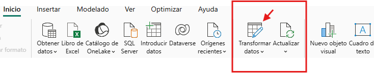

2. En la ventana **del Editor de Power Consultas**, en el panel **de Consultas**, selecciona la **consulta DimEmployee**.  
   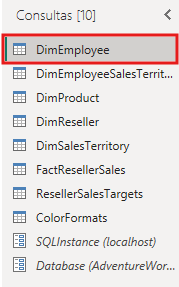  

> **Nota**: Si recibes un mensaje de advertencia pidiendo especificar cómo conectarte,
> selecciona **Editar credenciales**, conéctate usando las credenciales actuales y **selecciona OK** para usar una conexión sin cifrar.

3. Para renombrar la consulta, en el panel **de Configuración de la consulta** (ubicado a la derecha), en el cuadro **de Nombre**, sustituye el texto por **Salesperson** y luego pulsa **Enter**. Luego verifica que el nombre se haya actualizado en **el panel de Consultas**.  
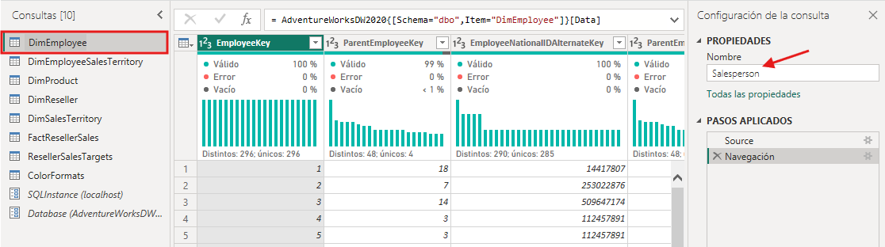
> *El nombre de la consulta determina el nombre de la tabla de modelos. Se recomienda definir nombres concisos y fáciles de usar.*  
4. Para localizar una columna específica, en la pestaña de **la cinta de inicio**, desde dentro del grupo **Gestionar columnas**, selecciona la flecha **descendente Elegir** columnas y luego **selecciona Ir a columna**.  
> ***Ir a Columna** es una función útil con muchas columnas. Si no, puedes desplazarte horizontalmente para encontrar columnas.*  
*Gestionar columnas \> Elegir columnas \> Ir a columna*  

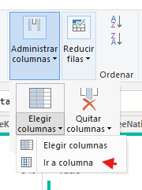

5. En la ventana **Ir a columna**, para ordenar la lista por nombre de columna, selecciona el botón **de ordenar AZ** y luego **selecciona Nombre**.  
Ve a las opciones de ordenación de columnas

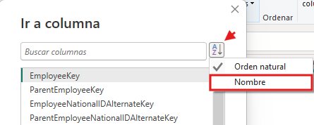

6. Localiza la columna **SalesPersonFlag**, luego filtra la columna para seleccionar solo Salespeople (es decir, **TRUE**) y haz **clic en OK**.  
7. En el panel **de Configuración de Consulta**, en la lista **de Pasos Aplicados**, observa la adición del paso **Filas Filtradas**.

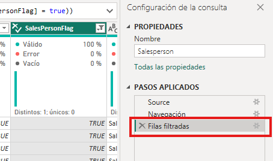  
> *Cada transformación que creas da lugar a una lógica de paso más. Es posible editar o eliminar pasos. También es posible seleccionar un paso para previsualizar los resultados de la consulta en esa fase de la transformación de la consulta.*  
*![Pasos aplicados][image5]*  
8. Para eliminar columnas, en la pestaña de **cinta de inicio**, desde dentro del **grupo Gestionar columnas**, selecciona el icono **Elegir columnas**.  
9. En la ventana **Elegir columnas**, para desmarcar todas las columnas, desmarque el elemento **(Seleccionar todas las columnas**).  
10. Para incluir columnas, revisa las siguientes seis columnas:  
    * EmployeeKey  
    * EmployeeNationalIDAlternateKey  
    * FirtsName  
    * LastName  
    * Título  
    * Dirección de correo electrónico

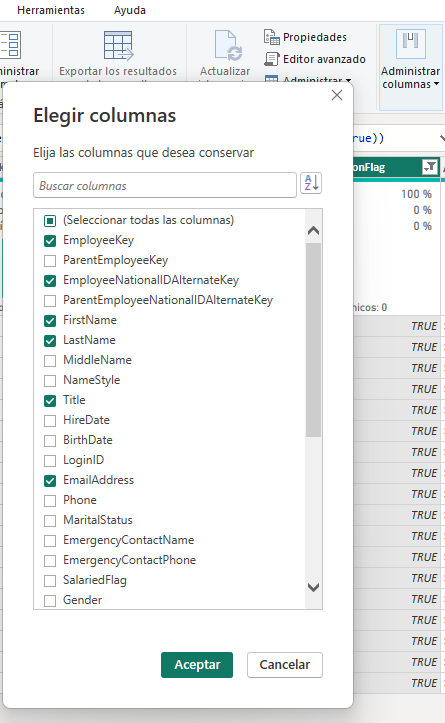

11. En la lista **de Pasos Aplicados**, observa la adición de otro paso de consulta.  
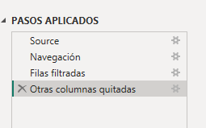

12. Para crear una columna con un solo nombre, selecciona primero el encabezado de la columna **FirstName**. Mantén pulsada la tecla **Ctrl** y selecciona la columna **LastName**.  
    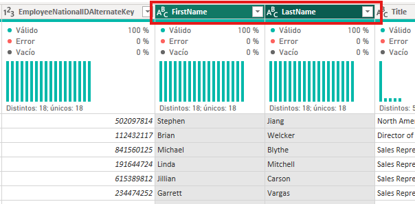

13. Haz clic con el botón derecho del ratón en cualquiera de los encabezados de las columnas seleccionadas y, a continuación, en el menú contextual, selecciona **Combinar columnas**.
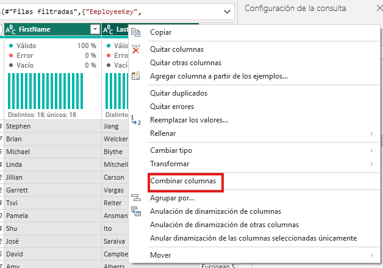

> *Muchas de las transformaciones habituales se pueden aplicar haciendo clic con el botón derecho del ratón en el encabezado de la columna y seleccionándolas a continuación en el menú contextual. Ten en cuenta que hay transformaciones adicionales disponibles en la cinta de opciones.*

14. En la ventana **Combinar columnas**, en la lista desplegable **Separador**, selecciona **Espacio**.  
15. En el cuadro **Nombre de la nueva columna**, sustituye el texto por **Salesperson**.
   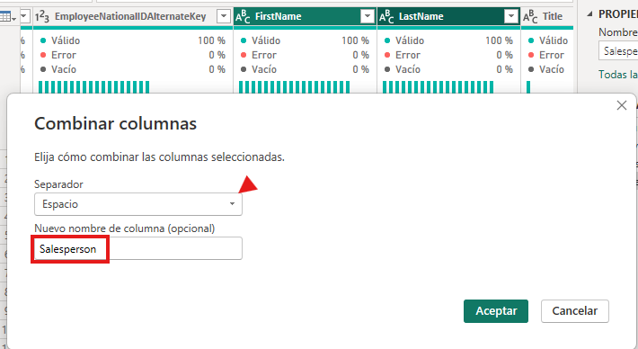  
16. Para cambiar el nombre de la columna **EmployeeNationalIDAlternateKey**, haz doble clic en el encabezado de la columna **EmployeeNationalIDAlternateKey**  y sustituye el texto por  **EmployeeID** a continuación, pulsa **Enter**.

      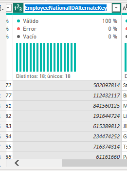  

17. Cambia el nombre de la columna **EmailAddress** por **UPN**.  
> *UPN son las siglas de «User Principal Name» (nombre principal de usuario).*

**En la barra de estado situada en la esquina inferior izquierda del Editor de Power Query, comprueba que la consulta tenga 5 columnas y 18 filas.**
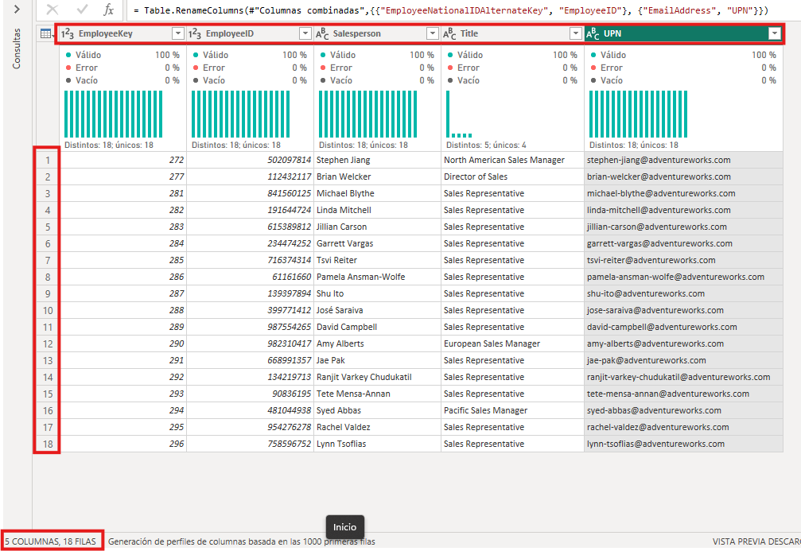 

# Bloque 2: Preparar la tabla puente (Bridge)
## Configurar la consulta **SalespersonRegion**

En esta tarea, configurarás la consulta **SalespersonRegion**.

1. En el panel **Consultas**, selecciona la consulta **DimEmployeeSalesTerritory**.
2. En el panel **Configuración de la consulta**, cambia el nombre de la consulta a **SalespersonRegion**.
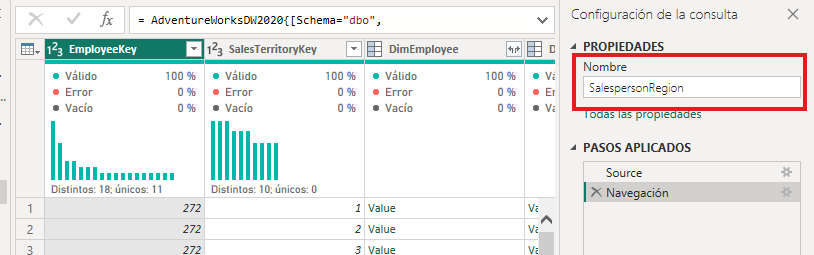 
3. Para eliminar las dos últimas columnas, selecciona primero el encabezado de columna **DimEmployee**.
4. Mientras mantienes pulsada la tecla **Ctrl**, selecciona el encabezado de columna **DimSalesTerritory**.
5. Haz clic con el botón derecho del ratón en cualquiera de los encabezados de columna seleccionados y, a continuación, en el menú contextual, selecciona **Eliminar columnas**.
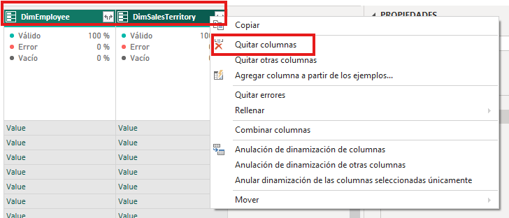 
**En la barra de estado, comprueba que la consulta tenga 2 columnas y 39 filas.**

# Bloque 3: Desnormalizar el catálogo de producto
## Configurar la consulta «Product»

En esta tarea, configurarás la consulta **Product**.

> ***Importante**: Cuando ya se hayan proporcionado instrucciones detalladas, los pasos del laboratorio ofrecerán instrucciones más concisas. Si necesitas las instrucciones detalladas, puedes consultar los pasos de las tareas anteriores.*

1. Selecciona la consulta **DimProduct** y cámbiale el nombre por **Product**.
2. Localiza la columna **FinishedGoodsFlag** y, a continuación, filtra la columna para recuperar los productos que sean productos terminados (es decir, TRUE).
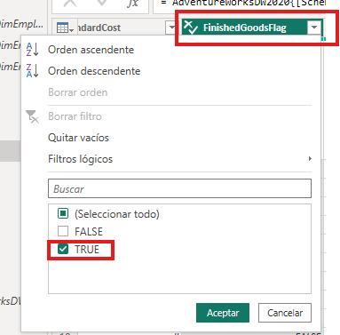

3. Elimina todas las columnas, **excepto** las siguientes:
   * ProductKey
   * EnglishProductName
   * StandardCost
   * Color
   * DimProductSubcategory

4. Fíjate en que la columna **DimProductSubcategory** representa una tabla relacionada (contiene enlaces **Value**). [¿value?](./ )
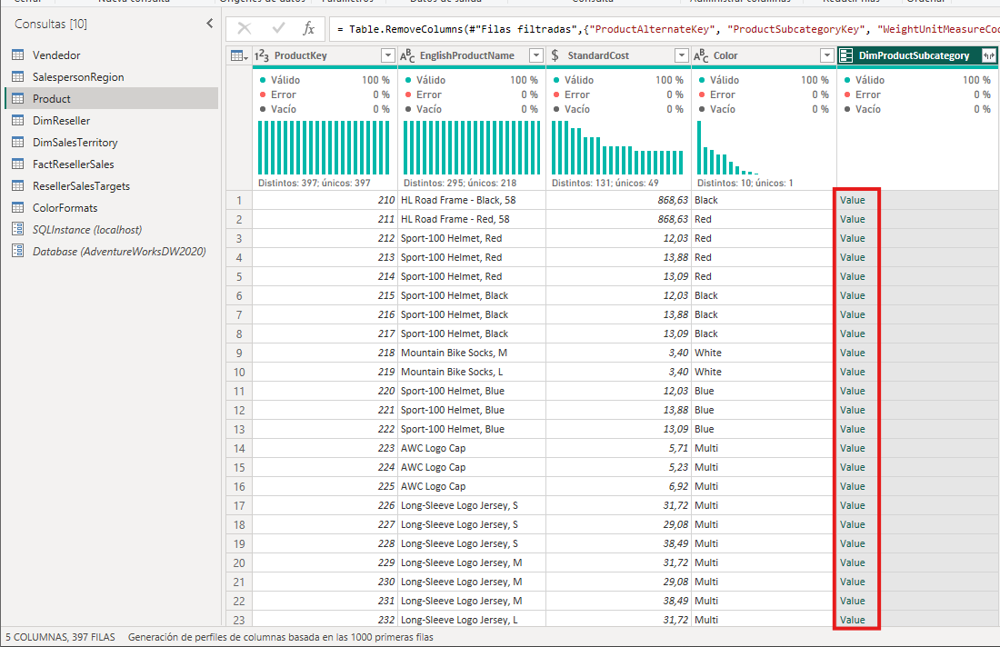
> El texto en color verde azulado «Value» aparece en esas celdas porque Power Query representa visualmente un registro complejo o entidad relacional anidada (Record / Table) en lugar de un dato escalar plano (como un texto o un número).

5. En el encabezado de la columna **DimProductSubcategory**, a la derecha del nombre de la columna, selecciona el botón de expansión.

      

6. Consulta la lista completa de columnas y, a continuación, marca la casilla **Seleccionar todas las columnas** para desmarcar todas las columnas.
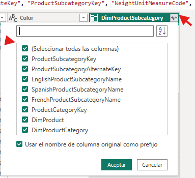

7. Selecciona **EnglishProductSubcategoryName** y **DimProductCategory**, y desmarca la casilla **Usar el nombre original de la columna como prefijo** antes de hacer clic en **Aceptar**.  
  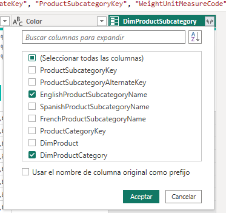 
> *Al seleccionar estas dos columnas, se aplicará una transformación para unirlas a la tabla **DimProductSubcategory** y, a continuación, incluir estas columnas. La columna **DimProductCategory** es, de hecho, otra tabla relacionada en la fuente de datos.*

> *Los nombres de las columnas de la consulta deben ser siempre únicos. Si se deja marcada, esta casilla antepondría a cada columna el nombre completo de la columna (en este caso, **DimProductSubcategory**). Dado que se sabe que los nombres de las columnas seleccionadas no entran en conflicto con los nombres de las columnas de la consulta **Product**, la opción se desmarca.*  
8. Fíjate en que la transformación ha dado lugar a la incorporación de dos columnas y en que se ha eliminado la columna **DimProductSubcategory**. 
9. Expande la columna **DimProductCategory** y luego introduce solo la columna **EnglishProductCategoryName**.
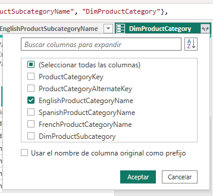

10. Renombra las siguientes cuatro columnas:  
    * **EnglishProductoNombre** a **Product**  
    * **Coste estándar** a **coste estándar** (incluye un espacio)  
    * **InglésSubcategoríaProducto Nombre** a **Subcategoría**  
    * **InglésProductoCategoríaNombre** a **Categoría**

**En la barra de estado, comprueba que la consulta tenga 6 columnas y 397 filas.**
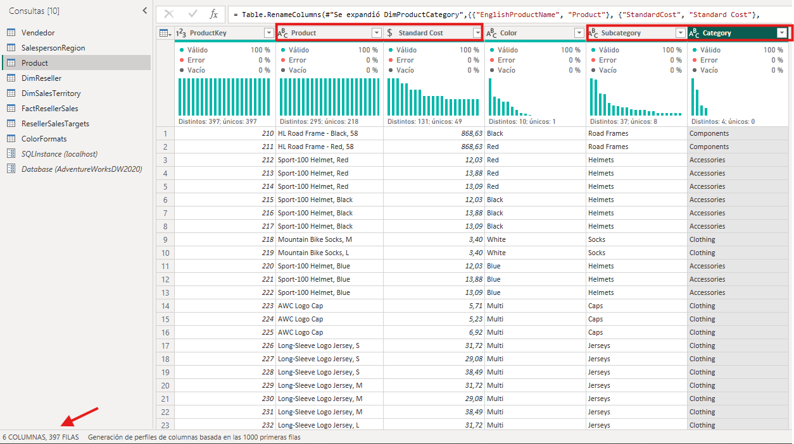

# Bloque 4: Limpieza de calidad de datos
## Configurar la consulta de Reseller

En esta tarea, configurarás la consulta **de Reseller**.

1. Selecciona la consulta **DimReseller** y cambia el nombre a **Reseller**.  
2. Eliminar todas las columnas, **excepto** las siguientes:  
   * ResellerKey  
   * Tipo de negocio  
   * Nombre del Distribuidor  
   * DimGeography  
3. Amplía la columna **DimGeography** para **incluir solo** las siguientes tres columnas:  
   * Ciudad  
   * EstadoNombre de la Provincia  
   * InglésPaísPaísNombre  
4. En la cabecera **de columna BusinessType**, selecciona la flecha hacia abajo y luego revisa los valores distintos de las columnas, y observa ambos valores **como Almacén** y **Almacén**.  
5. Haz clic derecho en la cabecera **de la columna BusinessType** y luego **selecciona Reemplazar valores**.  
6. En la ventana **de Reemplazar Valores**, configura los siguientes valores:  
   * En la casilla **Valor para encontrar**, introduce **Warehouse**  
   * En la **caja Reemplazar con**, introduce **Almacén**

**![Cuadro de diálogo Reemplazar valores][image10]**

1. Renombra las siguientes cuatro columnas:  
   * **Tipo de negocio** a **tipo de negocio** (incluir un espacio)  
   * **Nombre del revendedor** al **revendedor**  
   * **EstadoProvinciaNombre** a **Estado-Provincia**  
   * **InglésPaísRegiónNombre** a **País-Región**

**En la barra de estado, verifica que la consulta tenga 6 columnas y 701 filas.**

## Configurar la consulta por región

En esta tarea, configurarás la consulta **de Región**.

1. Selecciona la consulta **DimSalesTerritory** y renombra la consulta a **Región**.  
2. Aplica un filtro a la columna **SalesTerritoryAlternateKey** para eliminar el valor 0 (cero).  
3. *Esto eliminará una fila.*  
4. Eliminar todas las columnas, **excepto** las siguientes:  
   * ClaveTerritorioVentas  
   * RegiónTerritorioVentas  
   * SalesTerritoryCountry  
   * SalesTerritoryGroup  
5. Renombra las siguientes tres columnas:  
   * **SalesTerritorioRegión** a **Región**  
   * **Territoriode ventasPaís** a **país**  
   * **SalesTerritoryGroup** to **Group to Group**

**En la barra de estado, verifica que la consulta tenga 4 columnas y 10 filas.**

## Configurar la consulta de ventas

En esta tarea, configurarás la consulta **de Ventas**.

1. Selecciona la consulta **FactResellerSales** y cámbela a **Ventas**.  
2. Eliminar todas las columnas, **excepto** las siguientes:  
   * Número de Venta  
   * Fecha de pedido  
   * ProductKey  
   * ResellerKey  
   * EmployeeKey  
   * ClaveTerritorioVentas  
   * OrderQuantity  
   * Precio unitario  
   * CosteProducto Total  
   * SalesAmount  
   * DimProduct  
3. ***Nota:** Puede que recuerdes en **el laboratorio Preparar Datos en Power BI Desktop** que un pequeño porcentaje de las filas **de FactResellerSales** tenían valores **TotalCostProducto** faltantes. La columna **DimProduct** se ha incluido para recuperar la columna de costes estándar del producto y así ayudar a corregir los valores faltantes.*  
4. Expande la columna **DimProduct**, desmarca todas las columnas e incluye solo la columna **Coste Estándar**.  
5. Para crear una columna personalizada, en la pestaña de **Añadir columna**, desde dentro del grupo **General**, selecciona **Columna Personalizada**.  
   ![Imagen 5664][image11]  
6. En la ventana **de Columna Personalizada**, en el cuadro **de Nombre de Nueva Columna**, sustituye el texto por **Coste**.  
7. En el cuadro **Fórmula de Columna Personalizada**, introduce la siguiente expresión (después del símbolo de iguales) y guarda la nueva columna:  
   ' si \[CostoProductoTotal\] \= nulo, entonces \[CantidadDeOrden\] \* \[CostoEstándar\] si no, \[CostoProductoTotal\] '  
8. ***Nota:** Puedes copiar la expresión del archivo **Snippets.txt** en la carpeta 02-transform-data.*  
9. *Esta expresión prueba si falta el valor **de CostoProducto Total**. Si falta, produce un valor multiplicando el **valor de Cantidad de Orden** por el valor **de Coste Estándar**; de lo contrario, utiliza el valor **TotalCostoProducto** existente.*  
10. Elimina las siguientes dos columnas:  
    * CosteProducto Total  
    * Coste Estándar  
11. Renombra las siguientes tres columnas:  
    * **OrdenCantidad** a **Cantidad**  
    * **Precio unitario** a **precio unitario** (incluye un espacio)  
    * **Ventas Cantidad** a **Ventas**  
12. Para modificar el tipo de dato de la columna, en la cabecera **de la columna Cantidad**, a la izquierda del nombre de la columna, selecciona el icono **1.2** y luego selecciona **Número Entero**.  
13. *Configurar el tipo de dato correcto es importante. Cuando la columna contiene valor numérico, también es importante elegir el tipo correcto si esperas realizar cálculos matemáticos.*  
14. *![Imagen 5667][image12]*  
15. Modificar los siguientes tres tipos de datos columnas a **Número Decimal Fijo**.  
16. *El tipo de dato de número decimal fijo permite 19 dígitos y permite mayor precisión para evitar errores de redondeo. Es importante usar el tipo de número decimal fijo para valores financieros o tipos de cambio (como los tipos de cambio).*  
    * Precio unitario  
    * Ventas  
    * Coste

**En la barra de estado, comprueba que la consulta tenga 10 columnas y 999+ filas.** Se *cargarán un máximo de 1000 filas como datos de vista previa para cada consulta.*

# Bloque 5: Desdinamización de datos (Unpivot)
## Configurar la consulta de Targets

En esta tarea, configurarás la consulta **Targets**.

1. Selecciona la consulta **ResellerSalesTargets** y renombra a **Targets**.  
2. **Nota:** Si recibes un mensaje de advertencia pidiendo especificar cómo conectarte, selecciona **Editar credenciales** y usa acceso anónimo.  
3. Para despivotar las columnas de 12 meses (**M01-M12**), primero selecciona varias veces los encabezados **de las columnas Year** y **EmployeeID**.  
4. Haz clic derecho en cualquiera de las cabeceras de seleccionar columnas y, en el menú contextual, **selecciona Despivotar otras columnas**.  
5. Fíjate que los nombres de las columnas ahora aparecen en la columna **de Atributos**, y los valores en la columna **de Valor**.  
6. Aplica un filtro a la columna **Valor** para eliminar los valores del guion (-).  
7. *Quizá recuerdes que el carácter guion se usaba en el archivo CSV de origen para representar cero (0).*  
8. Renombra las siguientes dos columnas:  
   * **Atributo** a **Número de Mes** (no hay espacio)  
   * **Valor** para **el objetivo**  
9. Para preparar los valores de la columna **MonthNumber**, haz clic derecho en la cabecera **de la columna MonthNumber** y luego **selecciona Reemplazar valores**.  
10. *Ahora aplicarás transformaciones para producir una columna de fecha. La fecha se derivará de las columnas **Año** y **Número de Mes**. Crearás la columna usando la función **Columnas de Ejemplos**.*  
11. En la ventana **Reemplazar Valores**, en el cuadro **Valor A Encontrar**, introduce **M** y deja **Reemplazar con** vacío.  
12. Modifica el tipo de dato de la columna **Número de Mes** a **Número Entero**.  
13. En la pestaña **de Añadir columna**, desde el grupo **General**, selecciona el icono **La columna de ejemplos**.  
    ![Imagen 5675][image13]  
14. Fíjate que la primera fila corresponde al año **2017** y al mes **número 7**.  
15. En la columna **Columna1**, en la primera celda de la cuadrícula, comienza a introducir **el 1/7/2017** y luego pulsa **Enter**.  
16. ***Nota:** La máquina virtual utiliza configuraciones regionales de EE. UU., por lo que esta fecha es en realidad el 1 de julio de 2017\. Otros entornos regionales pueden requerir un **0** antes de la fecha.*  
17. Fíjate que las celdas de la cuadrícula se actualizan con los valores predichos.  
18. *La función ha predicho con precisión que estás combinando valores de las columnas **Año** y **Número de Mes**.*  
19. Fíjate también en la fórmula presentada sobre la cuadrícula de consulta.  
    ![Imagen 5679][image14]  
20. Para renombrar la nueva columna, haz doble clic en el encabezado **de la columna Fusionado** y cambia el nombre a la columna como **TargetMonth**.  
21. Elimina las siguientes columnas:  
    * Año  
    * Número de mes  
22. Modificar los siguientes tipos de datos de columna:  
    * **Objetivo** como número decimal fijo  
    * **TargetMonth** en la fecha  
23. Para multiplicar los valores **de Objetivo** por 1000, selecciona la cabecera de la columna **Destino** y, en la pestaña **de Transformar**, desde dentro del grupo **de Columnas de Números**, **selecciona Estándar** y después **selecciona Multiplicar**.  
24. *Quizá recuerdes que los valores objetivo se almacenaban en miles.*  
25. *![Imagen 5682][image15]*  
26. En la ventana **de Multiplicar**, en el cuadro **de Valor**, introduce **1000** y selecciona **OK.**

**En la barra de estado, verifica que la consulta tenga 3 columnas y 809 filas.**

# Bloque 6: Carga al modelo (Close & Apply)
## Configurar la consulta ColorFormats

En esta tarea, configurarás la consulta **ColorFormats**.

1. Selecciona la consulta **ColorFormatos** y observa que la primera fila contiene los nombres de las columnas.  
2. En la pestaña de **la cinta de inicio**, desde dentro del **grupo Transformar**, selecciona **Usar Primera Fila como Cabeceras**.  
   ![Imagen 5688][image16]

**En la barra de estado, verifica que la consulta tenga 3 columnas y 10 filas.**

## Actualizar la consulta del producto

En esta tarea, actualizarás la consulta **de Producto** fusionando la consulta **ColorFormats**.

1. Selecciona la consulta **de producto**.  
2. Para fusionar la consulta **ColorFormats**, en la pestaña de **cinta de inicio**, desde dentro del grupo **Combinar**, selecciona **Combinar consultas**.  
3. *La fusión de consultas permite integrar datos, en este caso de diferentes fuentes de datos (SQL Server y un archivo CSV).*  
4. *![Imagen 5654][image17]*  
5. En la ventana **de Fusionar**, en la cuadrícula **de consultas de Producto**, selecciona la cabecera de la columna **Color**.  
   ![Imagen 5655][image18]  
6. Debajo de la cuadrícula de **consultas de producto**, en la lista desplegable, selecciona la consulta **ColorFormats**.  
   ![Imagen 21][image19]  
7. En la cuadrícula **de consulta ColorFormatos**, selecciona el encabezado de columna **Color**.  
8. Cuando se abra la ventana **de Niveles de Privacidad**, para cada una de las dos fuentes de datos, en la lista desplegable correspondiente, selecciona **Organizacional** y **luego Guardar**.  
9. *Se pueden configurar niveles de privacidad para la fuente de datos y así determinar si los datos pueden compartirse entre fuentes. Configurar cada fuente de datos como **Organizacional** les permite compartir datos, si es necesario. Las fuentes de datos privadas nunca pueden compartirse con otras fuentes. No significa que los datos privados no puedan compartirse; significa que el motor Power Query no puede compartir datos entre las fuentes.*  
10. *![Imagen 5691][image20]*  
11. En la ventana **de Fusión**, usa el tipo de **unión** por defecto \- manteniendo la selección de Exterior Izquierdo y **selecciona OK**.  
12. Amplíe la columna **ColorFormatos** para incluir las siguientes dos columnas:  
    * Formato de color de fondo  
    * Formato de color de fuente

**En la barra de estado, verifica que la consulta ahora tenga 8 columnas y 397 filas.**

## Actualizar la consulta ColorFormats

En esta tarea, actualizarás los **ColorFormatos** para desactivar su carga.

1. Selecciona la consulta **ColorFormats**.  
2. En el panel **de Configuración de consulta**, selecciona el enlace **Todas las propiedades**.  
   ![Imagen 322][image21]  
3. En la ventana **de Propiedades de consulta**, desmarca la **casilla Habilitar Cargar para Informar**.  
4. *Desactivar la carga significa que no se cargará como tabla en el modelo de datos. Esto se hace porque la consulta se fusionó con la **consulta de Producto**, que está habilitada para cargar en el modelo de datos.*  
5. *![Imagen 323][image22]*

## Revisión del producto final

1. En Power Query Editor, verifica que tienes **8 consultas**, correctamente nombradas de la siguiente manera:  
   * Comercial  
   * Región de Vendedores  
   * Producto  
   * Revendedor  
   * Región  
   * Ventas  
   * Objetivos  
   * ColorFormats (que no se carga en el modelo de datos)  
2. **Selecciona Cerrar y Aplicar** para cargar los datos en el modelo y cierra la ventana del Editor de Power Consultas.  
   ![Imagen 326][image23]  
3. Ahora puedes ver el lienzo en Power BI Desktop, con los paneles de Filtros, Visualizaciones y Datos a la derecha. En el panel de datos, fíjate en las **7 tablas** cargadas en el modelo de datos.  
   ![Imagen 3][image24]

## Laboratorio completo

Puedes optar por guardar tu informe de Power BI, aunque no es necesario para este laboratorio. En el siguiente ejercicio, trabajarás con un archivo inicial predefinido.

1. Ve al menú **"Archivo"** en la esquina superior izquierda y **selecciona "Guardar como".**  
2. Seleccione **Explorar este dispositivo**.  
3. Selecciona la carpeta donde quieres guardar el archivo y ponle un nombre descriptivo.  
4. Selecciona el botón **Guardar** para guardar tu informe como archivo .pbix.  
5. Si aparece un cuadro de diálogo que te pide que apliques cambios pendientes en la consulta, selecciona **Aplicar**.  
6. Cierra Power BI Desktop.