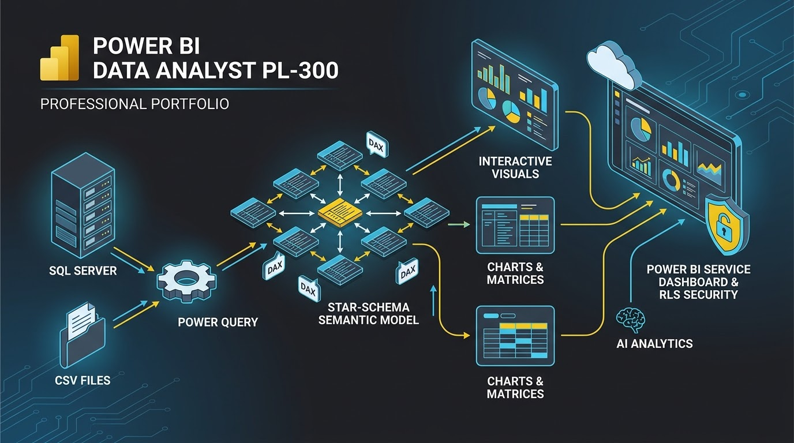

**PL-300-Microsoft-Power-BI-Data-Analyst**

# Proceso

# Índice de Laboratorios PL-300

| # | Laboratorio | Resumen / Descripción |
|---|---|---|
| 1 | [Set up your own environment](./00_set_up_your_own_environment/readme0.md) | Configuración del entorno de trabajo inicial y las herramientas necesarias para el desarrollo de los laboratorios de Power BI. |
| 2 | [Get data in Power BI](./01_get_data_in_power_bi/readme1.md) | Conexión e importación de datos desde diferentes fuentes y orígenes hacia Power BI Desktop. |
| 3 | [Clean, transform, and load data in Power BI](./02_clean_transform_and_load_data_in_power_bi/readme3.md) | Uso de Power Query para limpiar, dar formato, transformar y cargar los datos listos para el modelo. |
| 4 | [Configure a semantic model in Power BI](./03_configure_a_semantic_model_in_power_bi/readme3.md) | Establecimiento de relaciones, propiedades y configuración general del modelo semántico de datos. |
| 5 | [Create DAX calculations in semantic models](./04_create_dax_calculations_in_semantic_models/readme4.md) | Creación de columnas calculadas, medidas y tablas mediante fórmulas DAX. |
| 6 | [Modify DAX filter context in Power BI](./05_modify_dax_filter_context_in_power_bi/readme5.md) | Comprensión y manipulación avanzada del contexto de filtro en las expresiones DAX. |
| 7 | [Use DAX time intelligence functions in Power BI](./06_use_dax_time_intelligence_functions_in_power_bi/readme6.md) | Aplicación de funciones de inteligencia de tiempo en DAX para análisis acumulados y temporales. |
| 8 | [Create visual calculations in Power BI Desktop](./07_create_visual_calculations_in_power_bi_desktop/readme7.md) | Implementación de cálculos visuales directamente sobre los elementos visuales de Power BI Desktop. |
| 9 | [Design Power BI reports](./08_design_power_bi_reports/readme8.md) | Diseño, estructuración y maquetación de informes visuales e interactivos. |
| 10 | [Enhance Power BI report designs](./09_enhance_power_bi_report_designs/readme09.md) | Optimización del diseño visual y de la experiencia de usuario (UX) en los informes. |
| 11 | [Perform analytics in Power BI](./10_perform_analytics_in_power_b/readme10.md) | Ejecución de análisis avanzados de datos y herramientas analíticas integradas. |
| 12 | [Secure data access in Power BI](./11_secure_data_access_in_power_bi/readme11.md) | Configuración de la seguridad basada en roles (RLS) para restringir y proteger el acceso a la información. |
| 13 | [(Optional) Create dashboards in Power BI](./12_create_dashboards_in_power_bi/readme12.md) | Creación de paneles interactivos (dashboards) en el servicio web de Power BI. |

---

🏠 **Página principal PL-300:** [Volver al Inicio PL-300](../readmePL-300.md)